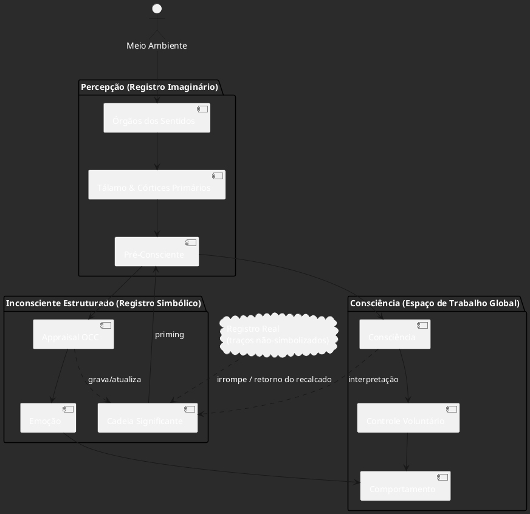

A síntese abaixo transforma a famosa frase de Lacan – “o inconsciente é estruturado como uma linguagem” – num diagrama de fluxo que mostra **(1)** como os dados sensoriais sobem até a consciência, **(2)** como são “apreendidos” pelo inconsciente simbólico e **(3)** como esse reservatório subterrâneo devolve ― já “saturados” de significantes, traumas e desejos ― impulsos que modulam emoção, decisão e ação.  O esquema, escrito em PlantUML, mantém a estética modular que Ortony-Clore-Collins (OCC) usam para emoções, mas injeta a tripartição lacaniana (Imaginário–Simbólico–Real) para ilustrar o circuito completo percepção → inconsciente → comportamento.

## 1  |  Fundamentos teóricos em três camadas

### 1.1  Registro Imaginário = pré-processamento perceptivo

A primeira parada dos estímulos é o tálamo, estação de retransmissão que projeta sinais crus para córtices primários antes de qualquer rotulagem conceitual ([Encyclopedia Britannica][1]).  Esse estágio “pré-consciente” encaixa-se no **Imaginário** de Lacan, onde predominam imagens e identificações rápidas ([TheCollector][2]).

### 1.2  Registro Simbólico = inconsciente estruturado como linguagem

Os traços brutos atravessam a “cadeia significante”: redes léxico-semânticas, memórias implícitas, complexos e samskaras que funcionam fora do radar do ego.  Aqui vale o lema lacaniano de que o inconsciente opera pelas mesmas leis da linguagem (metáfora, metonímia) ([TheCollector][2], [PlantUML.com][3]).  Cada novo dado sensorial ativa nós antigos e, se cruzar limiar de pertinência (ex. perigo → amígdala), já dispara respostas emocionais rápidas ([Nature][4]).

### 1.3  Registro Real = traços não simbolizáveis

Quando algo excede a capacidade de simbolização (trauma bruto, dor extrema), o material fica “encalhado” no Real.  O diagrama marca isso como um nó-sombra que pode provocar acting-out ou sintomas, em eco ao “retorno do recalcado” ([Wikipédia][5]).

## 2  |  Módulo de avaliação OCC dentro do Simbólico

O bloco **Appraisal OCC** calcula se um evento é congruente com metas, padrões ou autoestima; o resultado gera uma das 22 emoções básicas do modelo ([plantuml-documentation.readthedocs.io][6]).  Importante: essas avaliações usam tanto crenças conscientes quanto as predisposições inscritas nas memórias implícitas (samskaras/complexos).

## 3  |  PlantUML – diagrama esquemático

## 4  |  Como ler o fluxo

1. **Da sensação ao símbolo.**  O tálamo repassa informação para córtices primários; dali, padrões rápidos (ex.: face de medo) podem ativar amígdala em milissegundos antes da consciência ([Nature][4]).
2. **Appraisal gera emoção.**  O módulo OCC combina o input atual com “tabelas” no Simbólico (metas, padrões, autoconceito) e devolve alegria, raiva, etc.  Todo resultado deixa novas impressões na Cadeia Significante (reforço ou recalque).
3. **Feedback top-down.**  A Consciência pode reforçar ou inibir tendências via atenção, reinterpretação ou práticas (ex.: meditação diminui reatividade do hipocampo/amígdala) ([PMC][7]).
4. **Furos do Real.**  O que não ganha símbolo retorna em sintomas, sonhos ou atos falhos, ilustrando o “Real” de Lacan ([Wikipédia][5]).

## 5  |  Por que este diagrama é útil?

* **Integra modelos.**  Alinha o pipeline neurocognitivo (tálamo → córtex → workspace) a um modelo emocional formal (OCC) e às três ordens lacanianas, numa mesma folha.
* **Mostra dois sentidos de causalidade.**  O inconsciente é modificado (grava impressões) mas também modifica (priming, sintomas).
* **É computável.**  A sintaxe PlantUML facilita prototipar agentes que implementem appraisal + memória implícita, permitindo simulações ou jogos sérios de psicodinâmica.  (PlantUML suporta agrupamento em *package* como usado acima) ([plantuml-documentation.readthedocs.io][8]).

---

### Fontes principais

* TheCollector: explicação dos registros Imaginário-Simbólico-Real ([TheCollector][2])
* Lacan (“o inconsciente é estruturado como linguagem”) ([TheCollector][2])
* LacanQuest sobre cadeia significante e desejo ([PlantUML.com][3])
* MIT AI-Lab PDF de Ortony-Clore-Collins&#x20;
* Manual OCC revisitado com lista de 22 emoções ([plantuml-documentation.readthedocs.io][6])
* Britannica & NIH sobre tálamo como estação sensorial ([Encyclopedia Britannica][1])
* Nature Reviews Neuroscience: rotas rápidas da amígdala para emoção não-consciente ([Nature][4])
* Research (2023) sobre aquisição inconsciente de medo ([spj.science.org][9])
* Frontiers-in-Neuroscience sobre hipocampo e regulação de memória/emissão emocional ([PMC][7])
* Material de Lacan sobre o “grafo do desejo” (exemplo de retorno do Real) ([Wikipédia][5])

Com esse diagrama você pode tanto visualizar rapidamente o “trajeto” de um estímulo até se tornar ato falho, quanto aproveitar o código PlantUML para ampliar ou testar a dinâmica em softwares de modelagem ou em agentes cognitivos artificiais.

[1]: https://www.britannica.com/science/human-nervous-system/Lobes-of-the-cerebral-cortex?utm_source=chatgpt.com "Human nervous system - Brain Lobes, Cortex, Neurons"
[2]: https://www.thecollector.com/jacques-lacan-imaginary-symbolic-real/ "Jacques Lacan: Explaining the Imaginary, the Symbolic, and the Real | TheCollector"
[3]: https://plantuml.com/sequence-diagram?utm_source=chatgpt.com "Sequence Diagram"
[4]: https://www.nature.com/articles/nrn2920.pdf?utm_source=chatgpt.com "Emotion processing and the amygdala: from a 'low road' to ' ..."
[5]: https://en.wikipedia.org/wiki/Graph_of_desire "Graph of desire - Wikipedia"
[6]: https://plantuml-documentation.readthedocs.io/en/latest/diagrams/sequence.html "UML Sequence Diagram — Ashley's PlantUML Doc 0.2.01 documentation"
[7]: https://pmc.ncbi.nlm.nih.gov/articles/PMC5573739/ "
            The Influences of Emotion on Learning and Memory - PMC
        "
[8]: https://plantuml-documentation.readthedocs.io/en/latest/diagrams/sequence.html?utm_source=chatgpt.com "UML Sequence Diagram - Ashley's PlantUML Doc"
[9]: https://spj.science.org/doi/10.34133/research.0181?utm_source=chatgpt.com "Rapid Unconscious Acquisition of Conditioned Fear with ..."
