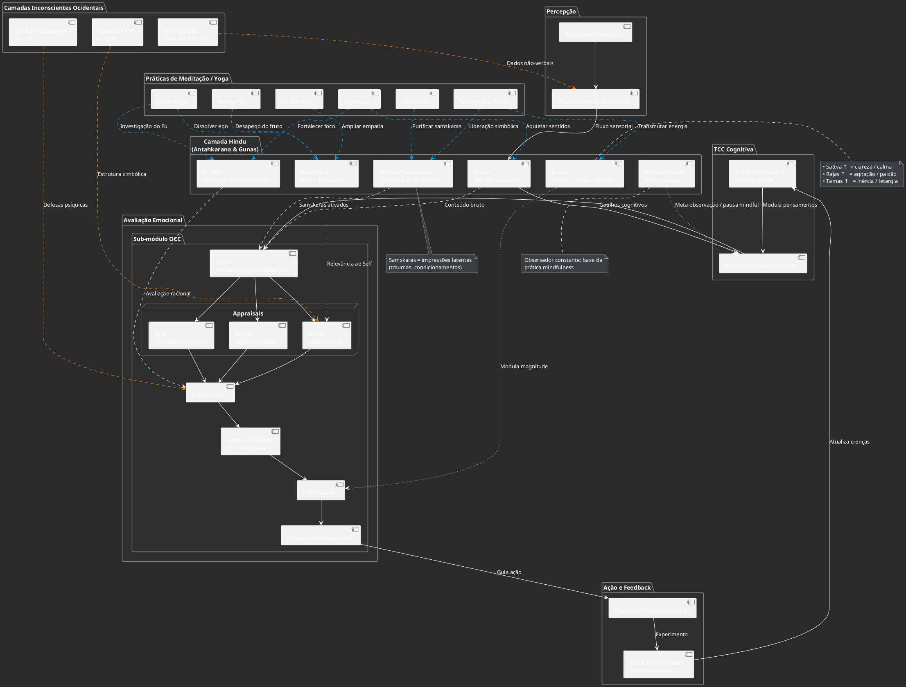

Below is one possible “road-map” for weaving classic Hindu models of mind into the cognitive-behavioural/OCC diagram you showed me earlier, while still keeping the Big Five as an accessible vocabulary for everyday personality talk.

---

### 1 .  Two complementary lenses on personality

| Western trait language                                     | Parallel/process in Hindu psychology                                                                  | Where it “lives” in your diagram                                                                                               |
| ---------------------------------------------------------- | ----------------------------------------------------------------------------------------------------- | ------------------------------------------------------------------------------------------------------------------------------ |
| **Neuroticism** – proneness to anxiety, anger, mood swings | Samskaras of fear/aversion lodged in **chitta**; excess **tamas/rajas** colouring manas               | Occurs in the **inconsciente** layer as latent threat–schemas that bias OCC appraisals toward the *undesirable-event* branch   |
| **Extraversion** – sociability, positive affect            | High **prana** flow toward heart/throat chakras; sattvic manas that seeks contact                     | Speeds up the *desirability* appraisal-loop and increases frequency of joy / hope emotions in the OCC map                      |
| **Openness to experience** – curiosity, fantasy            | Dominant **buddhi** (discriminative intellect) + light sattva; frequent activation of **ajña** chakra | Enlarges the repertoire of cognitive re-framing options available to the TCC “disputa de pensamentos” step                     |
| **Agreeableness** – altruism, empathy                      | Harmonious **ahankara** (ego) that identifies with others; cultivated through **bhakti/karma-yoga**   | Tilts OCC’s *agent-evaluation* node toward approving others; lowers baseline anger in emotion engine                           |
| **Conscientiousness** – self-discipline, dutifulness       | Strong **buddhi** governance over manas; prevalence of sattva                                         | Gives executive control that the TCC model calls *funções de monitoramento*; raises threshold before impulses become behaviour |

> **Take-home:** the Big Five describe *phenotypes* that emerge from deeper Hindu “machinery”: guna-mix, the relative strength of manas / buddhi / ahamkara, and the samskara stock stored in chitta.

---

### 2 .  Plug-in points for the Hindu modules

| Hindu component                                        | What it does (succinct)                                                            | Concrete place in TCC + OCC + Psicanálise stack                                  |
| ------------------------------------------------------ | ---------------------------------------------------------------------------------- | -------------------------------------------------------------------------------- |
| **Manas** – sensory mind, stimulus-driven              | Generates raw “situation” nodes that feed the OCC appraisal tree                   | Maps onto fast, pre-attentive *Sistema 1* stream.                                |
| **Buddhi** – higher intellect / discernment            | Runs cost–benefit, moral and goal checks                                           | Same job the TCC explicit-thought column already does.                           |
| **Ahamkara** – ego-constructor                         | Adds “this concerns *me*” tag to any appraisal; holds self-schemata                | Corresponds to Beck’s **core beliefs** / “Eu” node in psychoanalytic ego.        |
| **Chitta + Samskaras** – storehouse & latent imprints  | Weight incoming OCC appraisals via implicit priors; auto-suggest habitual thoughts | Becomes the dynamic database behind automatic thoughts & transferências.         |
| **Gunas (Sattva-Rajas-Tamas)**                         | Global state-variables modulating *all* modules’ speed & valence                   | A higher-level “mood register” that your diagram can track like arousal/valence. |
| **Atman / Sakshi (observador)**                        | Pure witnessing awareness; source of mindfulness                                   | Implemented as meta-cognitive monitor that enables reappraisal before action.    |

---

### 3 .  How this enriches intervention logic

1. **Assessment**

   * Use Big Five scores to spot *surface* tendencies (e.g., high Neuroticism).
   * Trace back to likely guna patterns (excess rajas + tamas) and samskara clusters driving those scores.

2. **Choice of technique**

   * Rajas/tamas overload → **Raja-yoga** breath + focus practices to boost sattva, calming manas (good adjunct to CBT relaxation).
   * Entrenched negative samskaras → **Pratipaksha-bhavana** (cultivar o pensamento oposto) layered onto standard cognitive restructuring.
   * Inflated ahamkara (low Agreeableness) → **Bhakti/karma-yoga** homework to widen identification with others (acts of service).

3. **Mechanism tracking**

   * After each session, log changes in sattva-rajas-tamas vector as you would mood scores.
   * Watch whether chitta “latency” for intrusive thoughts shortens (a proxy that samskara weight is dropping).

4. **Long-term aim**

   * Therapy = *“onde era o samskara, seja buddhi”*: gradually shift control from manas-habit loops to buddhi-governed, sattvic processing, while rooting identity in the Atman/observador to prevent relapse.

---

### 4 .  Visual tweak to your diagram

* **Bottom layer** – **Chitta/Samskaras** store (a weighted associative memory).
* **Middle fast loop** – **Manas** → OCC quick appraisal → emotion.
* **Middle slow loop** – **Buddhi + Ahamkara** do CBT-style evaluation; feed re-appraisal back to manas.
* **Global tone bar** – three coloured gauges for **S / R / T**.
* **Meta-ring** – **Atman/Sakshi** observer that can pause any loop (mindfulness step).

This keeps your original TCC-OCC skeleton intact, only adding *where* each Hindu construct plugs in.

---

### 5 .  Why bother?

* **Theory coherence** – replaces a vague “inconsciente” with specific, modifiable sub-systems.
* **Intervention menu** – maps traditional yoga tools to clear mechanisms of change rather than generic “relaxation”.
* **Cultural flexibility** – allows clients who value Eastern frameworks to see themselves in the model without losing CBT precision.

Feel free to let me know which part of the diagram you’d like fleshed out next (e.g., gunas gauges, samskara database schema, or yoga-protocol cheat-sheet) and we’ll iterate from there!

Incorporei ao canvas um **diagrama completo** que:

* Adiciona a **Antahkarana hindu** (Manas, Buddhi, Ahamkara, Chitta + Samskaras, Gunas, Atman) entre percepção e cognição.
* Mantém o **sub-módulo OCC** detalhado e todo o loop TCC → Emoção → Comportamento → Reestruturação.
* Mostra, em linhas tracejadas, como Freud, Lacan e Arte-terapia influenciam o appraisal.
* Introduz um bloco de **Práticas de Meditação/Yoga** (Raja, Vipassana, Bhakti, Karma, Jnana, Tantra) com setas para os componentes mentais que cada técnica regula.
* Inclui notas explicativas para **Sattva / Rajas / Tamas**, Samskaras e o papel do Atman-observador.



```
@startuml
skinparam backgroundColor #2B2B2B
skinparam defaultFontColor #FFFFFF
skinparam packageTitleFontColor #FFFFFF
skinparam noteBackgroundColor #3C3F41
skinparam noteBorderColor #BBBBBB
skinparam componentFontColor #FFFFFF
skinparam arrowColor #AAAAAA

title Integração Freud + Lacan + OCC + TCC + Personalidade (OCC Expandido)

' ==================== Entrada Sensorial ====================
package "Percepção" {
    [Entrada de Estímulos] as Estimulos
    [Processamento Perceptivo] as Percepcao
}
Estimulos --> Percepcao

' ==================== Camada Lacaniana ====================
package "Registros Lacanianos" {
    [Real] as Real
    [Simbólico] as Simbolico
    [Imaginário] as Imaginario
    [Outro (A)] as Outro
}
Percepcao --> Imaginario : formação de imagens
Imaginario --> Simbolico : tradução em linguagem
Simbólico --> Percepcao : moldura interpretativa
Outro --> Simbolico : normas e leis culturais
Real -[#FF6666,dashed]-> Simbolico : trauma/furo
Real -[#FF6666,dashed]-> Imaginario : angústia

' ==================== Camada Freudiana ====================
package "Sistema Freudiano" {
    [Id] as Id
    [Ego] as Ego
    [Superego] as Superego
    [Mecanismos de Defesa] as Defesas
}
Id -[#FF6666]-> Ego : impulsos
Superego -[#66FF66]-> Ego : exigências morais
Ego -[#66CCFF]-> Defesas
Defesas -[#AAAAAA]-> Ego : modulação de respostas

' ==================== Crenças e Pensamentos ====================
package "Crenças e Pensamentos (TCC)" {
    component "Crenças Centrais e Intermediárias" as Crenças
    component "Pensamentos Automáticos" as PensAutom
}
Percepcao --> PensAutom
Crenças --> PensAutom

' ==================== OCC Detalhado ====================
package "Avaliação Emocional (OCC)" {
    [Appraisal 1:\nDesejabilidade] as Desej
    [Appraisal 2:\nAgência] as Agencia
    [Appraisal 3:\nNormas] as Normas
    [Appraisal 4:\nAtratividade] as Atratividade

    package "Mapeamento Emocional" {
        
        ' Eventos
        [Desejável Futuro] as EsperadoBom
        [Indesejável Futuro] as EsperadoRuim
        [Desejável Ocorreu] as OcorreuBom
        [Indesejável Ocorreu] as OcorreuRuim
        [Desejável Não Ocorreu] as FalhouBom
        [Indesejável Não Ocorreu] as FalhouRuim
        
        ' Ações de agentes
        [Ação Própria Louvável] as AcaoBoaSelf
        [Ação Própria Condenável] as AcaoRuimSelf
        [Ação Alheia Louvável] as AcaoBoaOutro
        [Ação Alheia Condenável] as AcaoRuimOutro
        
        ' Objetos
        [Objeto Atraente] as ObjPos
        [Objeto Repulsivo] as ObjNeg

        ' Emoções finais
        package "Emoções" {
            [Esperança]
            [Medo]
            [Alegria]
            [Satisfação]
            [Tristeza]
            [Frustração]
            [Alívio]
            [Decepção]
            [Orgulho]
            [Vergonha]
            [Culpa]
            [Admiração]
            [Reprovação]
            [Gratidão]
            [Raiva]
            [Gosto]
            [Desgosto]
            [Alívio + Gratidão]
            [Raiva + Desgosto]
            [Confiança]
            [Ansiedade]
        }
    }
}

' Ligações Pensamentos → Appraisals
PensAutom --> Desej
PensAutom --> Agencia
PensAutom --> Normas
PensAutom --> Atratividade

' Ligações Appraisals → Situações
Desej --> EsperadoBom
Desej --> EsperadoRuim
Desej --> OcorreuBom
Desej --> OcorreuRuim
Desej --> FalhouBom
Desej --> FalhouRuim

Agencia --> AcaoBoaSelf
Agencia --> AcaoRuimSelf
Agencia --> AcaoBoaOutro
Agencia --> AcaoRuimOutro

Atratividade --> ObjPos
Atratividade --> ObjNeg

' Ligações Situações → Emoções
EsperadoBom --> Esperança
EsperadoRuim --> Medo
OcorreuBom --> Alegria
OcorreuBom --> Satisfação
OcorreuRuim --> Tristeza
OcorreuRuim --> Frustração
FalhouRuim --> Alívio
FalhouBom --> Decepção
AcaoBoaSelf --> Orgulho
AcaoRuimSelf --> Vergonha
AcaoRuimSelf --> Culpa
AcaoBoaOutro --> Admiração
AcaoRuimOutro --> Reprovação
AcaoBoaOutro --> Gratidão
AcaoRuimOutro --> Raiva
ObjPos --> Gosto
ObjNeg --> Desgosto

Alívio --> [Alívio + Gratidão]
Gratidão --> [Alívio + Gratidão]
Raiva --> [Raiva + Desgosto]
Desgosto --> [Raiva + Desgosto]
AcaoBoaSelf --> Confiança
AcaoRuimSelf --> Ansiedade

' ==================== Influências Cruzadas ====================
Id -[#FF8800,dashed]-> Atratividade : impulsos primitivos
Superego -[#FF8800,dashed]-> Normas : moral internalizada
Ego -[#FF8800,dashed]-> Agencia : avaliação realista
Simbólico -[#00AAFF,dashed]-> Normas : rede de significantes
Imaginario -[#00AAFF,dashed]-> Atratividade : idealizações
Real -[#00AAFF,dashed]-> Desej : eventos traumáticos
Crenças -[#00FFAA,dashed]-> Superego
Crenças -[#00FFAA,dashed]-> Simbolico

' ==================== Perfil de Personalidade ====================
package "Perfil de Personalidade" {
    [Big Five] as BigFive
    [Taxonomia 120 Traços] as T120
}
BigFive -[#AAAAFF,dashed]-> Esperança : modulação geral
BigFive -[#AAAAFF,dashed]-> Medo
T120 -[#AAAAFF,dashed]-> Alegria : padrões específicos
T120 -[#AAAAFF,dashed]-> Raiva

' ==================== Saída e Feedback ====================
package "Ação e Feedback" {
    component "Geração de Resposta Comportamental" as Comport
    component "Testes de Realidade & Reestruturação" as RealTest
}
Emoções --> Comport
Comport --> RealTest
RealTest --> Crenças
@enduml
```

```
@startuml
title Mapa: Emoções ↔ Big Five ↔ T120

skinparam packageStyle rectangle
skinparam defaultFontName Inter
skinparam linetype ortho

'------------------------
' NÓS DE EMOÇÕES
'------------------------
package "Emoções (núcleo)" as EMO {
  node Medo
  node Tristeza
  node Nojo
  node Raiva
  node Alegria
  node Desprezo
  node Culpa
  node Vergonha
  node Gratidão
  node Admiração
}

'------------------------
' BIG FIVE + FACETAS
'------------------------
package "Big Five" as BF {
  package "Neuroticismo" as N {
    node Ansiedade
    node Raiva_N
    node Melancolia
    node Autoconsciencia
    node Impulsividade
    node Vulnerabilidade
  }
  package "Extroversão" as E {
    node Sociabilidade
    node Assertividade
    node Atividade
    node BuscaSensacoes
    node EmocoesPositivas
  }
  package "Abertura" as O {
    node Fantasia
    node Estetica
    node Emotividade
    node Aventura
    node Intelecto
    node Liberalismo
  }
  package "Afabilidade" as A {
    node Amizade
    node Cooperacao
    node Modestia
    node Empatia_BF
    node Moralidade
    node Altruismo
    node Confianca
  }
  package "Conscienciosidade" as C {
    node Autoeficacia
    node Ordem
    node Dever
    node Realizacao
    node Autodisciplina
    node Cautela
  }
}

'------------------------
' T120 (amostra focada)
'------------------------
package "T120 (amostra relevante)" as T120 {
  package "Empatia & Cuidado" {
    node Kindness
    node Compassion
    node Generosity
  }
  package "Hostilidade" {
    node Aggression
    node Bellicosity
    node Vindictiveness
    node Hostility
    node Deceptiveness
    node Narcissism
  }
  package "Autocontrole" {
    node Temperance
    node Patience
    node Discipline
  }
  package "Coragem & Direção" {
    node Courage
    node Purposefulness
    node Integrity
    node Honor
  }
  package "Status & Diplomacia" {
    node Humility_T
    node Courtesy
    node Consideration
    node Competitiveness
  }
  package "Ordem & Pureza" {
    node Fastidiousness
    node Cleanliness
    node Decency_T
    node Traditionalism
  }
  package "Abertura estética" {
    node Wonderment
    node Artistry
    node Imagination_T
  }
}

'------------------------
' LIGAÇÕES: BIG FIVE -> EMOÇÕES
' (setas sólidas = associação direta; rótulos ↑/↓ = tendência de aumentar/reduzir)
'------------------------
Ansiedade --> Medo : ↑
Raiva_N --> Raiva : ↑
Melancolia --> Tristeza : ↑
Autoconsciencia --> Vergonha : ↑
Impulsividade --> Raiva : ↑

EmocoesPositivas --> Alegria : ↑
Sociabilidade --> Alegria : ↑
BuscaSensacoes --> Alegria : ↑\n(volátil)

Empatia_BF --> Gratidão : ↑
Altruismo --> Gratidão : ↑
Modestia --> Vergonha : leve ↑\n(autoavaliação)
Moralidade --> Culpa : ↑\n(sensibilidade a transgressão)

Dever --> Culpa : ↑\n(violação de regra)
Autodisciplina --> Raiva : ↓
Cautela --> Raiva : ↓
Ordem --> Nojo : ↑\n(sensibilidade a contaminação)
Autoeficacia --> Tristeza : ↓

Estetica --> Admiração : ↑
Fantasia --> Admiração : ↑
Emotividade --> Alegria : ↑\n(amplitude afetiva)
Emotividade --> Tristeza : ↑\n(amplitude afetiva)

'------------------------
' LIGAÇÕES: T120 -> EMOÇÕES
'------------------------
Aggression --> Raiva : ↑
Bellicosity --> Raiva : ↑
Vindictiveness --> Raiva : ↑
Vindictiveness --> Desprezo : ↑
Hostility --> Desprezo : ↑
Deceptiveness --> Culpa : ↓\n(propensão a menor culpa)
Narcissism --> Desprezo : ↑
Narcissism --> Vergonha : ↓

Temperance --> Raiva : ↓
Patience --> Raiva : ↓\n(regulação)
Patience --> Medo : ↓\n(regulação)
Discipline --> Culpa : ↓\n(prevenção de falhas)

Courage --> Medo : ↓
Integrity --> Culpa : ↑\n(sensibilidade ética)
Honor --> Culpa : ↑\n(padrão de honra)
Honor --> Vergonha : ↑\n(padrão de honra)
Purposefulness --> Tristeza : ↓\n(sentido protege)

Humility_T --> Desprezo : ↓\n(modesta)
Humility_T --> Vergonha : ↑\n(modesta)
Courtesy --> Desprezo : ↓
Consideration --> Gratidão : ↑\n(nos outros)
Competitiveness --> Desprezo : ↑\n(em disputa)
Competitiveness --> Raiva : ↑\n(em disputa)

Fastidiousness --> Nojo : ↑
Cleanliness --> Nojo : ↑
Decency_T --> Culpa : ↑\n(normas)
Decency_T --> Nojo : ↑\n(normas)
Traditionalism --> Culpa : ↑\n(transgressão)

Wonderment --> Admiração : ↑
Artistry --> Admiração : ↑
Imagination_T --> Admiração : ↑

'------------------------
' LIGAÇÕES: PONTES ENTRE BIG FIVE E T120 (algumas âncoras)
'------------------------
Empatia_BF .. Kindness
Empatia_BF .. Compassion
Modestia .. Humility_T
Moralidade .. Integrity
Dever .. Honor
Autodisciplina .. Discipline
Cautela .. Temperance
Estetica .. Artistry
Fantasia .. Imagination_T
BuscaSensacoes .. Competitiveness : às vezes co-ocorre
Ordem .. Cleanliness
@enduml

```