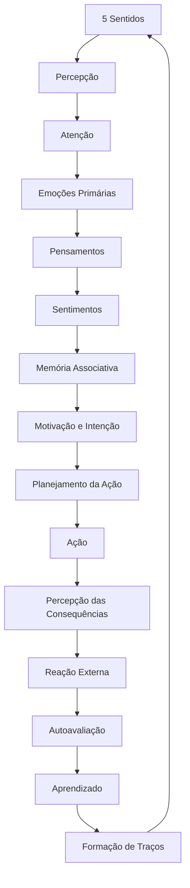

# Ciclo de Processamento da Experiência Humana

## Estágios Ampliados

|Ordem|Estágio|Explicação|
|---|---|---|
|1|**Sensação (5 Sentidos)**|Recepção de estímulos sensoriais brutos. Inclui visão, audição, tato, olfato, paladar. Na Escolástica: "Potências Sensitivas Externas".|
|2|**Percepção**|Organização e reconhecimento dos estímulos sensoriais. Processos como percepção de formas, rostos, sons significativos. Modernamente: Processamento Perceptual. Na Escolástica: "Potências Sensitivas Internas" (ex.: sensus communis).|
|3|**Atenção e Saliência**|Filtragem do que será destacado para processamento superior. Inclui mecanismos de "salience mapping" e atenção seletiva.|
|4|**Emoções Primárias**|Reações automáticas, muitas vezes instintivas, de valência positiva ou negativa (ex.: medo, nojo, alegria). Na Escolástica: "Appetitus Sensitivus" (Concupiscível e Irascível). Modernamente: Sistema Límbico (ex.: amígdala).|
|5|**Processamento Cognitivo Inicial (Avaliação Rápida)**|Julgamento imediato de ameaça ou benefício (ex.: Heurísticas de Detecção de Perigo). Inclui o Sistema 1 de Kahneman.|
|6|**Pensamentos / Avaliação Racional**|Processo deliberativo mais lento, consciente, baseado em linguagem e conceitos. Na Escolástica: "Intelecto Agente e Intelecto Possível". Modernamente: Funções Executivas (córtex pré-frontal).|
|7|**Sentimentos (Emoções Elaboradas e Interpretadas)**|Construção consciente da experiência emocional: tristeza, saudade, esperança. Combinação de emoção + interpretação cognitiva. Modernamente: James-Lange + Teoria de Schachter-Singer.|
|8|**Memória Associativa e Recontextualização**|O cérebro busca experiências passadas semelhantes, evocando memórias emocionais ou racionais que influenciarão a decisão. Na Escolástica: Memória e Fantasia Interna.|
|9|**Motivação e Intenção**|Formação de um impulso para agir (ou não agir), com base na integração das fases anteriores. Aqui surge a intenção formal.|
|10|**Planejamento da Ação (Praxis)**|Escolha do comportamento a ser realizado, modelado por fatores como controle inibitório, expectativas de resultado, normas sociais. Inclui os sistemas de autocontrole da personalidade (ex.: Conscienciosidade no Big Five).|
|11|**Ação (Comportamento Motor)**|Execução da ação concreta. Inclui a ativação de músculos, linguagem corporal, fala, escrita, etc.|
|12|**Percepção das Consequências Imediatas (Feedback Sensorial e Social)**|Feedback sensorial da ação: "Doeu?", "Deu certo?", "As pessoas reagiram como eu esperava?".|
|13|**Reação dos Outros / Ambiente Externo**|Resposta social e ambiental à ação. Pode incluir aprovação, punição, reforço, etc.|
|14|**Autoavaliação Pós-Ação / Regulação Emocional**|Reflexão sobre a adequação da ação. Avaliação moral, social e pragmática. Exemplo: remorso, orgulho, vergonha.|
|15|**Aprendizado e Atualização de Modelos Internos**|Modificação de crenças, expectativas e estratégias futuras com base nos resultados obtidos. Modernamente: Plasticidade Neural / Aprendizado por Reforço.|
|16|**Integração na Identidade e no Caráter**|Se os mesmos padrões de ação se repetem, eles passam a moldar traços de personalidade duradouros (Ex.: formação de virtudes e vícios). Escolástica: "Habitus".|

---

## Referências Escolásticas

|Etapa|Conceito Escolástico|
|---|---|
|Sensação e Percepção|Potências Sensitivas Externas e Internas|
|Emoções Primárias|Appetitus Sensitivus (Concupiscível e Irascível)|
|Pensamento|Intelecto Agente e Possível|
|Intenção|Vontade (Voluntas)|
|Ação|Actus Humanus|
|Autoavaliação|Consciência Moral|
|Formação de Hábitos|Habitus (Virtudes e Vícios)|

---

## Correspondências com Modelos Modernos

|Etapa|Psicologia Cognitiva / Neurociências / Big Five|
|---|---|
|Sensação/Percepção|Processamento Sensorial / Atenção|
|Emoção Primária|Sistema Límbico / Neuroticismo|
|Pensamento|Sistema 2 (Kahneman) / Conscienciosidade|
|Sentimentos|Construção Cognitiva da Emoção|
|Motivação|Teoria da Autodeterminação / Motivação Intrínseca|
|Planejamento|Funções Executivas / Extroversão (em ações sociais)|
|Ação|Psicologia do Comportamento / Controle Motor|
|Feedback|Modelos de Feedback Sensorial e Social|
|Reação Externa|Psicologia Social / Reforço Social|
|Autoavaliação|Metacognição / Neuroticismo (autocrítica)|
|Aprendizado|Aprendizagem Associativa / Modelos de Recompensa|
|Formação de Traços|Psicologia da Personalidade / Big Five (formação longitudinal dos traços)|

---

## Visualização do Ciclo

---

Se quiser, posso detalhar cada etapa com causas e consequências biológicas, psicológicas e sociais, nos moldes que usamos nos blocos da [Taxonomia dos 120 Traços de Personalidade](Taxonomia dos 120 Traços de Personalidade).

Quer que eu faça isso?

## 1	Sensação (5 Sentidos)
Recepção de estímulos sensoriais brutos. Inclui visão, audição, tato, olfato, paladar. Na Escolástica: "Potências Sensitivas Externas".
## 2	Percepção
Organização e reconhecimento dos estímulos sensoriais. Processos como percepção de formas, rostos, sons significativos. Modernamente: Processamento Perceptual. Na Escolástica: "Potências Sensitivas Internas" (ex.: sensus communis).
## 3	Atenção e Saliência
Filtragem do que será destacado para processamento superior. Inclui mecanismos de "salience mapping" e atenção seletiva.
## 4	Emoções Primárias
Reações automáticas, muitas vezes instintivas, de valência positiva ou negativa (ex.: medo, nojo, alegria). Na Escolástica: "Appetitus Sensitivus" (Concupiscível e Irascível). Modernamente: Sistema Límbico (ex.: amígdala).
## 5	Processamento Cognitivo Inicial (Avaliação Rápida)
Julgamento imediato de ameaça ou benefício (ex.: Heurísticas de Detecção de Perigo). Inclui o Sistema 1 de Kahneman.
## 6	Pensamentos / Avaliação Racional
Processo deliberativo mais lento, consciente, baseado em linguagem e conceitos. Na Escolástica: "Intelecto Agente e Intelecto Possível". Modernamente: Funções Executivas (córtex pré-frontal).
## 7	Sentimentos (Emoções Elaboradas e Interpretadas)
Construção consciente da experiência emocional: tristeza, saudade, esperança. Combinação de emoção + interpretação cognitiva. Modernamente: James-Lange + Teoria de Schachter-Singer.
## 8	Memória Associativa e Recontextualização
O cérebro busca experiências passadas semelhantes, evocando memórias emocionais ou racionais que influenciarão a decisão. Na Escolástica: Memória e Fantasia Interna.
## 9	Motivação e Intenção
Formação de um impulso para agir (ou não agir), com base na integração das fases anteriores. Aqui surge a intenção formal.
## 10	Planejamento da Ação (Praxis)
Escolha do comportamento a ser realizado, modelado por fatores como controle inibitório, expectativas de resultado, normas sociais. Inclui os sistemas de autocontrole da personalidade (ex.: Conscienciosidade no Big Five).
## 11	Ação (Comportamento Motor)
Execução da ação concreta. Inclui a ativação de músculos, linguagem corporal, fala, escrita, etc.
## 12	Percepção das Consequências Imediatas (Feedback Sensorial e Social)
Feedback sensorial da ação: "Doeu?", "Deu certo?", "As pessoas reagiram como eu esperava?".
## 13	Reação dos Outros / Ambiente Externo
Resposta social e ambiental à ação. Pode incluir aprovação, punição, reforço, etc.
## 14	Autoavaliação Pós-Ação / Regulação Emocional
Reflexão sobre a adequação da ação. Avaliação moral, social e pragmática. Exemplo: remorso, orgulho, vergonha.
## 15	Aprendizado e Atualização de Modelos Internos
Modificação de crenças, expectativas e estratégias futuras com base nos resultados obtidos. Modernamente: Plasticidade Neural / Aprendizado por Reforço.
## 16	Integração na Identidade e no Caráter
Se os mesmos padrões de ação se repetem, eles passam a moldar traços de personalidade duradouros (Ex.: formação de virtudes e vícios). Escolástica: "Habitus".

Aqui vai uma ampliação e sistematização detalhada do ciclo proposto, fundamentada tanto nas teorias escolásticas clássicas (como as de Tomás de Aquino) quanto nos modelos modernos (como Psicologia Cognitiva, Neurociências e Teorias da Personalidade como Big Five e a Taxonomia dos 120 Traços):

---
