```mermaid
graph LR

subgraph Ambiente
    A1[Ambiente: Estímulos Externos] --> S1
    S12 --> A2[Ambiente: Reações às Ações do Sujeito]
end

subgraph Sujeito
    S1[Sensação] --> S2[Percepção]
    S2 --> S3[Atenção e Saliência]
    S3 --> S4[Emoções Primárias]
    S4 --> S5[Pensamento e Avaliação]
    S5 --> S6[Sentimentos]
    S6 --> S7[Memória e Associação]
    S7 --> S8[Motivação e Intenção]
    S8 --> S9[Planejamento da Ação]
    S9 --> S10[Ação]
    S10 --> S11[Percepção das Consequências]
    S11 --> S12[Autoavaliação e Aprendizado]
    S12 --> S1
end

A2 --> S1
```

# Ciclo de Processamento da Experiência Humana

Perfeito! Agora vamos focar exclusivamente no detalhamento funcional de cada processo. Vou estruturar cada grande etapa como um bloco, quebrando-a em sub-etapas e sub-sub-etapas, com entradas e saídas claras para cada nível.

---

# Modelo Funcional Detalhado do Ciclo da Experiência Humana

---
```json
{
    "2. Emoções Primárias": {
        "2.1 Detecção de Gatilho Emocional": {
            "2.1.1 Análise de Valência e Relevância": {
                "entrada": "Estímulos priorizados pela atenção",
                "processo": "Avaliação automática de valor hedônico e de ameaça",
                "saida": "Classificação inicial: positivo, negativo ou neutro"
            },
            "2.1.2 Ativação do Sistema Límbico": {
                "entrada": "Classificação de valência",
                "processo": "Ativação de estruturas como a amígdala e hipotálamo",
                "saida": "Sinal de ativação emocional para o corpo e outras áreas cerebrais"
            }
        },
        "2.2 Resposta Emocional Inicial": {
            "2.2.1 Ativação Fisiológica": {
                "entrada": "Sinal do sistema límbico",
                "processo": "Liberação de hormônios e alterações fisiológicas",
                "saida": "Estado fisiológico alterado"
            },
            "2.2.2 Preparação Motora": {
                "entrada": "Estado fisiológico alterado",
                "processo": "Preparação automática para ação",
                "saida": "Prontidão motora"
            }
        },
        "2.3 Modulação Inicial da Emoção": {
            "2.3.1 Inibição ou Amplificação": {
                "entrada": "Intensidade da ativação emocional",
                "processo": "Modulação da emoção com base em contexto e experiência",
                "saida": "Emoção ajustada"
            }
        }
    },
    "3. Processamento Cognitivo": {
        "3.1 Avaliação Rápida (Sistema 1)": {
            "3.1.1 Heurística de Situação": {
                "entrada": "Emoção ajustada + estímulos priorizados",
                "processo": "Aplicação de julgamentos rápidos baseados em experiências passadas",
                "saida": "Resposta preliminar automática"
            }
        },
        "3.2 Avaliação Racional (Sistema 2)": {
            "3.2.1 Simulação Mental": {
                "entrada": "Resposta preliminar + intenções conscientes",
                "processo": "Projeção de cenários futuros",
                "saida": "Opções de resposta avaliadas"
            },
            "3.2.2 Deliberação": {
                "entrada": "Opções simuladas",
                "processo": "Ponderação consciente de prós e contras",
                "saida": "Decisão cognitiva inicial"
            }
        },
        "3.3 Acesso à Memória": {
            "3.3.1 Recuperação Episódica": {
                "entrada": "Sinais de situação atual",
                "processo": "Busca por experiências passadas semelhantes",
                "saida": "Conjunto de memórias ativadas"
            },
            "3.3.2 Recuperação Semântica": {
                "entrada": "Categorias cognitivas relevantes",
                "processo": "Ativação de conceitos e conhecimentos gerais",
                "saida": "Rede de informações relevantes"
            }
        },
        "3.4 Integração Social e Cultural": {
            "3.4.1 Filtragem por Normas": {
                "entrada": "Decisão cognitiva inicial + dados de memória",
                "processo": "Ajuste com base em padrões culturais e morais",
                "saida": "Decisão final cognitivamente filtrada"
            }
        }
    },
    "4. Construção Consciente dos Sentimentos": {
        "4.1 Consciência Emocional": {
            "4.1.1 Monitoramento Interoceptivo": {
                "entrada": "Estado fisiológico atual",
                "processo": "Leitura consciente das alterações corporais",
                "saida": "Registro subjetivo de estar sentindo algo"
            }
        },
        "4.2 Rotulação Emocional": {
            "4.2.1 Atribuição Verbal": {
                "entrada": "Consciência emocional + memória semântica",
                "processo": "Escolha de um termo emocional",
                "saida": "Sentimento nomeado"
            }
        },
        "4.3 Avaliação da Intensidade": {
            "4.3.1 Escala Subjetiva": {
                "entrada": "Sentimento nomeado + intensidade corporal",
                "processo": "Julgar subjetivamente a força da emoção",
                "saida": "Sentimento rotulado com intensidade"
            }
        },
        "4.4 Regulação Consciente": {
            "4.4.1 Estratégia de Modulação": {
                "entrada": "Sentimento rotulado + metas pessoais",
                "processo": "Escolha de estratégias de regulação emocional",
                "saida": "Emoção modulada"
            }
        }
    },
    "5. Planejamento e Execução da Ação": {
        "5.1 Formação de Intenção": {
            "5.1.1 Seleção de Meta": {
                "entrada": "Emoção modulada + decisão cognitiva final",
                "processo": "Definição de objetivo imediato",
                "saida": "Intenção de agir"
            }
        },
        "5.2 Planejamento Motor": {
            "5.2.1 Sequenciamento de Ação": {
                "entrada": "Intenção de agir",
                "processo": "Organização motora e neuromuscular",
                "saida": "Comando motor pronto"
            }
        },
        "5.3 Execução da Ação": {
            "5.3.1 Disparo Motor": {
                "entrada": "Comando motor",
                "processo": "Ativação muscular e execução do comportamento",
                "saida": "Comportamento observável"
            }
        }
    },
    "6. Feedback, Reação e Autoavaliação": {
        "6.1 Feedback Sensorial": {
            "6.1.1 Registro dos Resultados": {
                "entrada": "Mudanças no ambiente geradas pela ação",
                "processo": "Captação sensorial do resultado imediato",
                "saida": "Percepção do efeito da ação"
            }
        },
        "6.2 Reação dos Outros": {
            "6.2.1 Leitura Social": {
                "entrada": "Respostas dos outros (verbais, não verbais)",
                "processo": "Decodificação emocional e social",
                "saida": "Interpretação da aceitação ou rejeição social"
            }
        },
        "6.3 Autoavaliação": {
            "6.3.1 Análise Interna": {
                "entrada": "Feedback sensorial + reação dos outros",
                "processo": "Julgar a qualidade da ação",
                "saida": "Avaliação de sucesso ou falha"
            }
        },
        "6.4 Aprendizado e Memorização": {
            "6.4.1 Consolidação de Aprendizado": {
                "entrada": "Avaliação interna + feedback externo",
                "processo": "Gravação de padrões de ação e suas consequências",
                "saida": "Atualização de modelos internos de ação"
            }
        },
        "6.5 Atualização de Modelos Internos": {
            "6.5.1 Modificação de Expectativas": {
                "entrada": "Padrões recém-aprendidos",
                "processo": "Ajuste nos filtros perceptuais, emocionais e cognitivos",
                "saida": "Mudança nas futuras etapas de sensação e percepção"
            }
        }
    }
}
```
## 1. Sensação e Percepção

### 1.1 Sensação

#### 1.1.1 Recepção Sensorial

* **Entrada:** Estímulos físicos (luz, som, pressão, etc) vindos do ambiente.
* **Processo:** Ativação de receptores especializados (ex.: cones da retina, células ciliadas do ouvido interno).
* **Saída:** Sinais elétricos codificados (potenciais de ação).

#### 1.1.2 Transmissão Neural

* **Entrada:** Potenciais de ação dos receptores sensoriais.
* **Processo:** Condução dos sinais pelos nervos aferentes até o sistema nervoso central.
* **Saída:** Impulsos nervosos chegando ao tronco cerebral, tálamo ou córtex primário.

---

### 1.2 Percepção

#### 1.2.1 Processamento Sensorial Primário

* **Entrada:** Impulsos nervosos de áreas sensoriais periféricas.
* **Processo:** Processamento inicial em áreas sensoriais primárias (ex.: córtex visual primário, córtex auditivo primário).
* **Saída:** Representações básicas (ex.: contornos visuais, volume sonoro).

#### 1.2.2 Processamento Sensorial Secundário

* **Entrada:** Representações básicas de diferentes modalidades sensoriais.
* **Processo:** Integração de características complexas (ex.: reconhecimento de formas, padrões sonoros, texturas).
* **Saída:** Percepção multimodal inicial.

#### 1.2.3 Unificação Multissensorial (Sensus Communis)

* **Entrada:** Informações integradas de múltiplas modalidades.
* **Processo:** Integração consciente no espaço e tempo, sensação de "evento global".
* **Saída:** Experiência perceptual coesa e espacialmente situada.

---

### 1.3 Atenção e Saliência

#### 1.3.1 Mapeamento de Saliência

* **Entrada:** Conjunto de estímulos perceptuais disponíveis.
* **Processo:** Cálculo de relevância automática com base em novidade, intensidade, valor emocional.
* **Saída:** Lista de estímulos com pesos de saliência.

#### 1.3.2 Seleção Atencional Inicial

* **Entrada:** Mapa de saliência.
* **Processo:** Redirecionamento de recursos perceptivos para os estímulos mais salientes.
* **Saída:** Conjunto de estímulos "priorizados".

#### 1.3.3 Modulação Voluntária da Atenção

* **Entrada:** Conjunto de estímulos priorizados + objetivos internos (ex.: metas, motivações).
* **Processo:** Ajuste top-down dos focos atencionais com base em intenção.
* **Saída:** Conjunto definitivo de estímulos que receberão processamento emocional.

---

## 2. Emoções Primárias

### 2.1 Detecção de Gatilho Emocional

#### 2.1.1 Análise de Valência e Relevância

* **Entrada:** Estímulos priorizados pela atenção.
* **Processo:** Avaliação automática de valor hedônico e de ameaça.
* **Saída:** Classificação inicial: positivo, negativo ou neutro.

#### 2.1.2 Ativação do Sistema Límbico

* **Entrada:** Classificação de valência.
* **Processo:** Ativação de estruturas como a amígdala, hipotálamo.
* **Saída:** Sinal de ativação emocional para o corpo e outras áreas cerebrais.

---

### 2.2 Resposta Emocional Inicial

#### 2.2.1 Ativação Fisiológica

* **Entrada:** Sinal do sistema límbico.
* **Processo:** Liberação de hormônios (ex.: adrenalina, cortisol), alterações cardíacas, respiratórias.
* **Saída:** Estado fisiológico alterado.

#### 2.2.2 Preparação Motora

* **Entrada:** Estado fisiológico alterado.
* **Processo:** Preparação automática para luta, fuga, congelamento ou aproximação.
* **Saída:** Prontidão motora.

---

### 2.3 Modulação Inicial da Emoção

#### 2.3.1 Inibição ou Amplificação

* **Entrada:** Intensidade da ativação emocional.
* **Processo:** Mecanismos subcorticais e córtex pré-frontal modulam a emoção com base em contexto e experiência.
* **Saída:** Emoção ajustada.

---

## 3. Processamento Cognitivo

### 3.1 Avaliação Rápida (Sistema 1)

#### 3.1.1 Heurística de Situação

* **Entrada:** Emoção ajustada + estímulos priorizados.
* **Processo:** Aplicação de julgamentos rápidos baseados em experiências passadas.
* **Saída:** Resposta preliminar automática (ex.: "perigo", "seguro").

---

### 3.2 Avaliação Racional (Sistema 2)

#### 3.2.1 Simulação Mental

* **Entrada:** Resposta preliminar + intenções conscientes.
* **Processo:** Projeção de cenários futuros, previsão de consequências.
* **Saída:** Opções de resposta avaliadas.

#### 3.2.2 Deliberação

* **Entrada:** Opções simuladas.
* **Processo:** Ponderação consciente de prós e contras.
* **Saída:** Decisão cognitiva inicial.

---

### 3.3 Acesso à Memória

#### 3.3.1 Recuperação Episódica

* **Entrada:** Sinais de situação atual.
* **Processo:** Busca por experiências passadas semelhantes.
* **Saída:** Conjunto de memórias ativadas.

#### 3.3.2 Recuperação Semântica

* **Entrada:** Categorias cognitivas relevantes.
* **Processo:** Ativação de conceitos, regras, normas e conhecimentos gerais.
* **Saída:** Rede de informações relevantes.

---

### 3.4 Integração Social e Cultural

#### 3.4.1 Filtragem por Normas

* **Entrada:** Decisão cognitiva inicial + dados de memória.
* **Processo:** Ajuste com base em padrões culturais, regras morais e expectativas sociais.
* **Saída:** Decisão final cognitivamente filtrada.

---

## 4. Construção Consciente dos Sentimentos

### 4.1 Consciência Emocional

#### 4.1.1 Monitoramento Interoceptivo

* **Entrada:** Estado fisiológico atual.
* **Processo:** Leitura consciente das alterações corporais.
* **Saída:** Registro subjetivo de "estou sentindo algo".

---

### 4.2 Rotulação Emocional

#### 4.2.1 Atribuição Verbal

* **Entrada:** Consciência emocional + memória semântica.
* **Processo:** Escolha de um termo emocional que representa o estado (ex.: "ansiedade").
* **Saída:** Sentimento nomeado.

---

### 4.3 Avaliação da Intensidade

#### 4.3.1 Escala Subjetiva

* **Entrada:** Sentimento nomeado + intensidade corporal.
* **Processo:** Julgamento subjetivo de quão forte a emoção é.
* **Saída:** Sentimento rotulado com grau de intensidade.

---

### 4.4 Regulação Consciente

#### 4.4.1 Estratégia de Modulação

* **Entrada:** Sentimento rotulado + metas pessoais.
* **Processo:** Escolha de estratégias de regulação (ex.: reinterpretação, supressão).
* **Saída:** Emoção modulada.

---

## 5. Planejamento e Execução da Ação

### 5.1 Formação de Intenção

#### 5.1.1 Seleção de Meta

* **Entrada:** Emoção modulada + decisão cognitiva final.
* **Processo:** Definição do objetivo imediato.
* **Saída:** Intenção de agir.

---

### 5.2 Planejamento Motor

#### 5.2.1 Sequenciamento de Ação

* **Entrada:** Intenção de agir.
* **Processo:** Organização motora e neuromuscular.
* **Saída:** Comando motor pronto.

---

### 5.3 Execução da Ação

#### 5.3.1 Disparo Motor

* **Entrada:** Comando motor.
* **Processo:** Ativação de músculos e sistemas efetores.
* **Saída:** Comportamento observável.

---

## 6. Feedback, Reação e Autoavaliação

### 6.1 Feedback Sensorial

#### 6.1.1 Registro dos Resultados

* **Entrada:** Mudanças no ambiente geradas pela ação.
* **Processo:** Captação sensorial do resultado imediato.
* **Saída:** Percepção do efeito da ação.

---

### 6.2 Reação dos Outros

#### 6.2.1 Leitura Social

* **Entrada:** Respostas verbais, não verbais e comportamentais dos outros.
* **Processo:** Decodificação emocional e social.
* **Saída:** Interpretação da aceitação ou rejeição social.

---

### 6.3 Autoavaliação

#### 6.3.1 Análise Interna

* **Entrada:** Feedback sensorial + reação dos outros.
* **Processo:** Julgamento pessoal da qualidade da ação.
* **Saída:** Avaliação de sucesso ou falha.

---

### 6.4 Aprendizado e Memorização

#### 6.4.1 Consolidação de Aprendizado

* **Entrada:** Avaliação interna + feedback externo.
* **Processo:** Gravação de padrões de ação e suas consequências.
* **Saída:** Atualização de modelos internos de ação.

---

### 6.5 Atualização de Modelos Internos

#### 6.5.1 Modificação de Expectativas

* **Entrada:** Padrões recém-aprendidos.
* **Processo:** Ajuste nos filtros perceptuais, emocionais e cognitivos para o futuro.
* **Saída:** Mudança nas futuras etapas de sensação e percepção.

---

## Fechamento Sistêmico do Ciclo

A saída da etapa **6.5 (Atualização de Modelos Internos)** se conecta funcionalmente como **entrada moduladora da etapa 1.1 (Sensação)**, fechando o ciclo e garantindo adaptação futura.

---

👉 Posso agora gerar o arquivo `.md` completo com essa estrutura para o Obsidian. Quer?


## Estágios Ampliados

|Ordem|Estágio|Explicação|
|---|---|---|
|1|**Sensação (5 Sentidos)**|Recepção de estímulos sensoriais brutos. Inclui visão, audição, tato, olfato, paladar. Na Escolástica: "Potências Sensitivas Externas".|
|2|**Percepção**|Organização e reconhecimento dos estímulos sensoriais. Processos como percepção de formas, rostos, sons significativos. Modernamente: Processamento Perceptual. Na Escolástica: "Potências Sensitivas Internas" (ex.: sensus communis).|
|3|**Atenção e Saliência**|Filtragem do que será destacado para processamento superior. Inclui mecanismos de "salience mapping" e atenção seletiva.|
|4|**Emoções Primárias**|Reações automáticas, muitas vezes instintivas, de valência positiva ou negativa (ex.: medo, nojo, alegria). Na Escolástica: "Appetitus Sensitivus" (Concupiscível e Irascível). Modernamente: Sistema Límbico (ex.: amígdala).|
|5|**Processamento Cognitivo Inicial (Avaliação Rápida)**|Julgamento imediato de ameaça ou benefício (ex.: Heurísticas de Detecção de Perigo). Inclui o Sistema 1 de Kahneman.|
|6|**Pensamentos / Avaliação Racional**|Processo deliberativo mais lento, consciente, baseado em linguagem e conceitos. Na Escolástica: "Intelecto Agente e Intelecto Possível". Modernamente: Funções Executivas (córtex pré-frontal).|
|7|**Sentimentos (Emoções Elaboradas e Interpretadas)**|Construção consciente da experiência emocional: tristeza, saudade, esperança. Combinação de emoção + interpretação cognitiva. Modernamente: James-Lange + Teoria de Schachter-Singer.|
|8|**Memória Associativa e Recontextualização**|O cérebro busca experiências passadas semelhantes, evocando memórias emocionais ou racionais que influenciarão a decisão. Na Escolástica: Memória e Fantasia Interna.|
|9|**Motivação e Intenção**|Formação de um impulso para agir (ou não agir), com base na integração das fases anteriores. Aqui surge a intenção formal.|
|10|**Planejamento da Ação (Praxis)**|Escolha do comportamento a ser realizado, modelado por fatores como controle inibitório, expectativas de resultado, normas sociais. Inclui os sistemas de autocontrole da personalidade (ex.: Conscienciosidade no Big Five).|
|11|**Ação (Comportamento Motor)**|Execução da ação concreta. Inclui a ativação de músculos, linguagem corporal, fala, escrita, etc.|
|12|**Percepção das Consequências Imediatas (Feedback Sensorial e Social)**|Feedback sensorial da ação: "Doeu?", "Deu certo?", "As pessoas reagiram como eu esperava?".|
|13|**Reação dos Outros / Ambiente Externo**|Resposta social e ambiental à ação. Pode incluir aprovação, punição, reforço, etc.|
|14|**Autoavaliação Pós-Ação / Regulação Emocional**|Reflexão sobre a adequação da ação. Avaliação moral, social e pragmática. Exemplo: remorso, orgulho, vergonha.|
|15|**Aprendizado e Atualização de Modelos Internos**|Modificação de crenças, expectativas e estratégias futuras com base nos resultados obtidos. Modernamente: Plasticidade Neural / Aprendizado por Reforço.|
|16|**Integração na Identidade e no Caráter**|Se os mesmos padrões de ação se repetem, eles passam a moldar traços de personalidade duradouros (Ex.: formação de virtudes e vícios). Escolástica: "Habitus".|

---

## Referências Escolásticas

|Etapa|Conceito Escolástico|
|---|---|
|Sensação e Percepção|Potências Sensitivas Externas e Internas|
|Emoções Primárias|Appetitus Sensitivus (Concupiscível e Irascível)|
|Pensamento|Intelecto Agente e Possível|
|Intenção|Vontade (Voluntas)|
|Ação|Actus Humanus|
|Autoavaliação|Consciência Moral|
|Formação de Hábitos|Habitus (Virtudes e Vícios)|

---

## Correspondências com Modelos Modernos

| Etapa              | Psicologia Cognitiva / Neurociências / Big Five                           |
| ------------------ | ------------------------------------------------------------------------- |
| Sensação/Percepção | Processamento Sensorial / Atenção                                         |
| Emoção Primária    | Sistema Límbico / Neuroticismo                                            |
| Pensamento         | Sistema 2 (Kahneman) / Conscienciosidade                                  |
| Sentimentos        | Construção Cognitiva da Emoção                                            |
| Motivação          | Teoria da Autodeterminação / Motivação Intrínseca                         |
| Planejamento       | Funções Executivas / Extroversão (em ações sociais)                       |
| Ação               | Psicologia do Comportamento / Controle Motor                              |
| Feedback           | Modelos de Feedback Sensorial e Social                                    |
| Reação Externa     | Psicologia Social / Reforço Social                                        |
| Autoavaliação      | Metacognição / Neuroticismo (autocrítica)                                 |
| Aprendizado        | Aprendizagem Associativa / Modelos de Recompensa                          |
| Formação de Traços | Psicologia da Personalidade / Big Five (formação longitudinal dos traços) |

---

## Visualização do Ciclo

```mermaid
graph TD
    S1[5 Sentidos] --> S2[Percepção]
    S2 --> S3[Atenção]
    S3 --> S4[Emoções Primárias]
    S4 --> S5[Pensamentos]
    S5 --> S6[Sentimentos]
    S6 --> S7[Memória Associativa]
    S7 --> S8[Motivação e Intenção]
    S8 --> S9[Planejamento da Ação]
    S9 --> S10[Ação]
    S10 --> S11[Percepção das Consequências]
    S11 --> S12[Reação Externa]
    S12 --> S13[Autoavaliação]
    S13 --> S14[Aprendizado]
    S14 --> S15[Formação de Traços]
    S15 --> S1
```



---

Se quiser, posso detalhar cada etapa com causas e consequências biológicas, psicológicas e sociais, nos moldes que usamos nos blocos da [Taxonomia dos 120 Traços de Personalidade](Taxonomia dos 120 Traços de Personalidade).

Quer que eu faça isso?

## 1	Sensação (5 Sentidos)
Recepção de estímulos sensoriais brutos. Inclui visão, audição, tato, olfato, paladar. Na Escolástica: "Potências Sensitivas Externas".
## 2	Percepção
Organização e reconhecimento dos estímulos sensoriais. Processos como percepção de formas, rostos, sons significativos. Modernamente: Processamento Perceptual. Na Escolástica: "Potências Sensitivas Internas" (ex.: sensus communis).
## 3	Atenção e Saliência
Filtragem do que será destacado para processamento superior. Inclui mecanismos de "salience mapping" e atenção seletiva.
## 4	Emoções Primárias
Reações automáticas, muitas vezes instintivas, de valência positiva ou negativa (ex.: medo, nojo, alegria). Na Escolástica: "Appetitus Sensitivus" (Concupiscível e Irascível). Modernamente: Sistema Límbico (ex.: amígdala).
## 5	Processamento Cognitivo Inicial (Avaliação Rápida)
Julgamento imediato de ameaça ou benefício (ex.: Heurísticas de Detecção de Perigo). Inclui o Sistema 1 de Kahneman.
## 6	Pensamentos / Avaliação Racional
Processo deliberativo mais lento, consciente, baseado em linguagem e conceitos. Na Escolástica: "Intelecto Agente e Intelecto Possível". Modernamente: Funções Executivas (córtex pré-frontal).
## 7	Sentimentos (Emoções Elaboradas e Interpretadas)
Construção consciente da experiência emocional: tristeza, saudade, esperança. Combinação de emoção + interpretação cognitiva. Modernamente: James-Lange + Teoria de Schachter-Singer.
## 8	Memória Associativa e Recontextualização
O cérebro busca experiências passadas semelhantes, evocando memórias emocionais ou racionais que influenciarão a decisão. Na Escolástica: Memória e Fantasia Interna.
## 9	Motivação e Intenção
Formação de um impulso para agir (ou não agir), com base na integração das fases anteriores. Aqui surge a intenção formal.
## 10	Planejamento da Ação (Praxis)
Escolha do comportamento a ser realizado, modelado por fatores como controle inibitório, expectativas de resultado, normas sociais. Inclui os sistemas de autocontrole da personalidade (ex.: Conscienciosidade no Big Five).
## 11	Ação (Comportamento Motor)
Execução da ação concreta. Inclui a ativação de músculos, linguagem corporal, fala, escrita, etc.
## 12	Percepção das Consequências Imediatas (Feedback Sensorial e Social)
Feedback sensorial da ação: "Doeu?", "Deu certo?", "As pessoas reagiram como eu esperava?".
## 13	Reação dos Outros / Ambiente Externo
Resposta social e ambiental à ação. Pode incluir aprovação, punição, reforço, etc.
## 14	Autoavaliação Pós-Ação / Regulação Emocional
Reflexão sobre a adequação da ação. Avaliação moral, social e pragmática. Exemplo: remorso, orgulho, vergonha.
## 15	Aprendizado e Atualização de Modelos Internos
Modificação de crenças, expectativas e estratégias futuras com base nos resultados obtidos. Modernamente: Plasticidade Neural / Aprendizado por Reforço.
## 16	Integração na Identidade e no Caráter
Se os mesmos padrões de ação se repetem, eles passam a moldar traços de personalidade duradouros (Ex.: formação de virtudes e vícios). Escolástica: "Habitus".

Aqui vai uma ampliação e sistematização detalhada do ciclo proposto, fundamentada tanto nas teorias escolásticas clássicas (como as de Tomás de Aquino) quanto nos modelos modernos (como Psicologia Cognitiva, Neurociências e Teorias da Personalidade como Big Five e a Taxonomia dos 120 Traços):

---

