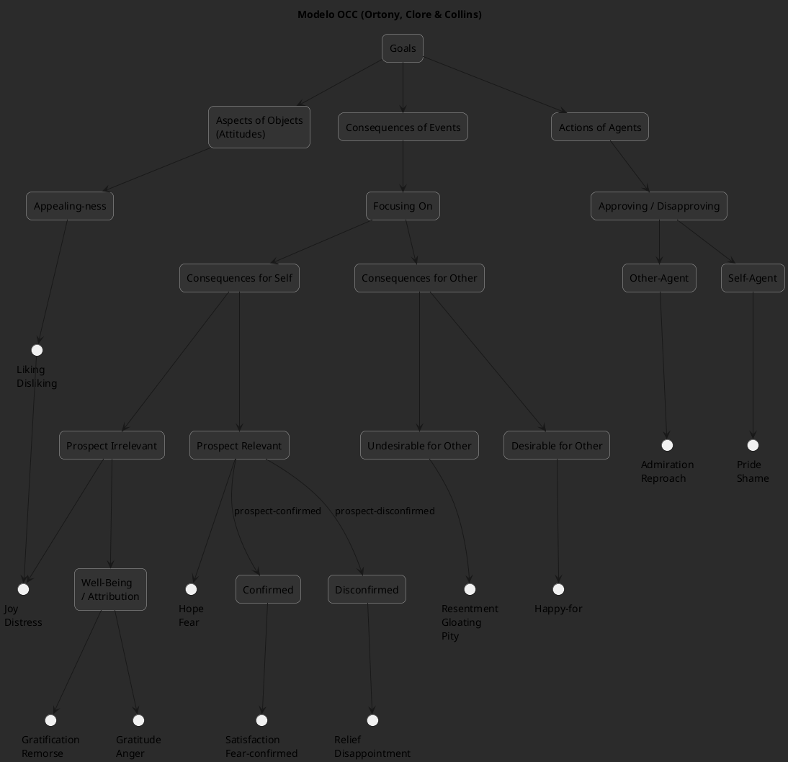
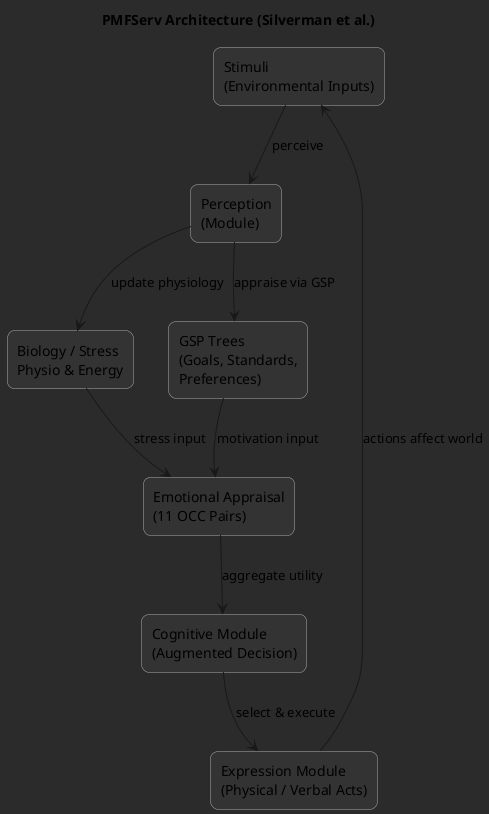

# Emotion Modeling in Social Simulation: A Survey
### Introduction

1.1One of the problems encountered with multi-agent simulations of real world situations is defining realistic models. This realism is important in order for the simulation results to be credible, as pointed out by van Ruijven ([2011](https://www.jasss.org/21/2/5.html#van2011)). However, defining a realistic model of inherently complex and unpredictable human behavior is particularly hard.

1.2To create believable agents in simulations, using simple reactive behaviors is insufficient as explained by Adam & Gaudou ([2016](https://www.jasss.org/21/2/5.html#adam2016)). A simple reactive behavior is useful to model low level actions such as moving to a point, but when simulating humans who need to decide between many different options, a higher level of thought is required. As noted by Balke & Gilbert ([2014](https://www.jasss.org/21/2/5.html#balke2014)) and Sun ([2007](https://www.jasss.org/21/2/5.html#sun2007)), adding cognition to agents is a way to tackle this issue by enabling the creation of more complex, human-like behaviors.

1.3Emotional agents have also been shown to be more believable. In particular, Bates ([1994](https://www.jasss.org/21/2/5.html#bates1994)) shows that emotions are used in art (in particular animation movies) to create believable characters, while unemotional characters are identified as objects, no matter if they look or act like humans. For Damasio and Sutherland ([1994](https://www.jasss.org/21/2/5.html#damasio1994)), emotions are strongly related to human decision-making and are an integral part of reasoning. They must therefore be considered when simulating human reasoning and decisions in agents. Finally, Nair et al. ([2005](https://www.jasss.org/21/2/5.html#nair2005)) studied the role played by emotions in teamwork and found that a team of humans in a stressful situation will react according to emotions, not according to a cognitive process. For example, when people evacuate a building in a crisis situation, ideally everybody should evacuate calmly via the nearest exits and follow orders. In reality, in such a situation people might be scared or panic, which influences their behavior in different ways: some run towards exits while others freeze. Emotions clearly play a decisive role in human behavior in such situations. Therefore, modeling emotions enables the creation of agents with more human-like behavior, thus increasing the validity of the resulting simulation. Moreover, emotions provide higher level explanations of the agents’ behavior, helping modelers to understand the simulation result.

1.4This idea to add emotions into the field of social simulation is also supported by Jager ([2017](https://www.jasss.org/21/2/5.html#jager2017))’s EROS (Enhancing the Realism Of Simulation) principle. Indeed, according to this principle, one way to improve the realism of social simulations is to use psychological theories developed to understand the way people dynamically make decisions. Since emotions are an important psychological component in human decisions, they should therefore be included in social simulations in order to improve their realism.

1.5The main purpose of this article is to understand the different ways used by modelers to handle emotional agents in social simulation. [Section 2](https://www.jasss.org/21/2/5.html#sect2) discusses different motivations showing that emotions should be a key component of multi-agent simulations when simulating humans. [Section 3](https://www.jasss.org/21/2/5.html#sect3) is an overview of various emotional theories, with a particular focus on cognitive appraisal theories. In [Section 4](https://www.jasss.org/21/2/5.html#sect4), the various representations of emotions used in multi-agent simulations are reviewed, and in [Section 5](https://www.jasss.org/21/2/5.html#sect5), with the same literature, the different uses of emotional agents in social simulations in the last few years are discussed. [Section 6](https://www.jasss.org/21/2/5.html#sect6) is an overview of some existing emotional architectures for social simulation to help the development of emotional agents. Finally, the state of emotional modeling is discussed in [Section 7](https://www.jasss.org/21/2/5.html#sect7) and [Section 8](https://www.jasss.org/21/2/5.html#sect8) serves as a conclusion.

### Motivations for Using Emotions in Multi-Agent Simulations

2.1In this section, different topics where multi-agent simulations would benefit from the use of emotional agents to improve their credibility are described. Emotions are a complex phenomenon which cannot be easily defined. Nevertheless, in this section, an emotion is considered to be an affective state of a person, created by the perception of the environment, which triggers a reaction.

#### Changing agents’ behavior with emotions

2.2As shown by Damasio and Sutherland ([1994](https://www.jasss.org/21/2/5.html#damasio1994)), emotions are tightly related to the way humans make decisions. Thus, emotions must be integrated when modeling humans who need to make decisions.

2.3Various works have been carried out to study the influence of a particular set of emotions over cognition. For example, Connolly & Zeelenberg ([2002](https://www.jasss.org/21/2/5.html#connolly2002)) studied the impact of regret on the decision-making process. Regret is one of the first emotions studied by decision researchers. Different works on regret show that experiencing regret about a decision changes the behavior of a person when facing the same decision again. Another example is the work of De Hooge et al. ([2007](https://www.jasss.org/21/2/5.html#de2007)) that focused on the role played by guilt and shame in cooperation between people. The result of a test carried out on students shows that a guilt emotion can improve the cooperation between people, changing their initial behavior. All of these studies tend to the same conclusion supported by Zeelenberg et al. ([2008](https://www.jasss.org/21/2/5.html#zeelenberg2008)); emotions modify motivations during a decision making process, making them a key component of human cognition.

2.4The role of emotions in cognition has been studied at a neurological level by Bechara ([2004](https://www.jasss.org/21/2/5.html#bechara2004)). They focused on patients that had a lesion in a specific area of the brain, giving them emotional disorders. These patients also had problems with decisional tests. The study demonstrates a link between the capacities to feel emotions and making good decisions. These results support the idea that emotions have to be taken into account to correctly reproduce the human decision making process.

2.5Frijda et al. ([1989](https://www.jasss.org/21/2/5.html#frijda1989)) propose another approach by considering that emotions are, by definition, linked to a specific action. They claim that feeling a particular emotion not only leads to a specific behavior, but also that the reason for the existence of this emotion is to produce this behavior. With this definition, the actions taken by a person are highly correlated to the emotional state of that person. Agents having different emotions may therefore exhibit different behaviors when facing the same situation, making the population more heterogeneous and unpredictable.

2.6These variations caused by emotions can be used in all sorts of simulations such as traffic simulations (e.g. angry drivers making wrong decisions), urban planning simulations (modeling the reactions of citizens towards new buildings, e.g. a prison, or towards new laws and regulations), etc. Emotions are relevant in any simulation involving emotionally-impacted human decisions.

2.7Of course, such agent behaviors can be implemented with simple decision rules. However, from the modeler’s point of view, it is easier to use explicitly the concept of emotions when human behavior is described as an answer to an emotional state. Indeed, it provides a higher level of abstraction and enables modelers to manipulate familiar concepts instead of abstract variables without real meaning.

#### Studying group dynamics with emotions

2.8Emotions can also be taken into account when studying the behavior of groups of people. As shown by Smith et al. ([2007](https://www.jasss.org/21/2/5.html#smith2007)), emotions play a role at a group level. This means that an individual can have a personal emotion and, at the same time, an emotion arising from their group membership. Seger et al. ([2009](https://www.jasss.org/21/2/5.html#seger2009)) indicate that this emotion related to a group can be used to define socially a group, but it also influences the behavior of people included in this group. This indicates that the study of groups of people would benefit from the use of emotions.

2.9Moreover, when studying groups of people interacting with each other, an emotional contagion occurs as explained by Hatfield et al. ([1993](https://www.jasss.org/21/2/5.html#hatfield1993)) and Barsade ([2002](https://www.jasss.org/21/2/5.html#barsade2002)). Emotional contagion is the process where the emotions of a person are influenced by the emotions of other people nearby. Creating credible simulations of groups and their interactions thus necessitates taking this process into account.

2.10Finally, emotions have a social role, as described by Frijda & Mesquita ([1994](https://www.jasss.org/21/2/5.html#frijda1994)), meaning that people can communicate through emotions and social relations and that these factors produce a behavior. Hence, people in a social group will communicate their emotions, which leads people around them to react to these emotions. For example, a person may express fear when looking at something hidden to another person. This other person will anticipate a reaction and change his/her behavior depending not only on the perceived fear, but also on the social link with the person. This reaction to others’ emotions needs to be taken into account to create realistic groups of agents simulating humans.

#### Synthesis

2.11This section explained, from a psychology point of view, the key role played by emotions in human cognition. As a result, it is useful to model emotions when studying humans who are making decisions. Indeed, taking emotions into account when modeling humans in social simulations can increase the believability of the agents’ behavior. Also, using emotions can provide a high level explanation of the agents’ behavior, helping modelers to understand and explain the simulation results. For example, the behavior observed in an evacuation during a crisis situation, where some people run to the exit while some others tend to freeze, can be explained more accurately by saying that these behaviors are the result of an emotional process. So, using emotions to model such a situation can help the modeler to understand the agents’ behavior.

2.12Other topics can also benefit from the use of emotions to improve the realism of the developed simulations. For example, emotions can be taken into account when studying opinion dynamics, to model how someone experiencing an emotion (such as fear or sadness) about a particular topic changes their opinion towards this topic. Brousmiche et al. ([2016](https://www.jasss.org/21/2/5.html#brousmiche2016)) use emotions in their study of attitudes towards a brand or a technology. The impact of emotions can also be taken into account when modeling the spread of infectious diseases or vaccination decisions in a realistic simulated population, since creating a realistic society is an important point in this field, as explained by Hunter et al. ([2017](https://www.jasss.org/21/2/5.html#hunter2017)).

2.13These few examples show some of the various situations where it is helpful to use emotions in multi-agent simulations. Using emotional agents leads to more realistic and believable simulations, and thus better scientific results. However, while an increasing number of modelers are using emotional agents, there is no standard in the way to use emotions. Moreover, most of the existing architectures featuring emotions require a high level of skill in programming. Consequently, most of modelers currently build simulations using emotions from scratch, which is complex and time consuming.

### Existing Emotional Theories

3.1This section explains how emotions are defined in psychology, and how these definitions have been used in artificial intelligence. In particular, the focus is on emotional theories designed to be used in multi-agent simulation to improve the credibility of a simulated human.

3.2In psychology, there is no global emotional theory. Lange & James ([1922](https://www.jasss.org/21/2/5.html#lange1922)) first lead a study on emotions and concluded that emotions are of a physiological origin. According to this theory, emotions are the result of a physiological response to perceived events. From this point of view, emotions are reflexes that do not need cognition. Cannon ([1927](https://www.jasss.org/21/2/5.html#cannon1927)) was the first to criticize this approach, explaining that an emotion is triggered faster than the physiological response to a situation. However, further researchers have shown that this assumption was partially wrong. From this starting point, different emotional theories have been proposed, arguing that emotions have a motivational origin, a behavioral origin, a communicative origin or a cognitive origin.

#### Emotional theories used in simulation

3.3Schachter & Singer ([1962](https://www.jasss.org/21/2/5.html#schachter1962)) were among the first to link cognition and emotion. Their idea is that an individual has to understand the physiological changes caused by a situation to trigger an emotion. These authors rely on sociological theories to explain that a person always needs to understand his/her physiological state.

3.4Arnold ([1960](https://www.jasss.org/21/2/5.html#arnold1960)) went further by introducing the concept of appraisal. Her theory is based on the idea that a person first appraises a situation with respect to personal criteria. This appraisal leads to an emotion and to a physiological response. This vision has been extended to create cognitive appraisal theories of emotions such as Frijda et al. ([1989](https://www.jasss.org/21/2/5.html#frijda1989)), Smith & Lazarus ([1990](https://www.jasss.org/21/2/5.html#smith1990)), Scherer et al. ([1984](https://www.jasss.org/21/2/5.html#scherer1984)) and Ortony et al. ([1988](https://www.jasss.org/21/2/5.html#ortony1988)). These theories define an emotion as the result of the cognitive appraisal of a situation. The difference between these approaches is mostly on the process and criteria used to appraise a situation.

3.5Among the other emotional theories used in simulation, there are works based on Russell & Mehrabian ([1977](https://www.jasss.org/21/2/5.html#russell1977)) that represent emotions on a continuous plane. These works use two or three dimensions to characterize an emotion. These dimensions are pleasure, arousal and dominance, when there is a third dimension. The idea is that the emotional state of a person is a point in a two or three dimensional space. Depending on the position, this emotional state expresses one particular emotion. However, this theory does not provide any model for the evolution of the emotional state.

3.6Cognitive appraisal theories of emotions explain why different people who face the same situation may have different emotions. These theories clearly define different emotions, contrarily to continuous theories or physiological theories. Moreover, cognitive appraisal theories express emotions with respect to a particular situation, making the emotional state of a person directly linked to a situation and not only to a particular physiological response. Applied in simulation, this allows creating heterogeneous agents which can dynamically respond to a change in their environment according to a well defined emotion.

#### A closer look at the two most popular emotional theories in simulation

3.7Smith & Lazarus ([1990](https://www.jasss.org/21/2/5.html#smith1990)) and Ortony et al. ([1988](https://www.jasss.org/21/2/5.html#ortony1988)) describe the two main emotional theories used in social simulation in recent years (see [Section 4](https://www.jasss.org/21/2/5.html#sect4)).

3.8Smith and Lazarus explain that a person is constantly appraising his/her environment. Emotions are created according to the goals of a person and the resources in the environment. This emotional process is made up of two steps: an appraisal step and a coping step.

3.9The emotional appraisal step triggers emotions according to the environment. It consists of a primary appraisal, evaluating the impact of the situation on the individual’s well-being, and a secondary appraisal, assessing the coping options that the individual possesses to face the situation. These two appraisal processes are complementary, and lead to an appraisal pattern which determines the triggered emotion. The authors define the appraisal patterns of nine negative (anger, anxiety, fright, guilt, shame, sadness, envy, jealousy, disgust) and six positive (joy, pride, affection, relief, hope, compassion) emotions. For example, fright is expressed as a "concrete and sudden danger of imminent physical harm".

3.10The coping step handles the impact of the triggered emotion on cognition or action, and is related to the stress level of the individual. The coping process can be seen as a way to minimize the stress caused by the triggered emotion. Smith and Lazarus have defined various coping strategies that can modify the actions chosen by a person or change their cognition. Some example of coping strategies are to seek social support, to turn to religion, to deny reality, or to put aside current concerns in order to focus on the situation causing the emotion.

3.11This theory is very complete as it explains both how emotions are triggered by cognition, and how emotions can change cognition. However, the notions developed, such as appraisal patterns or coping strategies, are very subjective and difficult to formalize from a computer science point of view.

3.12Ortony, Clore and Collins have developed another cognitive appraisal theory (often called the OCC theory) that focuses on the origins of emotions. From their point of view, emotions are valenced responses to the appraisal of three types of stimuli: events, actions performed by agents, and objects. This appraisal is performed with respect to three main variables: desirability of an event with respect to goals, praiseworthiness of an action with respect to standards, and appealingness of an object. These three main variables create three branches of emotions, each possessing its own variables to distinguish between specific emotions.

3.13The OCC model explains that when faced with a situation, people will first detect if the situation should be seen as an event, an action or an object, and evaluate it with respect to the corresponding main appraisal variable (desirability of events, praiseworthiness of actions, appealingness of objects). Then, they will evaluate the different appraisal variables of the particular branch, until an emotion is created.

3.14The OCC model defines twenty-two emotions grouped in eleven pairs of opposite emotions as shown in [Figure 1](https://www.jasss.org/21/2/5.html#fig1). One reason for its success is that it is easier to implement than the model proposed by Smith and Lazarus. It is only based on a small finite number of well-defined variables, and it is well structured as a typology. However, it does not provide a model for the coping behavior or for the impact of emotions on cognition.

3.15These works in psychology have been used in agent-based simulations to model emotions. However, there have been numerous implementations of these theories applied to various cases as explained in the rest of this paper; designers tend to start from scratch, and provide an _ad hoc_ implementation for their particular application, rather than re-using existing models.


![plantuml.com/plantuml/dsvg/VLNVRzCm47xtNt4A4cmI4GB4opHDItzqW42Pkg6zzCLDBfsfOmVRcQWG_plEkKtT9IFJrFlntVc-hnVtsZfkN5jBzWPct6p1FMADp6w5QhZXDQnviTqOtQfoggKsyEh3fFkB42LMl9Nk7d-xFMHEJmGnM3YkDXBX3mEOF6_vaPukeqs9PX_DwF7HPO0QXGRUVs9_6NF2-LxVTObIGpwTmbbkd5Qxjp3rfGYlmVUGGjbpvddTwoQL-8GI2kvmeur0ouuZ9JUQIvi0jq0MYtDJhIp-Qb4LQ45NC7z2vG9uEe-1MU64LeJ9DZqcoqumjl4EOVBrpyvSgRFCUJPjYVOyLEICqHYGfbV-ZCZ9ijZ9EshZuu5jryuWncSlTD5QeJQGApfdaRFfd3fvwqN6bJQG-vKmWJ6P_mNVeQm2jhFO8WyqgB3tAEMdNsZZMXKc9uIDUy_G2iFNtZoTmiS7S_nGvGjeoWHyc896c0rZCPBv_36HVEPDiqjztuGHA4ejqQ9ojVzVgHkfkVCIhzIjSBkaOpYgpmNS6ashaAwvnJ8cSiZ04ltASkM8n27gWwFWByQCmIdCI6wQDcupZ0OqYq1xzhh1bLeWz_HFi27zLUzMQYQiCsXj0fUN3oXbEa4lnDMLr-18jj2g4gR64jv1AMplFbke40nBD0QPKMc4YWE3yViMS05DFCauFFGQLfpCo_gcGO8xxeIjEDq0GQdqE26BMnwMHWgiI3M_MLg41QA58V7MdNXUfCmv8zPjrnOANJVTFMXZAOvIhzG9d7Hvc7IHuNTsIB3m6MQwCPv49GeUI2onriPYCi3GNRLIcTgWeOa75z_OxPCrNicdm2gm3YxD6PBTpPjbTD0n4FVe5ZQb8wYgSycBCVHcHY3o0wflIaTGzJ0U5x0U4zZV6j4nltlaDNPx7idj5vqA8tHMriBqOleZUF58UWr-15uI3Bdq2gKAhIKkVOXbT8z60TQRuV1lOkjjMZ19PW9i93Z-0XCnNknvNQCgsrh-0m00](https://www.plantuml.com/plantuml/dsvg/VLNVRzCm47xtNt4A4cmI4GB4opHDItzqW42Pkg6zzCLDBfsfOmVRcQWG_plEkKtT9IFJrFlntVc-hnVtsZfkN5jBzWPct6p1FMADp6w5QhZXDQnviTqOtQfoggKsyEh3fFkB42LMl9Nk7d-xFMHEJmGnM3YkDXBX3mEOF6_vaPukeqs9PX_DwF7HPO0QXGRUVs9_6NF2-LxVTObIGpwTmbbkd5Qxjp3rfGYlmVUGGjbpvddTwoQL-8GI2kvmeur0ouuZ9JUQIvi0jq0MYtDJhIp-Qb4LQ45NC7z2vG9uEe-1MU64LeJ9DZqcoqumjl4EOVBrpyvSgRFCUJPjYVOyLEICqHYGfbV-ZCZ9ijZ9EshZuu5jryuWncSlTD5QeJQGApfdaRFfd3fvwqN6bJQG-vKmWJ6P_mNVeQm2jhFO8WyqgB3tAEMdNsZZMXKc9uIDUy_G2iFNtZoTmiS7S_nGvGjeoWHyc896c0rZCPBv_36HVEPDiqjztuGHA4ejqQ9ojVzVgHkfkVCIhzIjSBkaOpYgpmNS6ashaAwvnJ8cSiZ04ltASkM8n27gWwFWByQCmIdCI6wQDcupZ0OqYq1xzhh1bLeWz_HFi27zLUzMQYQiCsXj0fUN3oXbEa4lnDMLr-18jj2g4gR64jv1AMplFbke40nBD0QPKMc4YWE3yViMS05DFCauFFGQLfpCo_gcGO8xxeIjEDq0GQdqE26BMnwMHWgiI3M_MLg41QA58V7MdNXUfCmv8zPjrnOANJVTFMXZAOvIhzG9d7Hvc7IHuNTsIB3m6MQwCPv49GeUI2onriPYCi3GNRLIcTgWeOa75z_OxPCrNicdm2gm3YxD6PBTpPjbTD0n4FVe5ZQb8wYgSycBCVHcHY3o0wflIaTGzJ0U5x0U4zZV6j4nltlaDNPx7idj5vqA8tHMriBqOleZUF58UWr-15uI3Bdq2gKAhIKkVOXbT8z60TQRuV1lOkjjMZ19PW9i93Z-0XCnNknvNQCgsrh-0m00)

**Figure 1**. Schema of the OCC model taken from Ortony et al. ([1988](https://www.jasss.org/21/2/5.html#ortony1988), 19).

### How Emotions Are Represented in Multi-Agent Simulations

4.1Different models exist to represent emotions in agent-based simulations. In this section, different types of representations used by researchers are reviewed, from using simple numerical values, to more complex representations that contain a name and many parameters, such as intensity or temporal decay. This section analyses these works only in the light of the **representations** of emotions, but the works cited here will then also be explained in more detail and with more context in [Section 5](https://www.jasss.org/21/2/5.html#sect5), in the light of the different **applications** of emotion models.

#### Emotions as simple numerical values

4.2The simplest way to represent an emotion is by using a numerical value standing for its intensity. This was used by Ta et al. ([2016](https://www.jasss.org/21/2/5.html#ta2016)) in an evacuation context where the agent has a fear emotion represented by a value between 0 and 1, with 0 meaning that the agent has no fear and 1 meaning that the agent is terrified. The way this emotion is used is described in [Section 5.30](https://www.jasss.org/21/2/5.html#5.30). Still in the evacuation context, in the work of Tsai et al. ([2011](https://www.jasss.org/21/2/5.html#tsai2011)), an emotion is defined as a value between 0 and 2 while Faroqi & Mesgari ([2015](https://www.jasss.org/21/2/5.html#faroqi2015)) uses a scale of 6 levels, from 1 to 6, to represent a fear emotion. The way these emotions are used by their author is described in [Section 5.33](https://www.jasss.org/21/2/5.html#5.33) and [5.34](https://www.jasss.org/21/2/5.html#5.34). The main advantage of a simple emotion is that it is easy to integrate in an agent as a numerical parameter which can be changed by a mathematical function.

4.3Le et al. ([2010](https://www.jasss.org/21/2/5.html#le2010)) use two numerical values to represent a fear emotion: an intensity value, and a duration value. This work studies the integration of emotions in an evacuation model and shows that using such a simple representation of emotions already improves the realism of the agents’ behavior, as it is detailed in [Section 5.2](https://www.jasss.org/21/2/5.html#5.2).

4.4Finally, some modelers have used simple numerical values to represent many emotions in their agents. For example, Kazemifard et al. ([2011](https://www.jasss.org/21/2/5.html#kazemifard2011)) simulate a team of workers developing a software (see details in [Section 5.8](https://www.jasss.org/21/2/5.html#5.8)) and represent the pairs joy/distress and gratitude/anger with a value between 0 and 100. Luo et al. ([2008](https://www.jasss.org/21/2/5.html#luo2008)) define attraction and panic during the evacuation of an airport (see details in [Section 5.5](https://www.jasss.org/21/2/5.html#5.5)) with simple numerical values. Silverman et al. ([2006a](https://www.jasss.org/21/2/5.html#silverman2006a)) uses eleven values to stand for the eleven pairs of emotions defined by the OCC model, in a military simulation (see details in [Section 5.23](https://www.jasss.org/21/2/5.html#5.23)).

4.5The main advantage of a simple numerical representation is that it is easy to implement and use, as it can be considered like any other numerical parameter of an agent. However, isolated numerical values cannot represent the complete emotional state of an agent.

#### Emotions aggregated in vectors

4.6Another approach is the representation of an agent’s emotional state with a vector of numerical values. This was used in Zoumpoulaki et al. ([2010](https://www.jasss.org/21/2/5.html#zoumpoulaki2010)) for an evacuation model detailed in [Section 5.16](https://www.jasss.org/21/2/5.html#5.16) and El Jed Mehdi et al. ([2004](https://www.jasss.org/21/2/5.html#el2004)) for the simulation of firemen in [Section 5.18](https://www.jasss.org/21/2/5.html#5.18). Each emotion is represented by a numerical value, its intensity, and all the intensities are aggregated in a vector representing the agent’s emotional state. This representation enables modelers to change the whole emotional state of an agent according to a change in the environment, but still with the easiness of a simple numerical computation.

4.7However, such a representation does not offer any differentiation between emotions, i.e. the meaning of each component of the vector is decided by the modeler and is not related to a situation.

#### Emotions represented in a dimensional space

4.8Schweitzer & Garcia ([2010](https://www.jasss.org/21/2/5.html#schweitzer2010)) chose to base their work for the simulation of on-line communities on a continuous representation of emotions in a two dimensional space. This means that the emotional state of an agent is characterized by a value of pleasure and a value of arousal. These two values are bounded between -1 and 1, creating a plane in which the emotional state is a point. The evolution of this emotional state is described in [Section 5.35](https://www.jasss.org/21/2/5.html#5.35).

4.9This idea is completed by Rincon et al. ([2016](https://www.jasss.org/21/2/5.html#rincon2016)) with a third dimension, dominance, for modeling a social society as explained in [Section 5.38](https://www.jasss.org/21/2/5.html#5.38). This three dimensional representation is called the PAD space by Russell & Mehrabian ([1977](https://www.jasss.org/21/2/5.html#russell1977)) and considers an emotion as a continuous process. Depending on its location in the PAD space, the emotional state expresses a different emotion, indicating that an agent is only affected by one emotion at a time. This implies that a given emotion is defined by its coordinate in the PAD space and not empirically by the modeler.

#### Symbolic representation

4.10Finally, some modelers have decided to work with a more symbolic representation of emotions: an emotion is represented with a name, various numerical values and is linked to a creation process. For example, Marreiros et al. ([2010](https://www.jasss.org/21/2/5.html#marreiros2010)) link the emotion of their agent to the rules described in the OCC model for the simulation of teamwork in a group decision process as detailed in [Section 5.20](https://www.jasss.org/21/2/5.html#5.20). This means that an agent will feel joy about a certain event if this event fulfills the agent’s desires.

4.11Gratch & Marsella ([2004a](https://www.jasss.org/21/2/5.html#gratch2004a)) link the emotions to rules based on appraisal variables taken from the Lazarus and Smith theory of emotions for the creation of a general emotional architecture unrelated to any case study. This means that a particular emotion has a name, an intensity and is the result of a certain combination of appraisal variables. The way this representation is used by its author is detailed in [Section 5.27](https://www.jasss.org/21/2/5.html#5.27). Henninger et al. ([2003](https://www.jasss.org/21/2/5.html#henninger2003)) use a similar approach by defining emotions as the result of inference rules defined over a value of pleasure/pain, clarity/confusion and a value of arousal, for the simulation of soldiers as detailed in [Section 5.27](https://www.jasss.org/21/2/5.html#5.27).

4.12This kind of representation enables emotions to be created that are directly related to a situation. This means that the agent can be aware of the situations that caused the emotions in detail. However, it is more complicated to manipulate an emotion represented this way as it is not reduced to a finite number of numerical values.

#### Synthesis

4.13This section shows that there already exists different ways to represent emotions in multi-agent simulations, from simple numerical values to more complex representations.

4.14The use of simple numerical values to represent emotions means that emotions can be considered as a simple parameter of the agent. Therefore, emotions are easy to use and only require the definition of simple computation rules to integrate them into an agent’s behavior. This makes it usable for modelers who are not expert in emotional theories and who want to test the addition of emotions in their model. However, this representation is quickly limited in terms of expressiveness and genericity.

4.15Other modelers have decided to use a combination of numerical values to represent not only one emotion of an agent but also its global emotional state. This means that all the emotions of an agent are affected at the same time by a situation, and it is this whole state that changes the agent’s behavior. This representation is closer to cognitive appraisal theories while still keeping the easiness of use of a numerical representation.

4.16Finally, a more conceptualized approach defines the emotions of an agent in relation to a set of rules. These rules can be inspired by a cognitive appraisal theory, making the emotions definitions closer to psychology. However, such a representation is more difficult to use than simple numerical values as it is tightly related to the cognitive process of the agent.

4.17The different representations of emotions in simulation are summarized in [Table 1](https://www.jasss.org/21/2/5.html#tab1) with their respective benefits and drawbacks.

|   |   |   |
|---|---|---|
**Table 1:** Comparison between the different representation of emotions used in simulation.
|Representations|Benefits|Drawbacks|
|**Simple numerical value** ([Ta et al. 2016](https://www.jasss.org/21/2/5.html#ta2016), [Tsai et al. 2011](https://www.jasss.org/21/2/5.html#tsai2011), [Faroqi Mesgari 2015](https://www.jasss.org/21/2/5.html#faroqi2015), [Le et al. 2010](https://www.jasss.org/21/2/5.html#le2010), [Kazemifard et al. 2011](https://www.jasss.org/21/2/5.html#kazemifard2011), [Luo et al. 2008](https://www.jasss.org/21/2/5.html#luo2008), [Silverman et al. 2006a](https://www.jasss.org/21/2/5.html#silverman2006a))|easy to implement, easy to use|too simple to represent the complete emotional state of an agent|
|**Vectors** ([Zoumpoulaki et al. 2010](https://www.jasss.org/21/2/5.html#zoumpoulaki2010), [El Jed Mehdi et al. 2004](https://www.jasss.org/21/2/5.html#el2004))|usable with mathematical computation, easy to implement|no strong link between a value and a particular emotion|
|**Value in a dimensional space** ([Schweitzer & Garcia 2010](https://www.jasss.org/21/2/5.html#schweitzer2010), [Rincon et al. 2016](https://www.jasss.org/21/2/5.html#rincon2016))|good representation of the overall emotional state, easy to implement|no clear distinction between different emotions|
|**Symbolic representation** ([Henninger et al. 2003](https://www.jasss.org/21/2/5.html#henninger2003), [Marreiros et al. 2010](https://www.jasss.org/21/2/5.html#marreiros2010), [Gratch & Marsella 2004a](https://www.jasss.org/21/2/5.html#gratch2004a))|differentiation between emotions, emotional state not reduced to one emotion and linked to a situation|complicated to use and to implement|

### How Emotions Are Used in Multi-Agent Simulations

5.1Once emotions are represented, they need to be integrated into the agents’ behavior. Different processes are linked to emotions in social simulations. Some processes are more focused on triggering emotions by the perception of the environment and some are more related to the evolution of the emotional state during the simulation. Also, these various processes use different implementation methods with different complexities.

#### Reactive creation of emotions

5.2An easy way to integrate emotions is to use reactive emotions, which means that emotions are directly created by the perception of given events. No cognition is involved and all of the agents, facing the same situation, will feel the same emotion.

5.3Le et al. ([2010](https://www.jasss.org/21/2/5.html#le2010)) use emotions in the context of an emergency evacuation of a building. Emotions are described by an intensity and a duration, as explained in [Section 4.2](https://www.jasss.org/21/2/5.html#4.2), and are taken into account only if their intensity is above a certain threshold. The study only uses the fear emotion to change the behavior of agents evacuating a building on fire. A simple emotional contagion is added to propagate an emotion between agents.

5.4The emotional system works as follows: the perception of a fire increases the intensity of the agent’s fear emotion, if this intensity is above a certain threshold, it modifies the agent’s behavior. This level of fear can evolve in time: it increases if other fires or other fearful agents are perceived and it decreases if not. Three thresholds are used for the intensity of the fear to create three different behaviors according. For example, the higher the fear level, the faster the agent runs towards the exit.

5.5The evacuation of a building is also the context of the work of Luo et al. ([2008](https://www.jasss.org/21/2/5.html#luo2008)), who simulate a crowd in an airport when a bomb explodes. Here again, emotions are added to improve the credibility of agents moving in a crowd under both normal circumstances and evacuating a hazardous situation. In this case, the authors define an attraction emotion used in the normal situation while a panic emotion is used in the evacuation process.

5.6Both those emotions are defined as dynamic variables of the agent, as explained in [Section 4.4](https://www.jasss.org/21/2/5.html#4.4). The attraction intensity models how likely an agent is to be attracted to some objects in a normal situation, while the panic intensity models the fear level felt by an agent evacuating. In a panic, the agent tries to evacuate the airport. These emotions are triggered by the perception of a certain object for the attraction, and by the perception of a danger for the panic. These two emotions are a part of the agent’s attributes along with its physiological abilities and its social group skills.

5.7However, this reactive creation of emotion does not rely on any emotional theory described in psychology. This means that the results obtained with these emotions cannot be interpreted scientifically.

#### Fuzzy appraisal

5.8Some modelers choose to use fuzzy logic rules to model the creation of emotions for their agents.

5.9Kazemifard et al. ([2011](https://www.jasss.org/21/2/5.html#kazemifard2011)) worked on COCOMO, a method used to evaluate the cost of software development. To improve this method, they proposed to take into account the employees involved in software development by simulating their behavior with a multi-agent simulation. In this context, the modeler considers the couples joy/distress and gratitude/anger as emotions to create a realistic behavior, as well as other aspects of the agents such as the level of technical knowledge, or the level of communication skill. The way these emotions are described is explained in [Section 4.4](https://www.jasss.org/21/2/5.html#4.4).

5.10To model all the aspects of their agents, Kazemifard _et al._ use fuzzy logic. For the emotional part, each couple of emotions has a value between 0 and 100. A fuzzy inference rule transforms this value into an actual emotion. For example, a value of 80 for the couple joy/distress corresponds to a distress emotion. This emotion is then used to compute an initial mood for the agent and this mood will then be used to modify the agent’s behavior. As agents simulate people working, an agent in a good mood works faster than an agent in a bad mood.

5.11The authors carried out an experiment where agents were initialized with a neutral mood. The results indicate that modeling the employees who create software improves the estimated cost of software development, but it is due more to the presence of cognitive agents over emotional agents.

5.12Jones et al. ([2011](https://www.jasss.org/21/2/5.html#jones2011)) have also used fuzzy logic to define emotions. Here the context is a traffic simulation. The emotions will lead the drivers to change their behavior, for example rescheduling their path if they fear being delayed because of a traffic jam. Emotions are based on the OCC theory and implemented using fuzzy logic, which is also used to implement the perception of the agents. Here, emotions are represented as in [Section 4.4](https://www.jasss.org/21/2/5.html#4.4).

5.13Fuzzy sets are used to define the perceptions of the driver agent. This way, the agent knows if its average speed is normal or low, if the number of vehicles on a road is low, normal or high, and if the percentage of trucks is low or high. Because of fuzzy rules, this information indicates the occurrence of a perceived event. With the same reasoning, a desirability is computed for each event, depending on its occurrence, its impact and its importance. In this case, emotions are built upon this desirability notion according to their definition in the OCC theory.

5.14In the illustrative example chosen by the authors, a driver agent blocked in a traffic jam perceives the event "travel time delayed". As it is not desirable and it is very likely, this leads to triggering a distress emotion and a fear emotion about this event. The authors explain that it is this fear that changes the driver’s behavior in order, for example, to modify its path.

5.15Again, this emotional modeling using fuzzy rules does not rely on any psychological theory about emotions.

#### Emotions based on cognitive appraisal theories

5.16Other modelers chose to integrate emotional behavior in their agents using cognitive appraisal theories proposed in psychology. This is the case with Zoumpoulaki et al. ([2010](https://www.jasss.org/21/2/5.html#zoumpoulaki2010)) who created an agent architecture for the study of evacuations, incorporating personality traits and emotions as described in [Section 4.6](https://www.jasss.org/21/2/5.html#4.6).

5.17In this work, emotions are the result of the appraisal of the situation, and not directly from a perception. Events are appraised according to the agent’s personality and according to the consequences on the agent’s goals, as described by cognitive appraisal theories. The emotional state of the agent is represented by a vector of five pairs of positive/negative emotions from the OCC model. In the implementation, the emotional vector contains five intensities and the appraisal process consists in vector computations involving a matrix to link emotions and personality, changing the emotions’ intensities. Finally, these intensities are taken into account by the agent when it chooses a desire to fulfill.

5.18This representation of the emotional state as a vector containing emotions’ intensities is also used by El Jed Mehdi et al. ([2004](https://www.jasss.org/21/2/5.html#el2004)) in the context of simulating firefighters tackling a fire. The four emotions from the OCC theory are satisfaction, disappointment, anger and fear, each with an intensity between 0 and 1. Once again, this vector is modified by vector computation as the emotional impact of an event is represented through a vector. The agent’s personality is linked to the emotions by a matrix indicating the weight of personality trait over a particular component of the emotional vector.

5.19Oliveira & Sarmento ([2003](https://www.jasss.org/21/2/5.html#oliveira2003)) also worked on simulating firefighters with the development of the _Pyrosim_ platform. In this model, emotions are considered as high level concepts and the appraisal is represented by a theoretical function taking into account the agent’s perceptions, its cognition, and its emotional mental state. This theoretical function can be changed according to the application case. For example, for the Pyrosim platform, fear is triggered when the agent perceives a danger. The agent can then adapt its behavior according to the emotion raised by the situation.

5.20The rule-based representation of appraisal, described in [Section 4.10](https://www.jasss.org/21/2/5.html#4.10), has also been used by Santos et al. ([2006](https://www.jasss.org/21/2/5.html#santos2006)) and Marreiros et al. ([2010](https://www.jasss.org/21/2/5.html#marreiros2010)) to simulate team work in a group decision process. Both works use the twelve emotions described in the revised OCC model Ortony ([2002](https://www.jasss.org/21/2/5.html#ortony2002)) and model the appraisal process with rules such as "agent i feels joy about an event P if this event fulfills one of its desires". These rules directly stem from the OCC theory. An intensity is then computed for each emotion and used to change the agent’s mood. This mood is then used to modify the agent’s behavior in the group decision process.

5.21Ochs et al. ([2009](https://www.jasss.org/21/2/5.html#ochs2009)) endowed non-playable characters in video games with emotions in order to make their behavior more realistic. They used the OCC appraisal theory to implement ten emotions, as described in [Section 4.10](https://www.jasss.org/21/2/5.html#4.10). Concretely, each situation contains variables that are evaluated by the agent depending on its mental state. This evaluation triggers an emotion, based on the OCC model of emotions. It is one of the most complete implementations of the OCC theory, and also includes personality and social relations between agents. However, the modeler must precisely implement each situation and also specify how it is evaluated by the agent.

5.22Other modelers have implemented emotional systems closer to the theory of Lazarus and Smith with an appraisal done with dedicated variables, which are not correlated to the cognitive process used by the agent. The appraisal of a situation changes the value of some variables and then, depending on rules about these variables, emotions are created inside the agent.

5.23The approach proposed by Silverman et al. ([2006a](https://www.jasss.org/21/2/5.html#silverman2006a)) is to give each agent three trees to define its preferences, its standards and its goals. Each tree has nodes to represent the agent’s motivation toward the possible situations. When an agent faces an event, it appraises it with the corresponding node, triggering a computation over the eleven couples of emotions from the OCC model. Finally, the eleven intensities are aggregated to produce a utility value that can change the agent’s behavior. This model is used in a military model to simulate soldiers and civilians. For example, if the civilians are afraid of the soldiers, they will not cooperate with them and they may protect the enemies.

5.24One of the drawbacks of this approach is that it is disconnected from the agent’s cognition as the trees are initialized at the start of the simulation; the evolution of a situation will not modify the appraisal process. However, this disconnection enables this model to be adaptable to other case studies. For example, Pelechano et al. ([2005](https://www.jasss.org/21/2/5.html#pelechano2005)) used the same architecture to create emotional agents evacuating a building. Only the nodes were modified and simulated people feel fear about an event or anger, which makes them stop following the person in charge of the evacuation for example.

5.25Dias & Paiva ([2013](https://www.jasss.org/21/2/5.html#dias2013)) use another approach by decomposing the appraisal process in two parts. A first step evaluates a situation according to appraisal variables that are not directly related to the agent’s cognition. The second step applies rules over these appraisal variables to produce emotions. In this work, an emotion is defined with a name, a valence (to know if it is a positive or a negative emotion) and an intensity computed from the appraisal variables.

5.26This method enables an agent to reason about its own emotions: finding the rule responsible for the emotions, then the corresponding variables, and finally the action that changed the variable values. The rationale for this approach is explained by the context of the work; developing non playable characters for a video game that need to react emotionally to the situation in the game, but that also need to trigger some emotions in the player. The choice of this approach, close to planning, is explained by the fact that the cognition of the agent is based on planning.

5.27This idea of dividing the appraisal in two parts has also been chosen by Henninger et al. ([2003](https://www.jasss.org/21/2/5.html#henninger2003)) in a military simulation. The situation perceived by a soldier is appraised according to a value of pleasure/pain and a value of clarity/confusion. The second step is the application of rules such as "if the appraised situation has raised clarity and pleasure, it creates joy". Incorporating the dimension of arousal from a situation, the agent can feel joy, anger, surprise, fear, panic, anxiety and regret, represented as in [Section 4.10](https://www.jasss.org/21/2/5.html#4.10). These emotions can then be used to change the agent’s behavior, making the soldier retreat when facing a threatening situation.

5.28Continuing in the context of military simulation, Gratch & Marsella ([2004a](https://www.jasss.org/21/2/5.html#gratch2004a)) have proposed an implementation of Lazarus and Smith’s emotional theory with emotions represented as in [Section 4.10](https://www.jasss.org/21/2/5.html#4.10). The appraisal part is once again done with appraisal variables added to the agent. Specifically, twelve variables are added, and the appraisal of a situation consists in giving a certain value to the concerned variables. Then, general rules are defined to create emotions depending on the state of the appraisal variables.

5.29This work also proposes a model for the coping system that specifies how an agent reacts to its own emotions. The system is based on multiple coping strategies which have different initial conditions and different outcomes. The agent chooses between all of the strategies according to its own emotions, the strategy then indicates to the cognition what to do, with the goal of bringing the agent back to a more stable emotional state.

#### Dynamics of emotions

5.30Finally, some researchers are interested in the evolution of emotions over time. In their studies, they consider that agents start with a set of emotions, and they focus on the changes of these emotions over time and the consequences of these changes on the agent’s behavior.

5.31Ta et al. ([2016](https://www.jasss.org/21/2/5.html#ta2016)) study the evacuation of a building, considering that the agents feel fear at the start of the simulation. This work models the evolution of the fear intensity between 0 and 1. Various equations take into account the proximity of the danger, the emotional contagion from the other agents, and also a decay in time. The agents’ behavior depends on the level of fear which means that during a simulation, an agent will go faster or slower if it has a high or a low level of fear.

5.32The same idea is applied to the evacuation of a shopping mall by Nguyen et al. ([2014](https://www.jasss.org/21/2/5.html#nguyen2014)). This second work tests various scenarios with multiple initial proportions of emotional agents with different initial levels for their fear emotion. The work concludes that the higher the proportion of emotional agents, the more realistic the simulation.

5.33Tsai et al. ([2011](https://www.jasss.org/21/2/5.html#tsai2011)) go a bit further by considering a fear emotion in the evacuation of an airport as a value between 0 and 2. This level of fear evolves during the simulation as a function of the proximity of the danger, the number of authority figures present, and the emotional contagion from other agents. The higher the fear level, the faster agents will go to the exit. However, this relation is not linear; under an intensity of 1, the agent still has the control of its emotion, but above an intensity of 1, the agent feels panic. In the simulation, this means that fear has no effect on the agents’ speed under an intensity of 1 but an agent with a fear intensity of 1 still feels fear, which can change other components of its behavior.

5.34Faroqi & Mesgari ([2015](https://www.jasss.org/21/2/5.html#faroqi2015)) use the same idea of different levels of an emotion in the evacuation of an open square. Each agent has a transition diagram of six steps from calm to hysteria. This fear level indicates the probability of an agent to move randomly. The simulation also features security agents who indicate the location of an exit to the randomly moving agents, calming them from hysteria and reducing their fear level. This very simple emotional model produces interesting results, showing that taking into account emotions creates a more credible simulation.

5.35Schweitzer & Garcia ([2010](https://www.jasss.org/21/2/5.html#schweitzer2010)) propose a different approach by representing the emotional state of an agent on a two dimensional plane with a value for valence and a value for arousal. Valence indicates whether an emotion is positive or negative and arousal expresses the "degree of activity induced by that emotion". Each variable is defined between -1 and +1. The evolution of these variables follows the concept of Brownian agents, where each agent’s variables change over time according to an equation encompassing a deterministic and a stochastic part.

5.36Here, the equations for valence and arousal tend to return the agent’s emotional state back to a stationary state. This model is then applied to the simulation of online communities to study the evolution of the emotional state of communities. The model also modifies the emotions according to the messages exchanged by the community, which represent the stochastic part of equations.

5.37This representation of emotions on a two dimensional plane is also used by Šuvakov et al. ([2012](https://www.jasss.org/21/2/5.html#%C5%A1uvakov2012)) to simulate the spread of an emotion in an online social network. Here again, the variables of valence and arousal are used with stochastic equations to model the evolution of the emotional state of agents communicating through an online social network. To validate this work, the authors extracted emotions from a sample of the MySpace platform and quantified these emotions in terms of valence and arousal. To better understand the results, they also placed on their two dimensional map the conventional emotions, i.e. they transformed the concepts of "amused", "ashamed" or "worried" into values of valence and arousal. This work makes a link between the triggering of an emotion by an appraisal method and the dynamic behavior computed with mathematical equations.

5.38Finally, Rincon et al. ([2016](https://www.jasss.org/21/2/5.html#rincon2016)) use a third dimension to the previous two dimensional model by applying a dominance variable. Representing an emotion with three factors leads the authors to compare an emotion to a particle, and to use Newtonian gravity equations to model their movements in the three dimensional space. The mass of a particle is replaced by the inverse of an empathy value between 0 and 1, which indicates the strength necessary to change an emotion. As the work focuses on the emotional contagion in a society of emotional agents, other parameters related to this subject are taken into account in the computation of the emotions’ evolution.

#### Synthesis

5.39This section shows that researchers have already used and developed different ways to handle emotions in multi-agent simulations. The different types of use of emotions in social simulations during recent years are summarized in [Table 2](https://www.jasss.org/21/2/5.html#tab2), along with the benefits and drawbacks for each use.

5.40First, this review indicates there is no link between the context of the study and the process used to model emotions. The impact of emotions in the context of evacuation has been studied with various emotional processes: a reactive creation of emotions; a more complex mechanism based on appraisal theory; or even only with a simple evolution process.

5.41Secondly, the kind of representation used by modelers (as explained in [Section 4](https://www.jasss.org/21/2/5.html#sect4)) has an effect on the process used to model the dynamics of emotions. A simple numerical value is well adapted to a reactive creation process, while a complex representation fits well with the use of cognitive appraisal theories. This indicates that the modeler needs to focus on the role given to emotions in their simulation. If emotions are one of the parameters of the agent, they can be modeled as a set of numerical values driving simple computation rules. If emotions are considered as an important part of the agent’s behavior, then it should be based on a psychological theory.

5.42Most of the works reviewed in this section use emotions in an evacuation or a military context. These situations are very suitable for the use of emotions as people in these contexts need to make quick decisions under pressure. However, emotions have to be used in other situations. As explained in [Section 2](https://www.jasss.org/21/2/5.html#sect2), emotions are involved each time someone makes a decision, and have an impact on group behavior. So emotions can (and should) also be used for instance in simulations of pedestrians and drivers, or social communities; this would help creating and explaining non-rational behaviors in order to make simulations more realistic.

5.43All of these examples demonstrate that there is no standardization in the use of emotions in social simulations. Moreover, most of the works described implement emotions from scratch without using a dedicated architecture, which requires time and expertise on emotions. This implies that modelers refrain from using emotions in their agents as it is time consuming.

5.44With the use of standard architectures, it is easier to develop emotional agents with little knowledge in psychology, which means that emotional agents will go towards democratization. Furthermore, using standard architectures will allow simulations to be reproduced and compared, which means obtaining better scientific results.

|   |   |   |
|---|---|---|
**Table 2:** Comparison of the different uses of emotions in simulations.
|Different Uses|Benefits|Drawbacks|
|**Reactive creation** ([Le et al. 2010](https://www.jasss.org/21/2/5.html#le2010); [Luo et al.2008](https://www.jasss.org/21/2/5.html#luo2008))|easy to use and implement|too simple to realistically cope with the process of emotions’ creation, no support from a psychological theory|
|**Fuzzy appraisal** ([Kazemifard et al. 2011](https://www.jasss.org/21/2/5.html#kazemifard2011); [Jones et al. 2011](https://www.jasss.org/21/2/5.html#jones2011))|can be used on emotions represented as simple numerical values, easy implementation|too simple to realistically cope with the process of emotions’ creation, knowledge of fuzzy logic required, no support from a psychological theory|
|**Creation through cognitive appraisal theories** ([Zoumpoulaki et al. 2010](https://www.jasss.org/21/2/5.html#zoumpoulaki2010); [El Jed Mehdi et al. 2004](https://www.jasss.org/21/2/5.html#el2004); [Oliveira & Sarmento 2003](https://www.jasss.org/21/2/5.html#oliveira2003); [Santos et al. 2006](https://www.jasss.org/21/2/5.html#santos2006); [Marreiros et al. 2010](https://www.jasss.org/21/2/5.html#marreiros2010); [Ochs et al. 2009](https://www.jasss.org/21/2/5.html#ochs2009); [Silverman et al. 2006a](https://www.jasss.org/21/2/5.html#silverman2006a); [Pelechano et al. 2005](https://www.jasss.org/21/2/5.html#pelechano2005); [Dias & Paiva 2013](https://www.jasss.org/21/2/5.html#dias2013); [Henninger et al. 2003](https://www.jasss.org/21/2/5.html#henninger2003); [Gratch & Marsella 2004a](https://www.jasss.org/21/2/5.html#gratch2004a))|relies on psychological theories of emotions’ creation, mimic the human process of emotions’ creation, emotions are seen as a part of the cognitive behavior of the agent|knowledge of emotions’ theories required, complicated to implement|
|**Evolution over creation** ([Ta et al. 2016](https://www.jasss.org/21/2/5.html#ta2016); [Nguyen et al. 2014](https://www.jasss.org/21/2/5.html#nguyen2014); [Tsai et al. 2011](https://www.jasss.org/21/2/5.html#tsai2011); [Faroqi & Mesgari 2015](https://www.jasss.org/21/2/5.html#faroqi2015); [Schweitzer & Garcia 2010](https://www.jasss.org/21/2/5.html#schweitzer2010); [Šuvakov et al. 2012](https://www.jasss.org/21/2/5.html#%C5%A1uvakov2012); [Rincon et al. 2016](https://www.jasss.org/21/2/5.html#rincon2016))|complex mechanisms for the evolution of emotions’ intensities in time|creation process not explained|

### Architectures for Emotional Agents

6.1[Sections 4](https://www.jasss.org/21/2/5.html#sect4) and [5](https://www.jasss.org/21/2/5.html#sect5) have shown that, currently, most modelers tend to implement from scratch a way to handle emotions in their social agents. To ease the use of emotions in simulated humans, emotional architectures have been developed to prevent re-implementing the same structures.

6.2This section presents different existing emotional architectures that have been developed to add emotions to social simulations without the need of re-implementing an emotional theory. They aim to be as generic as possible, i.e. they are not domain-specific, and also to be as complete as possible in the implementation of the emotional theory on which they are based. The goal of this section is not only to present these architectures but also to investigate how they have been used by the community and what are their limitations.

#### DETT

6.3The DETT (for Disposition, Emotion, Trigger and Tendency) architecture proposed by Van Dyke Parunak et al. ([2006](https://www.jasss.org/21/2/5.html#van2006)) integrates an emotional system into a cognitive architecture based on the BDI paradigm described by Bratman ([1987](https://www.jasss.org/21/2/5.html#bratman1987)) as shown in [Figure 2](https://www.jasss.org/21/2/5.html#fig2).

6.4The main contribution of this architecture is the conditioning of the appraisal to a disposition and a trigger module. The disposition indicates how a certain belief should be appraised into a particular emotion. A military example is given in the article. One soldier can have a "cowardice" disposition and another can have an "irritability" disposition which means that the first soldier feels fear if he encounters an enemy while the second soldier feels anger for the same situation. The trigger module indicates which perception is the origin of a particular emotion. Eventually, the tendency module explains the consequences of an emotion on the agent’s intention.

6.5From the point of view of the modeler, the use of this architecture requires defining different dispositions to create heterogeneous agents, then attaching emotions from the OCC model to different beliefs created by perceptions, and finally describing the consequences of each emotion on the agent’s cognition.


```
@startuml
' Dark theme styling
skinparam backgroundColor #2B2B2B
skinparam defaultTextColor #EEEEEE
skinparam rectangle {
  BackgroundColor #333333
  BorderColor #AAAAAA
  RoundCorner 15
}

title DETT Architecture (Ortony, Clore & Collins Extension)

' Core BDI-like loop
rectangle "Beliefs" as Beliefs
rectangle "Intentions" as Intentions

' DETT modules
rectangle "Disposition\nModule" as Disposition
rectangle "Trigger\nModule" as Trigger
rectangle "Emotion\nGenerator" as Emotion
rectangle "Tendency\nModule" as Tendency

' Relationships
Beliefs --> Disposition : appraise according to
Beliefs --> Trigger     : identify trigger
Disposition --> Emotion : shapes evaluation
Trigger --> Emotion     : triggers appraisal
Emotion --> Tendency    : influences
Tendency --> Intentions : modifies intentions

@enduml
```
![plantuml.com/plantuml/dsvg/NP7FYXin38VlVWgnXVw1vj2MNdeekzc4ieTIM7BinPtHJ4GyyY3BPKFfkrTn7CPJvPAHFd_yXEwJUj4y1VS6TbvEe4US49AU0_7eqebuzk8d-EMxqoWnS_yOGnHuzN5x-JL4ZuFFGG_ueXNPbseGmKuzZm7XZmFO_g_yLEeoYTAZrEv3AUi-Nr5X5FZmsVrrJadDjTiV3l0WtP7K_5aGtluGZNn-3uzcG7WDfWh42VOlYfmeyZjd2viBORjxsWGw8OGOPxSalDjY81pI7VW4zNyxVc9JgQcknF9fvckaAVOvuEhHZj8S4rsud_ozpClhfj_Y1w5nH5cXjTTY-obUZT-GKRn6AMHjhuJ8FN9tNXjhynBy6OClMnnfJgwk3PlDrpOYV04_p-8f8VYkisCHZw1nnTUSO6KyzSXAmncqnczq1QzX3Kr7FsC2_Er3BbbSLRLSrLPRkkNnmLMWmBVDQWOUGhPFJEusADHoEeFiQ3GG9g3beFT6vody0m00](https://www.plantuml.com/plantuml/dsvg/NP7FYXin38VlVWgnXVw1vj2MNdeekzc4ieTIM7BinPtHJ4GyyY3BPKFfkrTn7CPJvPAHFd_yXEwJUj4y1VS6TbvEe4US49AU0_7eqebuzk8d-EMxqoWnS_yOGnHuzN5x-JL4ZuFFGG_ueXNPbseGmKuzZm7XZmFO_g_yLEeoYTAZrEv3AUi-Nr5X5FZmsVrrJadDjTiV3l0WtP7K_5aGtluGZNn-3uzcG7WDfWh42VOlYfmeyZjd2viBORjxsWGw8OGOPxSalDjY81pI7VW4zNyxVc9JgQcknF9fvckaAVOvuEhHZj8S4rsud_ozpClhfj_Y1w5nH5cXjTTY-obUZT-GKRn6AMHjhuJ8FN9tNXjhynBy6OClMnnfJgwk3PlDrpOYV04_p-8f8VYkisCHZw1nnTUSO6KyzSXAmncqnczq1QzX3Kr7FsC2_Er3BbbSLRLSrLPRkkNnmLMWmBVDQWOUGhPFJEusADHoEeFiQ3GG9g3beFT6vody0m00)
**Figure 2**. Schema of the DETT architecture taken from Van Dyke Parunak et al. ([2006](https://www.jasss.org/21/2/5.html#van2006), 3).



![plantuml.com/plantuml/dsvg/TPBFRnC_4CNl_Yj6_KfVKga51SI50sgIXef3HKGgJhrCxSd6YjTUZUsb4U9_PxoR7oOIarlcyvvVtkGk9kIKMwVUm3to3jAMMeAOzixwHiMTzHqojl22UjTmoDuiWWiC_xsVbqz56DfWTkc9NjC1MGvJ8KmweMySmIy5CB-q_31CsGGsn8TlPyCeWEyZofuOfX_LRwMIJUArUloo9kvXndfh4-cKcM2ojgudRj439K3tzbh9JrmdssPd0Rs1ZbXJbspmwfphwa0y-ydIzvQ3RyadTF3LTpd5wol0U7IfPQkJcIWVWycEHlQyaFTBLD2XxO8NrrWRp6rmeTd3Et5dYl7PhxRxQ0Fy3qjFtEm7Dw5gqSDw1KzC9FJa8Q2BDw96Rv1Dl147fWqnUKs7uCBNycKRIZ1qCEiwHXlHYT5q2jyM2rYXvODisSg-n5-4njjaUv9KzDgLd1VrdOcn1F6RvQPqI0RkITiY65q5_IlCoUyi7IhGwAIL7yGl9QW-7g7mIXqFUdlxkQeQP3wD1vOegbeKJaeim0Zbpc0Yw8QoomKkQUdiJEFO4q5lSMYpyX9uREe8n-6GOCi_HmdyJx2SeSVXnH6kjWMMfge8JSFKbCmvMMVJNbNhGfTYJdGaHpeDvoAT4wbgM-1ZVwErBXaYu6PJH3y3EwFko9lSkZy0](https://www.plantuml.com/plantuml/dsvg/TPBFRnC_4CNl_Yj6_KfVKga51SI50sgIXef3HKGgJhrCxSd6YjTUZUsb4U9_PxoR7oOIarlcyvvVtkGk9kIKMwVUm3to3jAMMeAOzixwHiMTzHqojl22UjTmoDuiWWiC_xsVbqz56DfWTkc9NjC1MGvJ8KmweMySmIy5CB-q_31CsGGsn8TlPyCeWEyZofuOfX_LRwMIJUArUloo9kvXndfh4-cKcM2ojgudRj439K3tzbh9JrmdssPd0Rs1ZbXJbspmwfphwa0y-ydIzvQ3RyadTF3LTpd5wol0U7IfPQkJcIWVWycEHlQyaFTBLD2XxO8NrrWRp6rmeTd3Et5dYl7PhxRxQ0Fy3qjFtEm7Dw5gqSDw1KzC9FJa8Q2BDw96Rv1Dl147fWqnUKs7uCBNycKRIZ1qCEiwHXlHYT5q2jyM2rYXvODisSg-n5-4njjaUv9KzDgLd1VrdOcn1F6RvQPqI0RkITiY65q5_IlCoUyi7IhGwAIL7yGl9QW-7g7mIXqFUdlxkQeQP3wD1vOegbeKJaeim0Zbpc0Yw8QoomKkQUdiJEFO4q5lSMYpyX9uREe8n-6GOCi_HmdyJx2SeSVXnH6kjWMMfge8JSFKbCmvMMVJNbNhGfTYJdGaHpeDvoAT4wbgM-1ZVwErBXaYu6PJH3y3EwFko9lSkZy0)
**Figure 3**. Schema of the PMFserv architecture taken from Silverman et al. ([2006b](https://www.jasss.org/21/2/5.html#silverman2006b), 7).

This architecture implements the OCC theory. However, the modeler needs to know emotional theory as he/she needs to define manually the situations that will lead to an emotion as a function of a disposition. So, the DETT architecture can be useful for an expert in emotional theory but it can be hard to use with valid results by social scientists who have little knowledge on that subject.

#### PMFServ

6.7Silverman et al. ([2006b](https://www.jasss.org/21/2/5.html#silverman2006b)) worked on the development of an architecture in order to create believable social agents. The general idea is to regroup different "performance moderator functions" (PMF) that model human behavior under stress according to different scopes. For example, there are PMF to model the biological response of an agent, PMF to model its cognitive response, or to model the influence of its culture or its emotions.

6.8The architecture called PMFServ is built upon various PMF, as shown in [Figure 3](https://www.jasss.org/21/2/5.html#fig3). It features perception of the environment, a biological appraisal, an emotional appraisal, a social module and finally a cognitive step to produce an action.

6.9The appraisal theory of emotions needs a representation of the agent’s motivations. This is done in PMFServ with three trees called GSP trees for Goals, Standards and Preferences. These three trees are an implementation of the three branches of the OCC model, i.e. emotions about events are in the goal tree, emotions about other agents’ behavior is in the standard tree and finally, emotions about the aspect of objects are modeled with the preference tree.

![[Pasted image 20250621205728.png]]
**Figure 4**. Schema of the EMA architecture taken from Gratch & Marsella ([2004a](https://www.jasss.org/21/2/5.html#gratch2004a), 278).