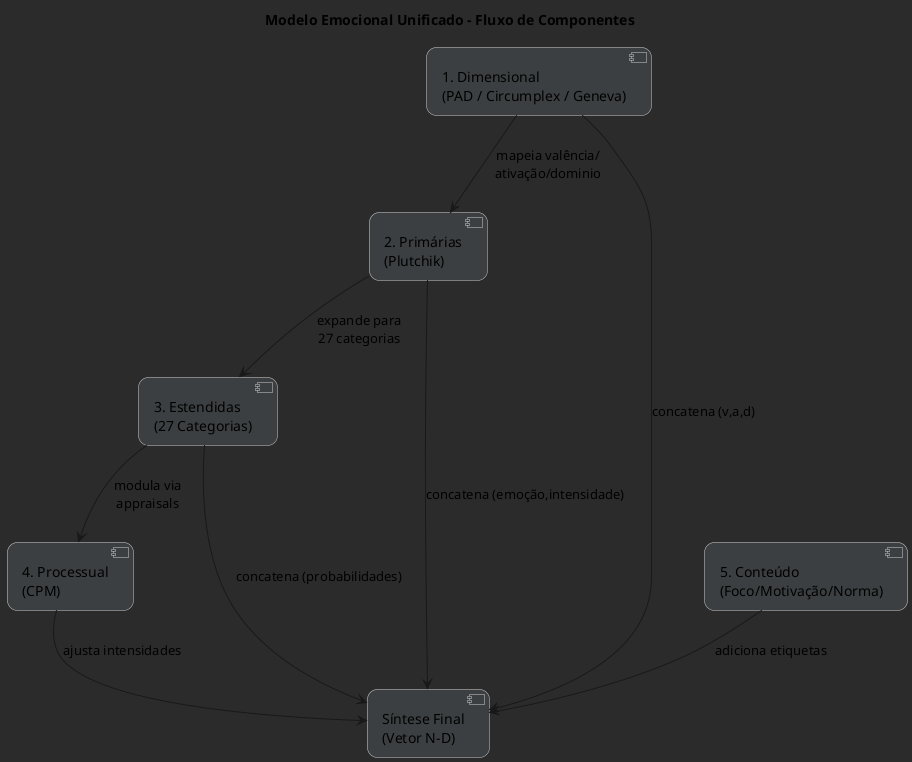

![[Pasted image 20250621202357.png]]A síntese unificada consiste em cinco módulos sequenciais, cada um com suas **entradas** (inputs), **mecanismos** internos e **saídas** (outputs). Juntos, eles produzem um vetor emocional rico e multidimensional capaz de modelar qualquer nuance dos sistemas OCC, PAD, Plutchik, Geneva, Cowen–Keltner e CPM.

## 1. Camada Dimensional (PAD / Circumplex / Geneva)

### Entrada

* **Autorrelato** ou **medidas fisiológicas** (ritmo cardíaco, condutância dermatogalvânica).
* **Estimadores de valência e ativação** extraídos de expressões faciais ou análise de texto/narração.

### Processamento

* **PAD**: calcula três coordenadas contínuas –

  * Pleasure (valência)
  * Arousal (ativação)
  * Dominance (controle percebido) ([en.wikipedia.org][1])
* **Circumplex/Core Affect**: projeta (valência, ativação) em espaço 2-D, descartando D para análises focais ([psu.pb.unizin.org][2], [pdodds.w3.uvm.edu][3])
* **Geneva Wheel**: mapeia valência e controle em quatro quadrantes, permitindo seleção de até 20 termos e intensidade em 5 níveis ([unige.ch][4], [researchgate.net][5])

### Saída

* Vetor **(v, a, d)** contínuo.
* Rótulos dimensionais (e.g. “positivo-alto domínio”, “negativo-baixa ativação”).

---

## 2. Camada de Emoções Primárias (Plutchik)

### Entrada

* Coordenadas PAD ou posição no Circumplex.

### Processamento

* **Roda de Plutchik**:

  * Identifica a emoção primária mais próxima (8 pólos: alegria, tristeza, confiança, repulsa, medo, raiva, surpresa, antecipação).
  * Avalia intensidade em três níveis internos → externos (pétalas internas são mais intensas) ([6seconds.org][6], [researchgate.net][7])

### Saída

* Par **\<emoçãoₚᵣᵢₘₐ́ʳⁱᵃ, intensidade>** (e.g., <“raiva”, alta>).

---

## 3. Camada de Categorias Estendidas (Cowen & Keltner)

### Entrada

* **Reações verbais/visuais** (self-reports, reconhecimento de expressões) a estímulos multimodais (vídeos, áudio, texto).

### Processamento

* **Mapeamento semântico** em **27 categorias discretas** (ex.: “divertimento”, “ansiedade”, “admiração”), usando análise de clusters e redução de dimensionalidade ([pnas.org][8], [researchgate.net][9])
* Mantém **gradientes contínuos** entre categorias, permitindo fusões (“calmness→aesthetic appreciation→awe”)

### Saída

* Vetor de probabilidades ou ativação para cada uma das 27 categorias.

---

## 4. Camada Processual (Component Process Model – CPM)

### Entrada

* **Descrição da situação** (evento, agentes, objetos).
* Variáveis de **appraisal**: novidade, relevância para metas, consequências, capacidade de enfrentamento, compatibilidade normativa.

### Processamento

* Sequência de quatro **Stimulus Evaluation Checks (SECs)**:

  1. **Relevance Check** – é o evento relevante?
  2. **Implications Check** – quais consequências para metas?
  3. **Coping Potential Check** – posso lidar/controlar?
  4. **Normative Significance** – é congruente com normas/valores? ([psu.pb.unizin.org][10])
* Cada estágio ajusta **intensidades emocionais** e pode gerar componentes fisiológicos e comportamentais.

### Saída

* Registro dos valores de **cada appraisal** (e.g. Relevance=0.8, Coping=0.3).
* Vetor de **modulação** (boost/attenuação) aplicado aos outputs das camadas 1–3.

---

## 5. Camada de Eixos de Conteúdo

| Eixo                    | Entrada                                                  | Saída / Etiqueta                                                         |
| ----------------------- | -------------------------------------------------------- | ------------------------------------------------------------------------ |
| **Foco (OCC)**          | Tipo de elicitor (evento, ação de agente, objeto)        | Self / Other / Event                          ([researchgate.net][11])   |
| **Motivação (BIS-BAS)** | Sensibilidade a punição (BIS) vs. recompensa (BAS)       | Evitação / Aproximação                        ([en.wikipedia.org][12])   |
| **Normatividade**       | Compatibilidade com normas culturais/internas (CPM SEC4) | Pró-social / Antagônico / Auto-centrado        ([psu.pb.unizin.org][10]) |

---

## 6. Síntese Final

### Entrada

* **Outputs** das camadas 1 a 5:

  * Vetor contínuo (v, a, d)
  * Emoção primária + intensidade
  * Probabilidades em 27 categorias
  * Valores de appraisal (RE, IM, CP, NS)
  * Rótulos de foco, motivação e normatividade

### Processamento

* **Concatenação** num vetor N-D (até \~12 dimensões).
* Normalização e **projeção** em espaço latente de alta dimensionalidade.
* Possibilidade de **retrocompatibilidade**: extrair subvetores que reconstroem OCC, PAD, Plutchik ou CPM isoladamente.

### Saída

* **Vetor de estado emocional** completo, capaz de:

  1. Reconstruir qualquer modelo individual (e.g., gerar rótulos OCC ou mapear no Circumplex)
  2. Alimentar simuladores, IAs sociais ou sistemas de recomendação com nuances finas (ex.: “ansiedade social mitigada por senso de controle e motivação de aproximação”)

---

**Essa arquitetura modular** garante:

* **Exaustividade**: cobre emoções básicas, estendidas e complexas (até 27+)
* **Flexibilidade**: aceita múltiplas fontes de input (self-report, fisiologia, análise multimodal)
* **Granularidade**: da dimensão bruta (v, a, d) até clusters semânticos e appraisals finos
* **Compatibilidade**: alinha-se a OCC, MBTI/Cognitive Functions e Big Five, mas livre de suas limitações binárias

Com esses componentes detalhados, torna-se viável implementar um **único motor emocional** capaz de capturar qualquer nuance dos seis sistemas originais e gerar simulações, previsões e recomendações com precisão de nível científico.

[1]: https://en.wikipedia.org/wiki/PAD_emotional_state_model?utm_source=chatgpt.com "PAD emotional state model"
[2]: https://psu.pb.unizin.org/psych425/chapter/circumplex-models/?utm_source=chatgpt.com "Russell's (1980) Circumplex Models – Psychology of Human Emotion"
[3]: https://pdodds.w3.uvm.edu/research/papers/others/1980/russell1980a.pdf?utm_source=chatgpt.com "[PDF] A Circumplex Model of Affect"
[4]: https://www.unige.ch/cisa/gew/?utm_source=chatgpt.com "The Geneva Emotion Wheel - Swiss Center For Affective Sciences"
[5]: https://www.researchgate.net/figure/Subjects-can-indicate-their-emotion-on-the-Geneva-emotion-wheel-by-selecting-the_fig2_233753130?utm_source=chatgpt.com "Subjects can indicate their emotion on the Geneva emotion wheel by..."
[6]: https://www.6seconds.org/2025/02/06/plutchik-wheel-emotions/?utm_source=chatgpt.com "Plutchik's Wheel of Emotions: Feelings Wheel - Six Seconds"
[7]: https://www.researchgate.net/figure/Plutchiks-wheel-of-emotions-Each-petal-is-partitioned-in-three-degrees-of-intensity_fig2_354295491?utm_source=chatgpt.com "Plutchik's wheel of emotions Each petal is partitioned in three ..."
[8]: https://www.pnas.org/doi/10.1073/pnas.1702247114?utm_source=chatgpt.com "Self-report captures 27 distinct categories of emotion bridged by ..."
[9]: https://www.researchgate.net/publication/319529804_Self-report_captures_27_distinct_categories_of_emotion_bridged_by_continuous_gradients?utm_source=chatgpt.com "Self-report captures 27 distinct categories of emotion bridged by ..."
[10]: https://psu.pb.unizin.org/psych425/chapter/component-process-model-cpm/?utm_source=chatgpt.com "Component Process Model (CPM; Scherer, 2001)"
[11]: https://www.researchgate.net/figure/The-OCC-model-of-emotions_fig1_200508159?utm_source=chatgpt.com "The OCC model of emotions. - ResearchGate"
[12]: https://en.wikipedia.org/wiki/Gray%27s_biopsychological_theory_of_personality?utm_source=chatgpt.com "Gray's biopsychological theory of personality"

