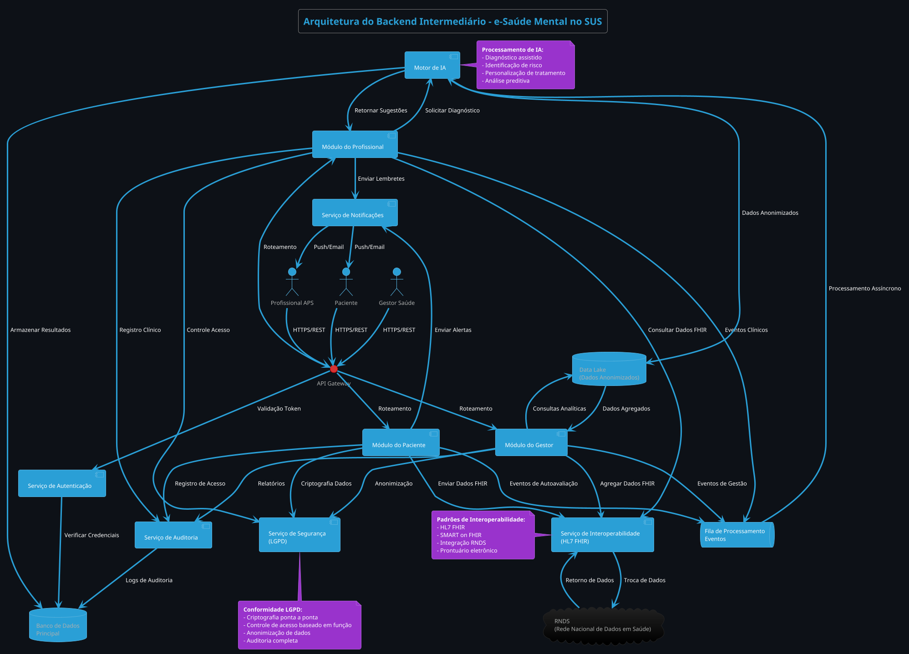

```plantuml
@startuml
!theme cyborg
skinparam backgroundColor #0d1117
skinparam handwritten false
skinparam shadowing false

title Arquitetura AWS - Backend Intermediário e-Saúde Mental

skinparam rectangle {
    BackgroundColor #1e2124
    BorderColor #00f5ff
    FontColor #ffffff
    FontName "Consolas"
}

skinparam database {
    BackgroundColor #1e2124
    BorderColor #ff00ff
    FontColor #ffffff
}

skinparam cloud {
    BackgroundColor #1e2124
    BorderColor #ff6600
    FontColor #ffffff
}

skinparam queue {
    BackgroundColor #1e2124
    BorderColor #ffff00
    FontColor #ffffff
}

skinparam storage {
    BackgroundColor #1e2124
    BorderColor #00ff00
    FontColor #ffffff
}

skinparam actor {
    BackgroundColor #1e2124
    BorderColor #00f5ff
    FontColor #ffffff
}

skinparam arrow {
    Color #00f5ff
    FontColor #ffffff
}

skinparam note {
    BackgroundColor #1e2124
    BorderColor #ff00ff
    FontColor #ffffff
}

actor "Paciente" as Paciente
actor "Profissional APS" as Profissional
actor "Gestor Saúde" as Gestor

cloud "AWS Region" as AWSRegion {

    rectangle "VPC: 10.0.0.0/16" as VPC {
        
        rectangle "Public Subnet A\n10.0.1.0/24" as PublicSubnetA {
            rectangle "API Gateway\n(Custom Domain)" as APIGateway
            rectangle "Application Load Balancer" as ALB
            rectangle "NAT Gateway" as NAT
        }
        
        rectangle "Public Subnet B\n10.0.2.0/24" as PublicSubnetB {
            rectangle "API Gateway\n(Secondary AZ)" as APIGatewayB
        }
        
        rectangle "Private Subnet A\n10.0.3.0/24" as PrivateSubnetA {
            rectangle "ECS Cluster\n(Microsserviços)" as ECS
            rectangle "Lambda Functions\n(Event Processing)" as Lambda
        }
        
        rectangle "Private Subnet B\n10.0.4.0/24" as PrivateSubnetB {
            rectangle "ECS Cluster\n(Secondary AZ)" as ECSB
        }
        
        rectangle "DB Subnet\n10.0.5.0/24" as DBSubnet {
            database "RDS PostgreSQL\n(Encrypted)" as RDS
            database "ElastiCache Redis\n(Session Store)" as Redis
        }
        
        storage "S3 Buckets" as S3 {
            storage "Data Lake\n(Anonimizado)" as DataLake
            storage "Logs & Auditoria" as LogsS3
            storage "Relatórios" as ReportsS3
        }
        
        queue "SQS Queues" as SQS {
            queue "Eventos Paciente" as QueuePaciente
            queue "Eventos Profissional" as QueueProfissional
            queue "Eventos Gestor" as QueueGestor
        }
        
        rectangle "SNS Topics" as SNS {
            rectangle "Notificações Push" as SNSPush
            rectangle "Alertas Email" as SNSEmail
        }
        
        rectangle "VPC Endpoints" as VPCEndpoints {
            rectangle "S3 Gateway" as S3Endpoint
            rectangle "SQS Interface" as SQSEndpoint
            rectangle "SNS Interface" as SNSEndpoint
            rectangle "Secrets Manager" as SecretsEndpoint
        }
        
        rectangle "Security Groups" as SecurityGroups {
            note "ALB: 443, 80\nECS: 8080\nRDS: 5432"
        }
    }
    
    rectangle "AWS Services" as AWSServices {
        rectangle "IAM Roles & Policies" as IAM
        rectangle "KMS Keys\n(Encryption)" as KMS
        rectangle "Secrets Manager" as SecretsManager
        rectangle "CloudWatch\n(Monitoring)" as CloudWatch
        rectangle "Route 53\n(DNS)" as Route53
        rectangle "WAF\n(Web Protection)" as WAF
        rectangle "CloudFront\n(CDN)" as CloudFront
    }
}

Paciente --> CloudFront : HTTPS
Profissional --> CloudFront : HTTPS
Gestor --> CloudFront : HTTPS

CloudFront --> WAF : DDoS Protection
WAF --> APIGateway : HTTPS
APIGatewayB --> APIGateway : Failover

APIGateway --> ALB : Load Balancing
ALB --> ECS : Health Checks
ECSB --> ECS : Auto Scaling

ECS --> RDS : App Data
ECS --> Redis : Sessions
ECS --> SQS : Event Publishing
ECS --> SNS : Notification Trigger

Lambda --> SQS : Event Processing
Lambda --> DataLake : Store Anonymized Data
Lambda --> LogsS3 : Audit Logs
Lambda --> SNS : Critical Alerts

S3Endpoint --> S3 : Private Access
SQSEndpoint --> SQS : Private Access
SNSEndpoint --> SNS : Private Access
SecretsEndpoint --> SecretsManager : Private Access

SecretsManager --> RDS : DB Credentials
KMS --> RDS : Encryption at Rest
KMS --> S3 : Encryption at Rest
KMS --> Lambda : Encryption in Transit

CloudWatch --> ECS : Metrics
CloudWatch --> Lambda : Logs
CloudWatch --> APIGateway : Monitoring

Route53 --> APIGateway : DNS Resolution

note right of VPC
  **VPC Configuration:**
  - CIDR: 10.0.0.0/16
  - 2 Public Subnets (ALB, NAT)
  - 2 Private Subnets (ECS, Lambda)
  - 1 Isolated DB Subnet
  - Flow Logs Enabled
end note

note left of ECS
  **ECS Services:**
  - Módulo Paciente (Python)
  - Módulo Profissional (Java)
  - Módulo Gestor (Node.js)
  - Serviço Autenticação
  - Serviço Interoperabilidade
  - Serviço Segurança (LGPD)
end note

note bottom of Lambda
  **Lambda Functions:**
  - Processamento Fila SQS
  - Integração Motor IA
  - Auditoria e Logs
  - Geração Relatórios
  - Notificações Críticas
end note

note top of S3
  **S3 Buckets:**
  - Data Lake: Dados anonimizados
  - Logs: Auditoria completa
  - Relatórios: Dashboards
  - Versioning & Encryption
end note

note right of AWSServices
  **AWS Security:**
  - IAM: Least Privilege
  - KMS: CMK Encryption
  - WAF: OWASP Protection
  - Secrets: Auto Rotation
  - VPC: Private Subnets
end note

@enduml
```




