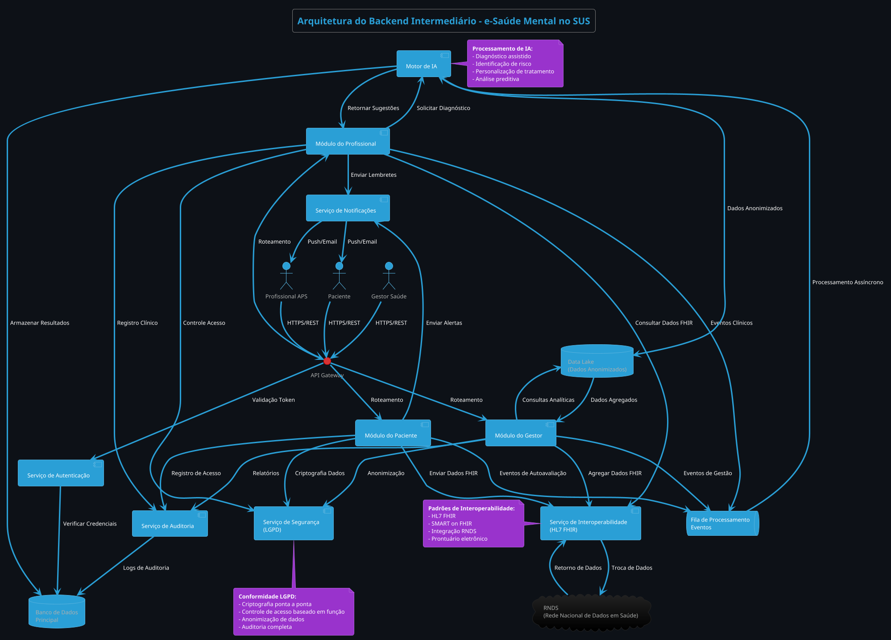

```plantuml
@startuml
!theme cyborg
skinparam backgroundColor #0d1117
skinparam shadowing false

title Arquitetura do Backend Intermediário - e-Saúde Mental no SUS

actor "Paciente" as Paciente
actor "Profissional APS" as Profissional
actor "Gestor Saúde" as Gestor

cloud "RNDS\n(Rede Nacional de Dados em Saúde)" as RNDS

database "Data Lake\n(Dados Anonimizados)" as DataLake
database "Banco de Dados\nPrincipal" as DBPrincipal

queue "Fila de Processamento\nEventos" as FilaEventos

interface "API Gateway" as APIGateway

component "Módulo do Paciente" as ModPaciente
component "Módulo do Profissional" as ModProfissional
component "Módulo do Gestor" as ModGestor

component "Motor de IA" as MotorIA
component "Serviço de Autenticação" as Auth
component "Serviço de Segurança\n(LGPD)" as Seguranca
component "Serviço de Interoperabilidade\n(HL7 FHIR)" as Interop
component "Serviço de Notificações" as Notificacoes
component "Serviço de Auditoria" as Auditoria

Paciente --> APIGateway : HTTPS/REST
Profissional --> APIGateway : HTTPS/REST
Gestor --> APIGateway : HTTPS/REST

APIGateway --> ModPaciente : Roteamento
APIGateway --> ModProfissional : Roteamento
APIGateway --> ModGestor : Roteamento

APIGateway --> Auth : Validação Token
Auth --> DBPrincipal : Verificar Credenciais

ModPaciente --> Seguranca : Criptografia Dados
ModProfissional --> Seguranca : Controle Acesso
ModGestor --> Seguranca : Anonimização

ModPaciente --> Interop : Enviar Dados FHIR
ModProfissional --> Interop : Consultar Dados FHIR
ModGestor --> Interop : Agregar Dados FHIR

Interop --> RNDS : Troca de Dados
RNDS --> Interop : Retorno de Dados

ModPaciente --> FilaEventos : Eventos de Autoavaliação
ModProfissional --> FilaEventos : Eventos Clínicos
ModGestor --> FilaEventos : Eventos de Gestão

FilaEventos --> MotorIA : Processamento Assíncrono
MotorIA --> DBPrincipal : Armazenar Resultados
MotorIA --> DataLake : Dados Anonimizados

ModProfissional --> MotorIA : Solicitar Diagnóstico
MotorIA --> ModProfissional : Retornar Sugestões

ModGestor --> DataLake : Consultas Analíticas
DataLake --> ModGestor : Dados Agregados

ModPaciente --> Notificacoes : Enviar Alertas
ModProfissional --> Notificacoes : Enviar Lembretes
Notificacoes --> Paciente : Push/Email
Notificacoes --> Profissional : Push/Email

ModPaciente --> Auditoria : Registro de Acesso
ModProfissional --> Auditoria : Registro Clínico
ModGestor --> Auditoria : Relatórios
Auditoria --> DBPrincipal : Logs de Auditoria

note right of MotorIA
  **Processamento de IA:**
  - Diagnóstico assistido
  - Identificação de risco
  - Personalização de tratamento
  - Análise preditiva
end note

note left of Interop
  **Padrões de Interoperabilidade:**
  - HL7 FHIR
  - SMART on FHIR
  - Integração RNDS
  - Prontuário eletrônico
end note

note bottom of Seguranca
  **Conformidade LGPD:**
  - Criptografia ponta a ponta
  - Controle de acesso baseado em função
  - Anonimização de dados
  - Auditoria completa
end note

@enduml
```