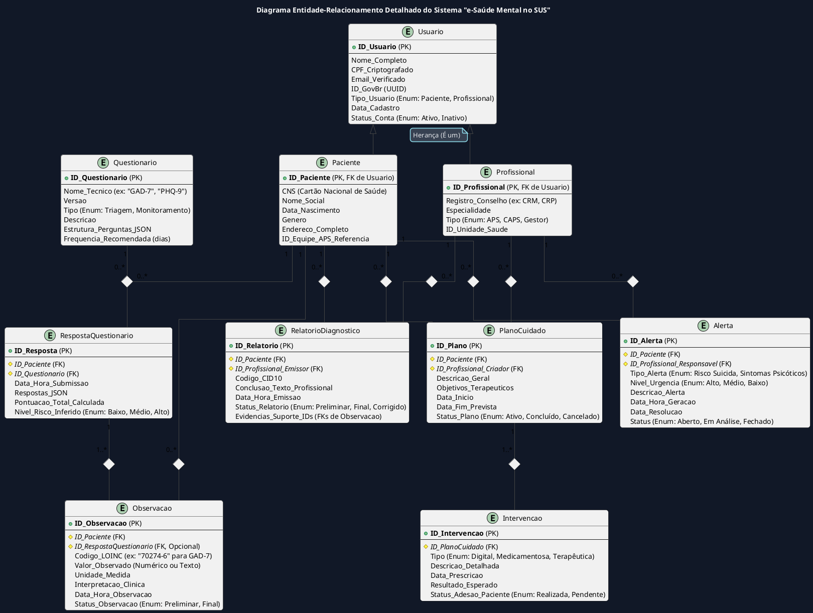

```plantuml
@startuml
!theme vibrant

' Definições de Estilo (Dark Theme)
skinparam linetype ortho
skinparam shadowing false
skinparam roundcorner 10
skinparam backgroundColor #111827
skinparam title {
    FontColor #FFFFFF
}
skinparam entity {
    FontColor #E5E7EB
    BorderColor #90E0EF
    BackgroundColor #374151
}
skinparam diamond {
    FontColor #111827
    BorderColor #00A8E8
    BackgroundColor #90E0EF
}
skinparam relationship {
    LineColor #90E0EF
    LineThickness 1.5
}
skinparam note {
    backgroundColor #374151
    borderColor #90E0EF
    fontColor #E5E7EB
}

title Diagrama Entidade-Relacionamento Detalhado do Sistema "e-Saúde Mental no SUS"

' --- Entidades com Detalhes Adicionais ---

entity "Usuario" as E_Usuario {
  + **ID_Usuario** (PK)
  --
  Nome_Completo
  CPF_Criptografado
  Email_Verificado
  ID_GovBr (UUID)
  Tipo_Usuario (Enum: Paciente, Profissional)
  Data_Cadastro
  Status_Conta (Enum: Ativo, Inativo)
}

entity "Paciente" as E_Paciente {
  + **ID_Paciente** (PK, FK de Usuario)
  --
  CNS (Cartão Nacional de Saúde)
  Nome_Social
  Data_Nascimento
  Genero
  Endereco_Completo
  ID_Equipe_APS_Referencia
}

entity "Profissional" as E_Profissional {
  + **ID_Profissional** (PK, FK de Usuario)
  --
  Registro_Conselho (ex: CRM, CRP)
  Especialidade
  Tipo (Enum: APS, CAPS, Gestor)
  ID_Unidade_Saude
}

entity "Questionario" as E_Questionario {
  + **ID_Questionario** (PK)
  --
  Nome_Tecnico (ex: "GAD-7", "PHQ-9")
  Versao
  Tipo (Enum: Triagem, Monitoramento)
  Descricao
  Estrutura_Perguntas_JSON
  Frequencia_Recomendada (dias)
}

entity "RespostaQuestionario" as E_RespostaQuestionario {
  + **ID_Resposta** (PK)
  --
  # //ID_Paciente// (FK)
  # //ID_Questionario// (FK)
  Data_Hora_Submissao
  Respostas_JSON
  Pontuacao_Total_Calculada
  Nivel_Risco_Inferido (Enum: Baixo, Médio, Alto)
}

entity "Observacao" as E_Observacao {
  + **ID_Observacao** (PK)
  --
  # //ID_Paciente// (FK)
  # //ID_RespostaQuestionario// (FK, Opcional)
  Codigo_LOINC (ex: "70274-6" para GAD-7)
  Valor_Observado (Numérico ou Texto)
  Unidade_Medida
  Interpretacao_Clinica
  Data_Hora_Observacao
  Status_Observacao (Enum: Preliminar, Final)
}

entity "RelatorioDiagnostico" as E_RelatorioDiagnostico {
  + **ID_Relatorio** (PK)
  --
  # //ID_Paciente// (FK)
  # //ID_Profissional_Emissor// (FK)
  Codigo_CID10
  Conclusao_Texto_Profissional
  Data_Hora_Emissao
  Status_Relatorio (Enum: Preliminar, Final, Corrigido)
  Evidencias_Suporte_IDs (FKs de Observacao)
}

entity "PlanoCuidado" as E_PlanoCuidado {
  + **ID_Plano** (PK)
  --
  # //ID_Paciente// (FK)
  # //ID_Profissional_Criador// (FK)
  Descricao_Geral
  Objetivos_Terapeuticos
  Data_Inicio
  Data_Fim_Prevista
  Status_Plano (Enum: Ativo, Concluído, Cancelado)
}

entity "Intervencao" as E_Intervencao {
  + **ID_Intervencao** (PK)
  --
  # //ID_PlanoCuidado// (FK)
  Tipo (Enum: Digital, Medicamentosa, Terapêutica)
  Descricao_Detalhada
  Data_Prescricao
  Resultado_Esperado
  Status_Adesao_Paciente (Enum: Realizada, Pendente)
}

entity "Alerta" as E_Alerta {
  + **ID_Alerta** (PK)
  --
  # //ID_Paciente// (FK)
  # //ID_Profissional_Responsavel// (FK)
  Tipo_Alerta (Enum: Risco Suicida, Sintomas Psicóticos)
  Nivel_Urgencia (Enum: Alto, Médio, Baixo)
  Descricao_Alerta
  Data_Hora_Geracao
  Data_Resolucao
  Status (Enum: Aberto, Em Análise, Fechado)
}

' --- Nós de Relacionamento e Cardinalidades ---

diamond "Responde" as R_Responde
diamond "Possui" as R_Possui
diamond "Recebe Diagnóstico" as R_RecebeDiagnostico
diamond "Tem Plano de Cuidado" as R_TemPlano
diamond "Gera Alerta" as R_GeraAlerta
diamond "Emite Diagnóstico" as R_EmiteDiagnostico
diamond "Cria Plano" as R_CriaPlano
diamond "É Notificado" as R_Notificado
diamond "Gera Observação" as R_GeraObservacao
diamond "Contém" as R_Contem

' Generalização
E_Usuario <|-- E_Paciente
E_Usuario <|-- E_Profissional
note on link: Herança (É um)

' Conexões
E_Paciente "1" -- "0..*" R_Responde
R_Responde -- E_RespostaQuestionario
E_Questionario "1" -- "0..*" R_Responde

E_Paciente "1" -- "0..*" R_Possui
R_Possui -- E_Observacao

E_Paciente "1" -- "0..*" R_RecebeDiagnostico
R_RecebeDiagnostico -- E_RelatorioDiagnostico

E_Paciente "1" -- "0..*" R_TemPlano
R_TemPlano -- E_PlanoCuidado

E_Paciente "1" -- "0..*" R_GeraAlerta
R_GeraAlerta -- E_Alerta

E_Profissional "1" -- "0..*" R_EmiteDiagnostico
R_EmiteDiagnostico -- E_RelatorioDiagnostico

E_Profissional "1" -- "0..*" R_CriaPlano
R_CriaPlano -- E_PlanoCuidado

E_Profissional "1" -- "0..*" R_Notificado
R_Notificado -- E_Alerta

E_RespostaQuestionario "1" -- "1..*" R_GeraObservacao
R_GeraObservacao -- E_Observacao

E_PlanoCuidado "1" -- "1..*" R_Contem
R_Contem -- E_Intervencao
@enduml
```

![[E-R Simplificado.png]]