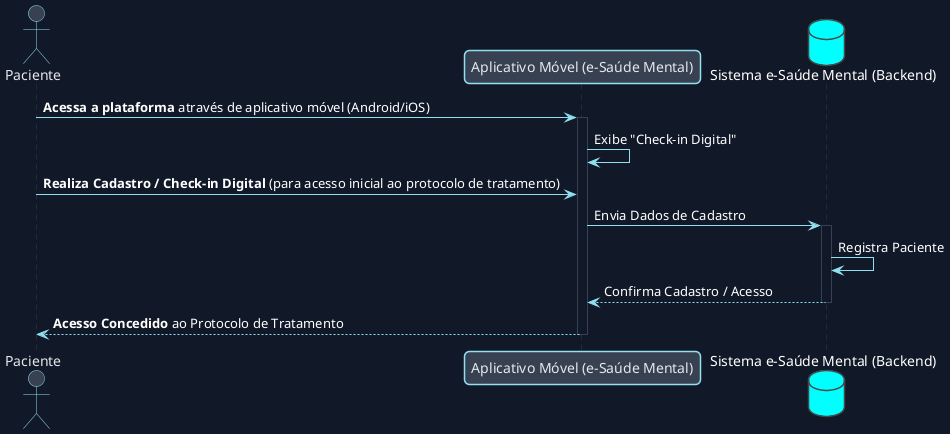
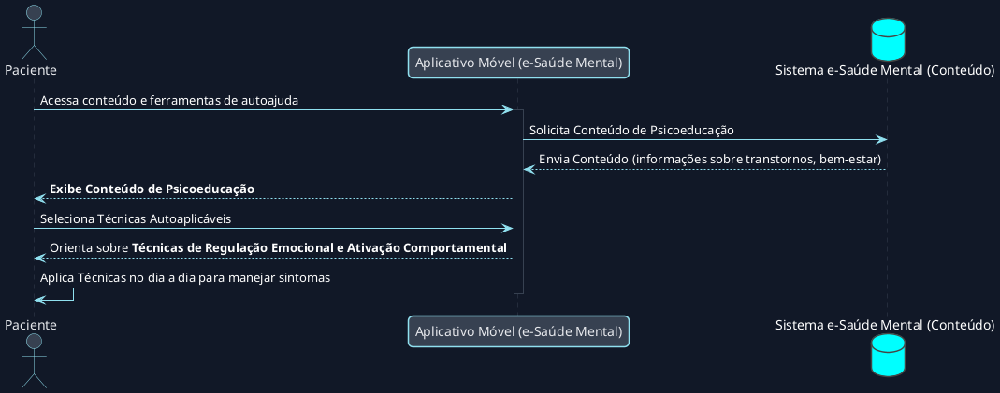
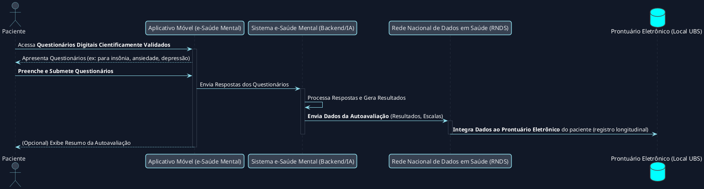
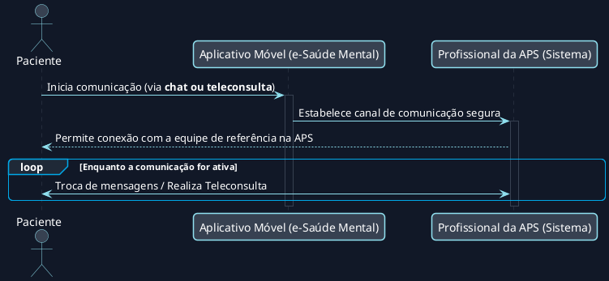
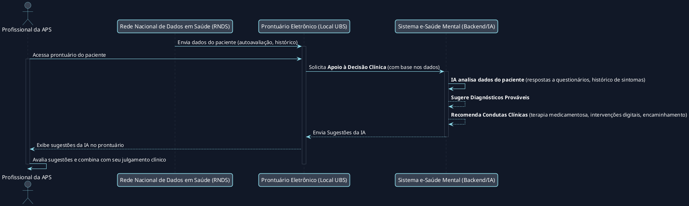
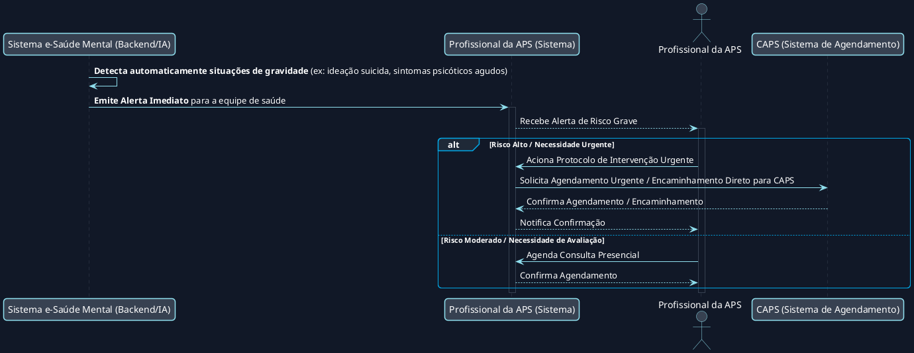
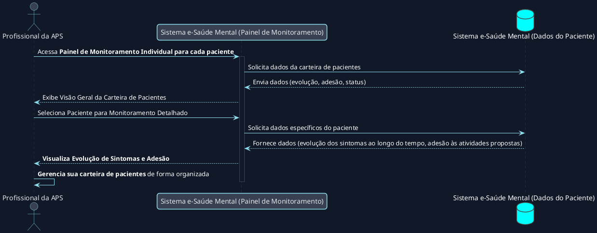
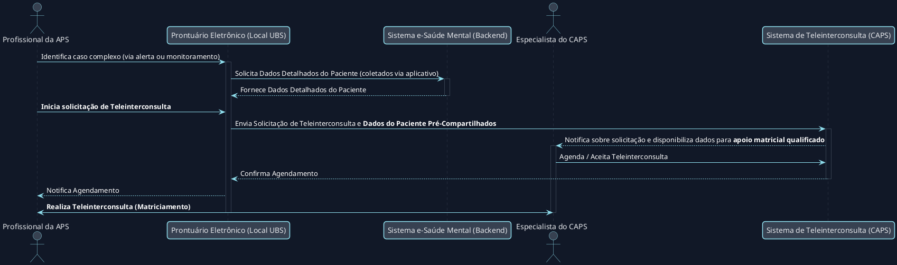
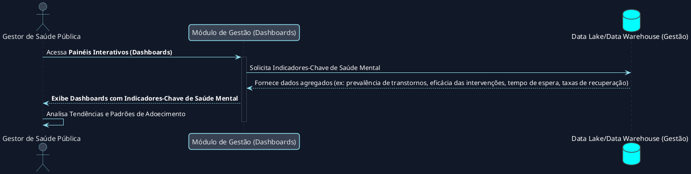
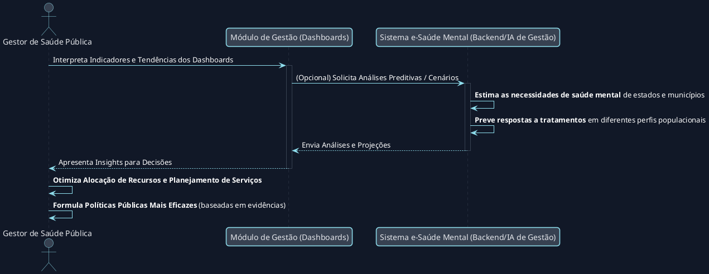

Com base nas descrições detalhadas dos fluxos de cada papel no sistema "e-Saúde Mental no SUS" da nossa conversa anterior e das fontes fornecidas, apresento os diagramas em PlantUML para cada sub-seção. Estes diagramas ilustram a interação entre os atores e os componentes do sistema, conforme a arquitetura funcional tripartite.

### 1. O Paciente (Usuário Final)

O módulo do paciente visa transformá-lo em um **agente ativo na sua própria saúde mental**.

#### 1.1 Início da Jornada e Cadastro

Este fluxo detalha como o paciente acessa a plataforma e realiza seu cadastro inicial, marcando o começo de sua jornada no sistema.



#### 1.2 Engajamento e Autoaplicação

Aqui, o diagrama mostra como o paciente interage com os recursos de autoajuda e psicoeducação oferecidos pelo aplicativo para o manejo diário de seus sintomas.



#### 1.3 Fluxo de Autoavaliação e Dados

Este diagrama ilustra o processo pelo qual o paciente utiliza questionários digitais para autoavaliar seus sintomas, e como esses dados são integrados ao sistema de saúde.



#### 1.4 Fluxo de Comunicação e Conexão

Demonstra como a plataforma facilita a comunicação segura entre o paciente e sua equipe de saúde da Atenção Primária.



### 2. O Profissional da Atenção Primária (APS)

Para os profissionais da APS, a plataforma funciona como um **"copiloto" inteligente**, visando aumentar sua confiança e capacidade no manejo de casos de saúde mental.

#### 2.1 Recebimento de Dados e Apoio à Decisão Clínica

Este diagrama ilustra como o profissional da APS recebe os dados do paciente via RNDS e como a IA do sistema oferece suporte à decisão clínica.



#### 2.2 Alerta de Risco e Ação Proativa

O fluxo demonstra como o sistema detecta situações de gravidade e emite alertas, permitindo uma intervenção rápida e proativa por parte da equipe de saúde.



#### 2.3 Monitoramento e Gestão da Carteira

Este diagrama ilustra como os profissionais da APS utilizam o painel de monitoramento para acompanhar a evolução dos pacientes e gerenciar suas respectivas carteiras.



#### 2.4 Registro e Feedback para o Sistema

O diagrama mostra como os registros clínicos feitos pelo profissional são enviados de volta para a RNDS, atualizando o histórico de saúde do paciente.

```plantuml
@startuml
actor "Profissional da APS" as ProfissionalAPS
participant "Prontuário Eletrônico (Local UBS)" as ProntuarioUBS
cloud "Rede Nacional de Dados em Saúde (RNDS)" as RNDS
database "Sistema e-Saúde Mental (Backend)" as Backend

ProfissionalAPS -> ProntuarioUBS : Realiza Consulta (Presencial ou Remota)
activate ProntuarioUBS
ProfissionalAPS -> ProntuarioUBS : <b>Confirma Diagnóstico e Define Plano Terapêutico</b>
ProntuarioUBS -> RNDS : <b>Envia Novo Registro Clínico</b> (Diagnóstico, Plano)
activate RNDS
RNDS -> RNDS : <b>Atualiza Histórico de Saúde do Paciente</b> (Prontuário Eletrônico Unificado)
RNDS --> ProntuarioUBS : Confirma Recebimento
deactivate RNDS
ProntuarioUBS --> Backend : Notifica Backend sobre atualização (para potencial feedback à IA)
deactivate ProntuarioUBS
@enduml
```

#### 2.5 Matriciamento e Teleinterconsulta

Este fluxo ilustra como o profissional da APS pode solicitar apoio de um especialista do CAPS via teleinterconsulta, utilizando os dados pré-coletados pelo aplicativo para qualificar o matriciamento.



### 3. O Gestor de Saúde Pública

O módulo de gestão visa transformar os dados clínicos gerados em **inteligência acionável para a formulação de políticas públicas**.

#### 3.1 Coleta e Agregação de Dados Anonimizados

Este diagrama mostra como os dados coletados de pacientes e profissionais são agregados e anonimizados para a vigilância epidemiológica e análise de tendências.

```plantuml
@startuml
participant "Sistema e-Saúde Mental (Backend)" as Backend
cloud "Rede Nacional de Dados em Saúde (RNDS)" as RNDS
database "Data Lake/Data Warehouse (Gestão)" as DataLake

Backend -> Backend : **Agrega dados de pacientes e profissionais** (anonimizados)
Backend -> RNDS : **Envia Lotes de Dados Anonimizados** (ex: prevalência de sintomas, uso de funcionalidades)
activate RNDS
RNDS -> DataLake : Armazena e consolida dados anonimizados
deactivate RNDS
@enduml
```

#### 3.2 Visualização e Análise de Indicadores

Ilustra como os gestores acessam painéis interativos para visualizar indicadores-chave de saúde mental e obter insights para a tomada de decisões.



#### 3.3 Apoio à Formulação de Políticas e Otimização de Recursos

Este diagrama detalha como as informações e análises da plataforma são utilizadas para otimizar a alocação de recursos e planejar serviços de saúde mental.



#### 3.4 Vigilância Epidemiológica


O fluxo final mostra como a agregação de dados anonimizados permite uma vigilância epidemiológica abrangente, identificando padrões e particularidades regionais na saúde mental.

```plantuml
@startuml
!theme vibrant
' Definições de Estilo (Dark Theme)
skinparam shadowing false
skinparam roundcorner 10
skinparam backgroundColor #111827
skinparam defaultFontColor #FFFFFF
skinparam title {
    FontColor #FFFFFF
}
skinparam actor {
    BorderColor #90E0EF
    BackgroundColor #374151
    FontColor #E5E7EB
}
skinparam usecase {
    BorderColor #00A8E8
    BackgroundColor #1F2937
    FontColor #E5E7EB
}
skinparam rectangle {
    BorderColor #00A8E8
    BackgroundColor #1F2937
    FontColor #E5E7EB
}
skinparam arrow {
    Color #90E0EF
}
skinparam sequence {
    ParticipantBorderColor #90E0EF
    ParticipantBackgroundColor #374151
    ParticipantFontColor #E5E7EB
    DatabaseBorderColor #00A8E8
    DatabaseBackgroundColor #1F2937
    DatabaseFontColor #E5E7EB
    LifeLineBackgroundColor #111827
    LifeLineBorderColor #374151
}

participant "Sistema e-Saúde Mental (Backend)" as Backend
cloud "Rede Nacional de Dados em Saúde (RNDS)" as RNDS
database "Data Lake/Data Warehouse (Gestão)" as DataLake
actor "Gestor de Saúde Pública" as Gestor
participant "Módulo de Gestão (Ferramentas de Vigilância)" as VigilanceTools

Backend -> RNDS : Envia Dados Anonimizados para Agregação Nacional
activate RNDS
RNDS -> DataLake : **Consolida Dados Epidemiológicos** de todas as interações
deactivate RNDS
Gestor -> VigilanceTools : Acessa Ferramentas de Vigilância Epidemiológica
activate VigilanceTools
VigilanceTools -> DataLake : Consulta Dados Consolidados
DataLake --> VigilanceTools : Fornece Dados Agregados e Geospatializados
VigilanceTools --> Gestor : **Exibe Padrões de Transtornos Mentais, Tendências de Adoecimento e Particularidades Regionais**
deactivate VigilanceTools
Gestor -> Gestor : **Realiza Vigilância Epidemiológica sem precedentes** para Saúde Mental
@enduml
```