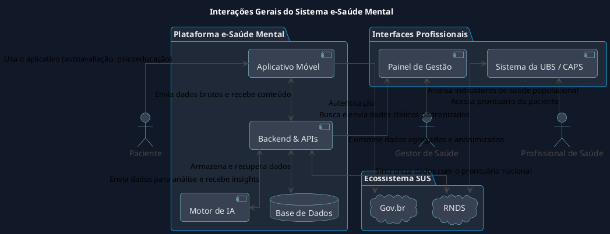

![[Interações Gerais.png]]

```plantuml
@startuml
!theme vibrant

' Definições de Estilo (Dark Theme)
skinparam linetype ortho
skinparam shadowing false
skinparam roundcorner 10
skinparam backgroundColor #111827
skinparam title {
    FontColor #FFFFFF
}
skinparam package {
    FontColor #E5E7EB
    BorderColor #00A8E8
    BackgroundColor #1F2937
}
skinparam component {
    FontColor #E5E7EB
    BorderColor #90E0EF
    BackgroundColor #374151
}
skinparam actor {
    BorderColor #90E0EF
    BackgroundColor #374151
}
skinparam database {
    FontColor #E5E7EB
    BorderColor #90E0EF
    BackgroundColor #374151
}
skinparam cloud {
    FontColor #E5E7EB
    BorderColor #90E0EF
    BackgroundColor #374151
}

title Interações Gerais do Sistema e-Saúde Mental

' Atores
actor "Paciente" as Paciente
actor "Profissional de Saúde" as Profissional
actor "Gestor de Saúde" as Gestor

' Pacote Central: Plataforma e-Saúde Mental
package "Plataforma e-Saúde Mental" {
    component "Aplicativo Móvel" as App
    component "Backend & APIs" as Backend
    component "Motor de IA" as IA
    database "Base de Dados" as DB
}

' Pacote Externo: Ecossistema SUS
package "Ecossistema SUS" {
    cloud "RNDS" as RNDS
    cloud "Gov.br" as GovBR
}

' Pacote de Interfaces de Usuário Profissional
package "Interfaces Profissionais" {
    component "Sistema da UBS / CAPS" as SistemaLocal
    component "Painel de Gestão" as Dashboard
}

' Fluxos de Interação

' Fluxo do Paciente
Paciente -up-> App : Usa o aplicativo (autoavaliação, psicoeducação)
App <--> Backend : Envia dados brutos e recebe conteúdo
App --> GovBR : Autenticação

' Fluxo do Profissional
Profissional -up-> SistemaLocal : Acessa prontuário do paciente
SistemaLocal <--> RNDS : Busca e envia dados clínicos padronizados

' Fluxo do Gestor
Gestor -up-> Dashboard : Analisa indicadores de saúde populacional
Dashboard <-- Backend : Consome dados agregados e anonimizados

' Interações Internas da Plataforma
Backend <--> DB : Armazena e recupera dados
Backend <--> IA : Envia dados para análise e recebe insights
Backend <--> RNDS : Sincroniza dados com o prontuário nacional
@enduml
```

