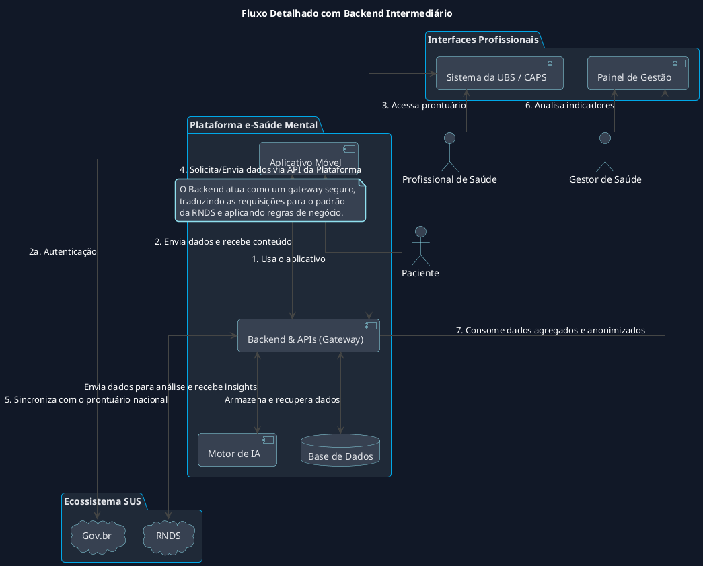

```plantuml
@startuml
!theme vibrant

' Definições de Estilo (Dark Theme)
skinparam linetype ortho
skinparam shadowing false
skinparam roundcorner 10
skinparam backgroundColor #111827
skinparam defaultFontColor #FFFFFF
skinparam nodesep 80  ' Aumenta o espaço horizontal entre nós
skinparam ranksep 100 ' Aumenta o espaço vertical entre ranks
skinparam title {
    FontColor #FFFFFF
}
skinparam package {
    FontColor #E5E7EB
    BorderColor #00A8E8
    BackgroundColor #1F2937
}
skinparam component {
    FontColor #E5E7EB
    BorderColor #90E0EF
    BackgroundColor #374151
}
skinparam actor {
    BorderColor #90E0EF
    BackgroundColor #374151
}
skinparam database {
    FontColor #E5E7EB
    BorderColor #90E0EF
    BackgroundColor #374151
}
skinparam cloud {
    FontColor #E5E7EB
    BorderColor #90E0EF
    BackgroundColor #374151
}
skinparam note {
    backgroundColor #374151
    borderColor #90E0EF
    fontColor #E5E7EB
}

title Fluxo Detalhado com Backend Intermediário

' Atores
actor "Paciente" as Paciente
actor "Profissional de Saúde" as Profissional
actor "Gestor de Saúde" as Gestor

' Pacote Central: Plataforma e-Saúde Mental
package "Plataforma e-Saúde Mental" {
    component "Aplicativo Móvel" as App
    component "Backend & APIs (Gateway)" as Backend
    component "Motor de IA" as IA
    database "Base de Dados" as DB
}

' Pacote Externo: Ecossistema SUS
package "Ecossistema SUS" {
    cloud "RNDS" as RNDS
    cloud "Gov.br" as GovBR
}

' Pacote de Interfaces de Usuário Profissional
package "Interfaces Profissionais" {
    component "Sistema da UBS / CAPS" as SistemaLocal
    component "Painel de Gestão" as Dashboard
}

' --- Fluxos de Interação Detalhados ---

' Fluxo do Paciente
Paciente -up-> App : 1. Usa o aplicativo
App <---> Backend : 2. Envia dados e recebe conteúdo
App ---> GovBR : 2a. Autenticação

' Fluxo do Profissional (com Backend Intermediário)
Profissional -up-> SistemaLocal : 3. Acessa prontuário
SistemaLocal <----> Backend : 4. Solicita/Envia dados via API da Plataforma
note on link
  O Backend atua como um gateway seguro,
  traduzindo as requisições para o padrão
  da RNDS e aplicando regras de negócio.
end note
Backend <----> RNDS : 5. Sincroniza com o prontuário nacional

' Fluxo do Gestor
Gestor -up-> Dashboard : 6. Analisa indicadores
Dashboard <---- Backend : 7. Consome dados agregados e anonimizados

' Interações Internas da Plataforma
Backend <---> DB : Armazena e recupera dados
Backend <---> IA : Envia dados para análise e recebe insights
@enduml
```

