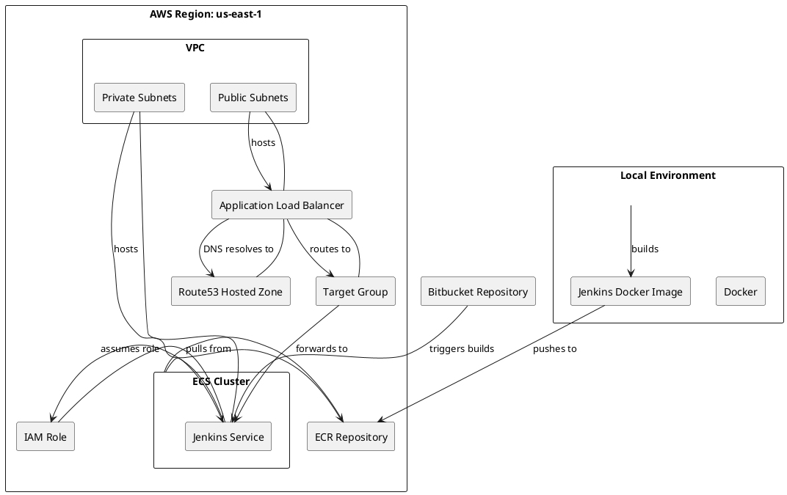

## Prompt

I'm trying to create a CI-CD pipeline to use for a project of Infrastructure as Code (IaC). 
In particular, my first task is to build a jenkins capable of deploying itself and the rest of my project.
The rest of the project is just a static web site

My current project structure is:

```
./projects/static_web_site
├── cicd
│   ├── container
│   │   ├── docker-compose.yml
│   │   ├── jcasc.yaml
│   │   ├── jenkins
│   │   │   └── Dockerfile
│   │   ├── plugin.txt
│   │   └── run-docker.py
│   └── infra
│       ├── terraform.tfstate
│       └── terraform.tfstate.backup
└── README.md
```

Initial definitions:
- I have to use Jenkins to deploy infrastructure using terraform.
- I have to use terraform for everything related to IaC
- I have to use aws.
- I have aws-cli/2.16.2 Python/3.11.8 Linux/5.15.0-139-generic exe/x86_64.ubuntu.20
- I don't have access to the aws web console.
- I'm using ubuntu 20.04
- I use python version 3.8.10
- I use Docker version 28.1.1, build 4eba377
- I want the jenkins to run inside a docker on aws so I can test it locally first
- I'm working on a shared bitbucket git repository so I need to track changes for deploy only inside a particular directory and only in some particular branches, but I want this to be configurable
- I want the jenkins docker infrastructure to be managed by job inside the same jenkins so I'll need one of the jobs to be a self-deploy
- I want a full plan and estimation of costs for the whole architecture before any code.
- Use plantuml to do any diagrams
- I need the jenkins to be accessible using a public URL, but I don't have permission to buy any dommain  so we'll have to use some AWS service that provides a public URL by default and I need this URL as one of the outputs of the terraform code
- Every resource created, deployed or updated by this jenkins must include a tag `GE-IaC-STS-CI-CD-Jenkins-2025` and key-value pairs showing the initial created date and last-updated date in the format `2025-09-13 14-03-57.123 UTC` 

Help me build a plan to accomplish all of this and ask me any necessary clarifications. Don't assume anything. I want you to clarify anything I didn't already say before any estimation or plan.

We can do this in steps, so initially, the minimum is to build a Jenkins docker that can be run locally on my configurations and can deploy itself.

The jenkins will also need to have some AWS credentials. I think it's not safe to use my own credentials to do this, but I don't have access to the web console so you'll need to show me just aws cli commands to create those credentials for Jenkins.

## Clarifications Q&A

1. **AWS Region**: Which AWS region do you plan to use for deployment?

We'll use us-east-1, but it should be easy to change this for all resources if necessary

2. **Jenkins Configuration**: 
   - What specific Jenkins plugins will you need beyond the basic installation?
	   - I don't know the existing plugins. But we'll need to interface with bitbucket and use terraform to do deploys. We already know there'll be an angular front-end, but I'm not sure if that requires a particular plugin to make the deploy.
   - Do you need any specific security configurations for Jenkins (SSL, authentication methods)?
	   - I don't know. I need the URL to be https so maybe. Help me here, I'm a newbie

2. **Terraform Version**: What version of Terraform should we use?
	1. Terraform v1.12.1 on linux_amd64


4. **Resource Specifications**:
   - What EC2 instance type or size do you prefer for running Jenkins?
	   - The cheapest that can fulfill the required conditions
   - Any specific storage requirements for Jenkins?
	   - I don't know. Help me here. Why would we need storage?

5. **Network Configuration**:
   - Should Jenkins be deployed in a new VPC or an existing one?
	   - Assume there's no current infra. We are starting from scratch
   - Any specific subnet requirements?
	   - I don't know. What are some common requirements? Why would we need anything in particular?

6. **Security Requirements**:
   - Should Jenkins be deployed in a private subnet with a load balancer, or directly in a public subnet?
	   - The cheapest option that is able to fulfill the requirements
   - Any specific security group requirements beyond default?
	   - I don't know. Give suggestions. What kind of requirements do you thing might be necesary?

7. **High Availability & Backup**:
   - Is high availability required for Jenkins?
	   - No it'll be run very sporadically. This is a toy project.
   - Do you need a backup strategy for Jenkins configuration and jobs?
	   - I guess. But I don't really know. Why is this usually required?

8. **Monitoring**:
   - Should we set up CloudWatch monitoring for Jenkins and the deployed infrastructure?

9. **Budget Constraints**:
   - Are there any budget constraints I should consider when designing the architecture?
	   - Yes, try to spend the minimum possible. This is not a real project. It's for studying purposes so I have no budget. Try to keep everything you can inside free-tier.

10. **Bitbucket Integration**:
    - Do you already have Bitbucket credentials or OAuth apps configured for Jenkins integration?
	    - Maybe but I don't know how to check this. Anyway we can let this for a next phase. We first need an working instance of Jenkins deployed, so any bitbucket configuration we can leave to a next step.
    - Should the pipeline trigger on all branches or specific ones (like main, develop, etc.)?
	    - Just specific ones. This should be configurable. But let's first build a pipeline that's only manually trigerable

11. **Docker Registry**:
    - Where will the Jenkins Docker image be stored? ECR, Docker Hub, or elsewhere?
	    - I have to use only AWS services so probably ECR

# First Round


# Comprehensive Plan for Jenkins CI-CD Pipeline on AWS

Thank you for providing the clarifications. Based on your requirements, I'll now provide a detailed plan for building a Jenkins CI-CD pipeline that can deploy itself using Terraform on AWS.

## Architecture Overview



## Implementation Plan

### Phase 1: Create Jenkins Docker Image (Local Testing)

#### 1.1 Create Dockerfile for Jenkins
```Dockerfile
FROM jenkins/jenkins:lts-jdk11

USER root
# Install required packages
RUN apt-get update && apt-get install -y \
    awscli \
    python3 \
    python3-pip \
    unzip \
    && rm -rf /var/lib/apt/lists/*

# Install Terraform
RUN wget https://releases.hashicorp.com/terraform/1.12.1/terraform_1.12.1_linux_amd64.zip
RUN unzip terraform_1.12.1_linux_amd64.zip
RUN mv terraform /usr/local/bin/
RUN rm terraform_1.12.1_linux_amd64.zip

USER jenkins
# Install Jenkins plugins
RUN jenkins-plugin-cli --plugins \
    terraform:1.0.11 \
    aws-credentials:191.vcb_f183ce37b_7 \
    workflow-aggregator:596.v8c71c9a_691a_5 \
    git:5.2.1 \
    docker-workflow:572.v950f58993843 \
    configuration-as-code:1850.va_a_8c31d3158b_

# Copy configuration files
COPY casc.yaml /usr/share/jenkins/ref/casc.yaml
COPY init.groovy /usr/share/jenkins/ref/init.groovy

EXPOSE 8080 50000

ENTRYPOINT ["sbin/tini", "--", "/usr/local/bin/jenkins.sh"]
```

#### 1.2 Create Configuration Files

**casc.yaml** (Jenkins Configuration as Code):
```yaml
jenkins:
  systemMessage: "Jenkins configured automatically with JCasC"
  numExecutors: 2
  mode: NORMAL
  authorizationStrategy:
    loggedInUsersCanDoAnything:
      allowAnonymousRead: false
  securityRealm:
    local:
      allowsSignup: false
      users:
        - id: admin
          password: admin
  clouds:
    - docker:
        name: "docker"
        dockerApi:
          dockerHost:
            uri: "unix:///var/run/docker.sock"
        templates:
          - labelString: "docker-agent"
            dockerTemplateBase:
              image: "jenkins/inbound-agent:latest"
              volumes:
                - "/var/run/docker.sock:/var/run/docker.sock"
            remoteFs: "/home/jenkins"
            connector:
              attach:
                user: "jenkins"
            pullStrategy: PULL_ALWAYS
            removeVolumes: true
  tool:
    terraform:
      installations:
        - name: "terraform"
          properties:
            - installSource:
                installers:
                  - terraformInstaller:
                      id: "1.12.1"
```

**init.groovy** (Initial setup script):
```groovy
import jenkins.model.*
import hudson.security.*
import jenkins.security.s2m.*

def instance = Jenkins.getInstance()

// Enable agent -> master access control
instance.injector.getInstance(AdminWhitelistRule.class).setMasterKillSwitch(false)

// Save the state
instance.save()
```

#### 1.3 Create docker-compose.yml for Local Testing
```yaml
version: '3.8'

services:
  jenkins:
    build: .
    ports:
      - "8080:8080"
      - "50000:50000"
    volumes:
      - jenkins_home:/var/jenkins_home
      - /var/run/docker.sock:/var/run/docker.sock
    environment:
      - JAVA_OPTS=-Djenkins.install.runSetupWizard=false
    networks:
      - jenkins

networks:
  jenkins:
    driver: bridge

volumes:
  jenkins_home:
```

#### 1.4 Test Locally
```bash
# Build and run Jenkins locally
docker-compose up -d

# Access Jenkins at http://localhost:8080
# Login with admin/admin
```

### Phase 2: AWS Infrastructure Setup with Terraform

#### 2.1 Create AWS Credentials for Jenkins
```bash
# Create IAM user for Jenkins
aws iam create-user --user-name jenkins-cicd

# Create access key for the user
aws iam create-access-key --user-name jenkins-cicd > jenkins-credentials.json

# Create policy for Jenkins
aws iam create-policy --policy-name jenkins-cicd-policy --policy-document '{
  "Version": "2012-10-17",
  "Statement": [
    {
      "Effect": "Allow",
      "Action": [
        "ec2:Describe*",
        "ecr:*",
        "ecs:*",
        "elasticloadbalancing:*",
        "iam:*",
        "logs:*",
        "route53:*",
        "s3:*",
        "sts:*"
      ],
      "Resource": "*"
    }
  ]
}'

# Attach policy to user
aws iam attach-user-policy --user-name jenkins-cicd --policy-arn arn:aws:iam::$(aws sts get-caller-identity --query Account --output text):policy/jenkins-cicd-policy
```

#### 2.2 Create Terraform Configuration Structure
```
terraform/
├── main.tf
├── variables.tf
├── outputs.tf
├── provider.tf
├── modules/
│   ├── vpc/
│   │   ├── main.tf
│   │   ├── variables.tf
│   │   └── outputs.tf
│   ├── ecs/
│   │   ├── main.tf
│   │   ├── variables.tf
│   │   └── outputs.tf
│   ├── ecr/
│   │   ├── main.tf
│   │   ├── variables.tf
│   │   └── outputs.tf
│   ├── iam/
│   │   ├── main.tf
│   │   ├── variables.tf
│   │   └── outputs.tf
│   └── alb/
│       ├── main.tf
│       ├── variables.tf
│       └── outputs.tf
```

#### 2.3 Create Main Terraform Files

**provider.tf**:
```hcl
terraform {
  required_version = ">= 1.12.1"
  required_providers {
    aws = {
      source  = "hashicorp/aws"
      version = "~> 5.0"
    }
  }
}

provider "aws" {
  region = var.aws_region
}
```

**variables.tf**:
```hcl
variable "aws_region" {
  description = "AWS region"
  type        = string
  default     = "us-east-1"
}

variable "environment" {
  description = "Environment name"
  type        = string
  default     = "dev"
}

variable "project_name" {
  description = "Project name"
  type        = string
  default     = "jenkins-cicd"
}
```

**main.tf**:
```hcl
# Get current timestamp for tags
locals {
  timestamp = formatdate("YYYY-MM-DD hh-mm-ss.sss Z", timestamp())
}

# Common tags
locals {
  common_tags = {
    "GE-IaC-STS-CI-CD-Jenkins-2025" = ""
    "created-date"                  = local.timestamp
    "last-updated"                  = local.timestamp
  }
}

# Create VPC
module "vpc" {
  source         = "./modules/vpc"
  aws_region     = var.aws_region
  environment    = var.environment
  project_name   = var.project_name
  common_tags    = local.common_tags
}

# Create ECR repository
module "ecr" {
  source         = "./modules/ecr"
  repository_name = "${var.project_name}-jenkins"
  common_tags    = local.common_tags
}

# Create IAM role for ECS
module "iam" {
  source         = "./modules/iam"
  project_name   = var.project_name
  ecr_repository_arn = module.ecr.repository_arn
  common_tags    = local.common_tags
}

# Create ECS cluster and service
module "ecs" {
  source         = "./modules/ecs"
  aws_region     = var.aws_region
  environment    = var.environment
  project_name   = var.project_name
  vpc_id         = module.vpc.vpc_id
  private_subnets = module.vpc.private_subnets
  ecr_repository_url = module.ecr.repository_url
  iam_role_arn   = module.iam.ecs_task_role_arn
  alb_security_group_id = module.alb.alb_security_group_id
  alb_target_group_arn = module.alb.alb_target_group_arn
  common_tags    = local.common_tags
}

# Create Application Load Balancer
module "alb" {
  source         = "./modules/alb"
  aws_region     = var.aws_region
  environment    = var.environment
  project_name   = var.project_name
  vpc_id         = module.vpc.vpc_id
  public_subnets = module.vpc.public_subnets
  common_tags    = local.common_tags
}
```

**outputs.tf**:
```hcl
output "jenkins_url" {
  description = "Public URL for Jenkins"
  value       = module.alb.alb_dns_name
}

output "ecr_repository_url" {
  description = "ECR repository URL"
  value       = module.ecr.repository_url
}
```

#### 2.4 Create Module Files

**modules/vpc/main.tf**:
```hcl
resource "aws_vpc" "main" {
  cidr_block           = "10.0.0.0/16"
  enable_dns_support   = true
  enable_dns_hostnames = true

  tags = merge(var.common_tags, {
    Name = "${var.project_name}-vpc-${var.environment}"
  })
}

resource "aws_internet_gateway" "main" {
  vpc_id = aws_vpc.main.id

  tags = merge(var.common_tags, {
    Name = "${var.project_name}-igw-${var.environment}"
  })
}

resource "aws_subnet" "public" {
  count                   = 2
  vpc_id                  = aws_vpc.main.id
  cidr_block              = "10.0.${count.index}.0/24"
  availability_zone       = data.aws_availability_zones.available.names[count.index]
  map_public_ip_on_launch = true

  tags = merge(var.common_tags, {
    Name = "${var.project_name}-public-subnet-${count.index}-${var.environment}"
  })
}

resource "aws_subnet" "private" {
  count             = 2
  vpc_id            = aws_vpc.main.id
  cidr_block        = "10.0.${count.index + 2}.0/24"
  availability_zone = data.aws_availability_zones.available.names[count.index]

  tags = merge(var.common_tags, {
    Name = "${var.project_name}-private-subnet-${count.index}-${var.environment}"
  })
}

resource "aws_eip" "nat" {
  count  = 2
  domain = "vpc"

  tags = merge(var.common_tags, {
    Name = "${var.project_name}-eip-${count.index}-${var.environment}"
  })
}

resource "aws_nat_gateway" "main" {
  count         = 2
  allocation_id = aws_eip.nat[count.index].id
  subnet_id     = aws_subnet.public[count.index].id

  tags = merge(var.common_tags, {
    Name = "${var.project_name}-nat-${count.index}-${var.environment}"
  })

  depends_on = [aws_internet_gateway.main]
}

resource "aws_route_table" "public" {
  vpc_id = aws_vpc.main.id

  route {
    cidr_block = "0.0.0.0/0"
    gateway_id = aws_internet_gateway.main.id
  }

  tags = merge(var.common_tags, {
    Name = "${var.project_name}-public-rt-${var.environment}"
  })
}

resource "aws_route_table" "private" {
  count  = 2
  vpc_id = aws_vpc.main.id

  route {
    cidr_block     = "0.0.0.0/0"
    nat_gateway_id = aws_nat_gateway.main[count.index].id
  }

  tags = merge(var.common_tags, {
    Name = "${var.project_name}-private-rt-${count.index}-${var.environment}"
  })
}

resource "aws_route_table_association" "public" {
  count          = 2
  subnet_id      = aws_subnet.public[count.index].id
  route_table_id = aws_route_table.public.id
}

resource "aws_route_table_association" "private" {
  count          = 2
  subnet_id      = aws_subnet.private[count.index].id
  route_table_id = aws_route_table.private[count.index].id
}

data "aws_availability_zones" "available" {
  state = "available"
}
```

**modules/ecr/main.tf**:
```hcl
resource "aws_ecr_repository" "jenkins" {
  name                 = var.repository_name
  image_tag_mutability = "MUTABLE"

  image_scanning_configuration {
    scan_on_push = true
  }

  tags = merge(var.common_tags, {
    Name = "${var.repository_name}-ecr"
  })
}
```

**modules/iam/main.tf**:
```hcl
resource "aws_iam_role" "ecs_task_role" {
  name = "${var.project_name}-ecs-task-role"

  assume_role_policy = jsonencode({
    Version = "2012-10-17"
    Statement = [
      {
        Action = "sts:AssumeRole"
        Effect = "Allow"
        Principal = {
          Service = "ecs-tasks.amazonaws.com"
        }
      }
    ]
  })

  tags = merge(var.common_tags, {
    Name = "${var.project_name}-ecs-task-role"
  })
}

resource "aws_iam_role_policy_attachment" "ecs_task_execution_policy" {
  role       = aws_iam_role.ecs_task_role.name
  policy_arn = "arn:aws:iam::aws:policy/service-role/AmazonECSTaskExecutionRolePolicy"
}

resource "aws_iam_policy" "jenkins_policy" {
  name        = "${var.project_name}-jenkins-policy"
  description = "Policy for Jenkins to manage AWS resources"

  policy = jsonencode({
    Version = "2012-10-17"
    Statement = [
      {
        Effect = "Allow"
        Action = [
          "ec2:Describe*",
          "ecr:GetAuthorizationToken",
          "ecr:BatchCheckLayerAvailability",
          "ecr:GetDownloadUrlForLayer",
          "ecr:GetRepositoryPolicy",
          "ecr:DescribeRepositories",
          "ecr:ListImages",
          "ecr:DescribeImages",
          "ecr:BatchGetImage",
          "logs:CreateLogGroup",
          "logs:CreateLogStream",
          "logs:PutLogEvents",
          "logs:DescribeLogStreams",
          "s3:*"
        ]
        Resource = "*"
      },
      {
        Effect = "Allow"
        Action = [
          "ecr:InitiateLayerUpload",
          "ecr:UploadLayerPart",
          "ecr:CompleteLayerUpload",
          "ecr:PutImage"
        ]
        Resource = var.ecr_repository_arn
      }
    ]
  })

  tags = merge(var.common_tags, {
    Name = "${var.project_name}-jenkins-policy"
  })
}

resource "aws_iam_role_policy_attachment" "jenkins_policy" {
  role       = aws_iam_role.ecs_task_role.name
  policy_arn = aws_iam_policy.jenkins_policy.arn
}
```

**modules/alb/main.tf**:
```hcl
resource "aws_security_group" "alb" {
  name        = "${var.project_name}-alb-sg-${var.environment}"
  description = "Security group for ALB"
  vpc_id      = var.vpc_id

  ingress {
    from_port   = 80
    to_port     = 80
    protocol    = "tcp"
    cidr_blocks = ["0.0.0.0/0"]
  }

  ingress {
    from_port   = 443
    to_port     = 443
    protocol    = "tcp"
    cidr_blocks = ["0.0.0.0/0"]
  }

  egress {
    from_port   = 0
    to_port     = 0
    protocol    = "-1"
    cidr_blocks = ["0.0.0.0/0"]
  }

  tags = merge(var.common_tags, {
    Name = "${var.project_name}-alb-sg-${var.environment}"
  })
}

resource "aws_lb" "main" {
  name               = "${var.project_name}-alb-${var.environment}"
  internal           = false
  load_balancer_type = "application"
  security_groups    = [aws_security_group.alb.id]
  subnets            = var.public_subnets

  tags = merge(var.common_tags, {
    Name = "${var.project_name}-alb-${var.environment}"
  })
}

resource "aws_lb_target_group" "jenkins" {
  name        = "${var.project_name}-tg-${var.environment}"
  port        = 8080
  protocol    = "HTTP"
  vpc_id      = var.vpc_id
  target_type = "ip"

  health_check {
    healthy_threshold   = 3
    unhealthy_threshold = 3
    timeout             = 30
    interval            = 60
    path                = "/login"
    matcher             = "200"
  }

  tags = merge(var.common_tags, {
    Name = "${var.project_name}-tg-${var.environment}"
  })
}

resource "aws_lb_listener" "http" {
  load_balancer_arn = aws_lb.main.arn
  port              = 80
  protocol          = "HTTP"

  default_action {
    type = "redirect"

    redirect {
      port        = "443"
      protocol    = "HTTPS"
      status_code = "HTTP_301"
    }
  }
}

resource "aws_lb_listener" "https" {
  load_balancer_arn = aws_lb.main.arn
  port              = 443
  protocol          = "HTTPS"
  certificate_arn   = aws_acm_certificate.main.arn

  default_action {
    type             = "forward"
    target_group_arn = aws_lb_target_group.jenkins.arn
  }
}

resource "aws_acm_certificate" "main" {
  domain_name       = "${aws_lb.main.dns_name}"
  validation_method = "DNS"

  tags = merge(var.common_tags, {
    Name = "${var.project_name}-cert-${var.environment}"
  })

  lifecycle {
    create_before_destroy = true
  }
}

resource "aws_route53_record" "cert_validation" {
  name    = aws_acm_certificate.main.domain_validation_options[0].resource_record_name
  type    = aws_acm_certificate.main.domain_validation_options[0].resource_record_type
  records = [aws_acm_certificate.main.domain_validation_options[0].resource_record_value]
  zone_id = aws_route53_zone.main.zone_id
  ttl     = 60
}

resource "aws_acm_certificate_validation" "main" {
  certificate_arn         = aws_acm_certificate.main.arn
  validation_record_fqdns = [aws_route53_record.cert_validation.fqdn]
}

resource "aws_route53_zone" "main" {
  name = "${var.project_name}-${var.environment}.local"

  tags = merge(var.common_tags, {
    Name = "${var.project_name}-zone-${var.environment}"
  })
}

resource "aws_route53_record" "jenkins" {
  zone_id = aws_route53_zone.main.zone_id
  name    = "jenkins.${aws_route53_zone.main.name}"
  type    = "A"

  alias {
    name                   = aws_lb.main.dns_name
    zone_id                = aws_lb.main.zone_id
    evaluate_target_health = true
  }
}
```

**modules/ecs/main.tf**:
```hcl
resource "aws_ecs_cluster" "main" {
  name = "${var.project_name}-cluster-${var.environment}"

  setting {
    name  = "containerInsights"
    value = "enabled"
  }

  tags = merge(var.common_tags, {
    Name = "${var.project_name}-cluster-${var.environment}"
  })
}

resource "aws_cloudwatch_log_group" "jenkins" {
  name              = "/ecs/${var.project_name}-jenkins-${var.environment}"
  retention_in_days = 7

  tags = merge(var.common_tags, {
    Name = "${var.project_name}-jenkins-logs-${var.environment}"
  })
}

resource "aws_ecs_task_definition" "jenkins" {
  family                   = "${var.project_name}-jenkins-${var.environment}"
  requires_compatibilities = ["FARGATE"]
  network_mode             = "awsvpc"
  cpu                      = "1024"
  memory                   = "2048"
  execution_role_arn       = var.iam_role_arn
  task_role_arn            = var.iam_role_arn

  container_definitions = jsonencode([
    {
      name  = "jenkins"
      image = "${var.ecr_repository_url}:latest"
      portMappings = [
        {
          containerPort = 8080
          protocol      = "tcp"
        },
        {
          containerPort = 50000
          protocol      = "tcp"
        }
      ]
      environment = [
        {
          name  = "JAVA_OPTS"
          value = "-Djenkins.install.runSetupWizard=false"
        }
      ]
      logConfiguration = {
        logDriver = "awslogs"
        options = {
          awslogs-group         = aws_cloudwatch_log_group.jenkins.name
          awslogs-region        = var.aws_region
          awslogs-stream-prefix = "ecs"
        }
      }
    }
  ])

  tags = merge(var.common_tags, {
    Name = "${var.project_name}-jenkins-task-${var.environment}"
  })
}

resource "aws_security_group" "jenkins" {
  name        = "${var.project_name}-jenkins-sg-${var.environment}"
  description = "Security group for Jenkins"
  vpc_id      = var.vpc_id

  ingress {
    from_port       = 8080
    to_port         = 8080
    protocol        = "tcp"
    security_groups = [var.alb_security_group_id]
  }

  ingress {
    from_port       = 50000
    to_port         = 50000
    protocol        = "tcp"
    security_groups = [var.alb_security_group_id]
  }

  egress {
    from_port   = 0
    to_port     = 0
    protocol    = "-1"
    cidr_blocks = ["0.0.0.0/0"]
  }

  tags = merge(var.common_tags, {
    Name = "${var.project_name}-jenkins-sg-${var.environment}"
  })
}

resource "aws_ecs_service" "jenkins" {
  name            = "${var.project_name}-service-${var.environment}"
  cluster         = aws_ecs_cluster.main.id
  task_definition = aws_ecs_task_definition.jenkins.arn
  desired_count   = 1
  launch_type     = "FARGATE"

  network_configuration {
    subnets          = var.private_subnets
    security_groups  = [aws_security_group.jenkins.id]
    assign_public_ip = false
  }

  load_balancer {
    target_group_arn = var.alb_target_group_arn
    container_name   = "jenkins"
    container_port   = 8080
  }

  depends_on = [aws_ecs_task_definition.jenkins]

  tags = merge(var.common_tags, {
    Name = "${var.project_name}-service-${var.environment}"
  })
}
```

### Phase 3: Jenkins Self-Deployment Configuration

#### 3.1 Create Jenkinsfile for Self-Deployment
```groovy
pipeline {
    agent any
    
    environment {
        AWS_REGION = 'us-east-1'
        ECR_REPOSITORY = 'jenkins-cicd-jenkins'
    }
    
    stages {
        stage('Checkout') {
            steps {
                git branch: 'main', url: 'https://bitbucket.org/your-repo/infrastructure.git'
            }
        }
        
        stage('Build and Push Docker Image') {
            steps {
                script {
                    docker.build("${ECR_REPOSITORY}:latest", "./jenkins")
                    awsAccount = sh(script: 'aws sts get-caller-identity --query Account --output text', returnStdout: true).trim()
                    ecrUrl = "${awsAccount}.dkr.ecr.${AWS_REGION}.amazonaws.com"
                    
                    sh "aws ecr get-login-password --region ${AWS_REGION} | docker login --username AWS --password-stdin ${ecrUrl}"
                    sh "docker tag ${ECR_REPOSITORY}:latest ${ecrUrl}/${ECR_REPOSITORY}:latest"
                    sh "docker push ${ecrUrl}/${ECR_REPOSITORY}:latest"
                }
            }
        }
        
        stage('Deploy Infrastructure') {
            steps {
                dir('terraform') {
                    sh 'terraform init'
                    sh 'terraform plan -out=tfplan'
                    sh 'terraform apply -auto-approve tfplan'
                }
            }
        }
        
        stage('Update Jenkins Service') {
            steps {
                script {
                    // Force update of ECS service to use new Docker image
                    sh 'aws ecs update-service --cluster jenkins-cicd-cluster-dev --service jenkins-cicd-service-dev --force-new-deployment'
                }
            }
        }
    }
    
    post {
        always {
            cleanWs()
        }
    }
}
```

### Phase 4: CI-CD Pipeline Configuration

#### 4.1 Create Jenkinsfile for Infrastructure Deployment
```groovy
pipeline {
    agent any
    
    environment {
        AWS_REGION = 'us-east-1'
    }
    
    triggers {
        pollSCM('H/5 * * * *')  // Poll every 5 minutes
    }
    
    stages {
        stage('Checkout') {
            steps {
                git branch: env.BRANCH_NAME, url: 'https://bitbucket.org/your-repo/infrastructure.git'
            }
        }
        
        stage('Validate Terraform') {
            steps {
                dir('terraform') {
                    sh 'terraform init'
                    sh 'terraform validate'
                }
            }
        }
        
        stage('Plan Terraform') {
            steps {
                dir('terraform') {
                    sh 'terraform plan -out=tfplan'
                }
            }
        }
        
        stage('Apply Terraform') {
            when {
                branch pattern: "main|develop", comparator: "REGEXP"
                changeset "terraform/**"
            }
            steps {
                dir('terraform') {
                    sh 'terraform apply -auto-approve tfplan'
                }
            }
        }
    }
    
    post {
        always {
            cleanWs()
        }
    }
}
```

## Cost Estimation

### AWS Services Cost Breakdown (Free Tier Eligible):

1. **VPC**: Free
2. **ECR**: Free tier includes 500 MB-month of storage
3. **IAM**: Free
4. **ECS Fargate**: 
   - Free tier includes 750 hours/month of Fargate usage
   - Cost beyond free tier: $0.04048 per vCPU/hour and $0.01024 per GB/hour
   - Our configuration: 1 vCPU, 2 GB memory
   - Monthly cost (beyond free tier): ~$30.72 (24/7 usage)

5. **Application Load Balancer**:
   - Free tier includes 750 hours/month
   - Cost beyond free tier: $0.0225 per hour
   - Monthly cost (beyond free tier): ~$16.20 (24/7 usage)

6. **CloudWatch Logs**:
   - Free tier includes 5 GB of ingested logs
   - Cost beyond free tier: $0.50 per GB

7. **ACM**: Free for public certificates

8. **Route 53**: 
   - Hosted zone: $0.50 per month
   - Queries: Free tier includes 1 billion queries per month

### Total Monthly Cost (Beyond Free Tier):
- ECS Fargate: ~$30.72
- Application Load Balancer: ~$16.20
- Route 53 Hosted Zone: $0.50
- CloudWatch Logs: ~$0.50 (assuming 1 GB beyond free tier)
- Total: ~$47.92

### Cost Optimization:
1. Use AWS Free Tier effectively
2. Stop Jenkins when not in use (saves ~$47 per month)
3. Use smaller instance types if possible
4. Use Spot Instances for ECS tasks (not applicable for Fargate)

## Implementation Steps

### Step 1: Create Jenkins Docker Image
1. Create the Dockerfile and supporting files
2. Build and test locally using docker-compose
3. Verify Jenkins starts properly and plugins are installed

### Step 2: Set Up AWS Infrastructure
1. Create the Terraform configuration files
2. Initialize Terraform and apply the configuration
3. Verify all resources are created properly

### Step 3: Push Jenkins Image to ECR
1. Tag and push the Jenkins Docker image to ECR
2. Verify the image is accessible by ECS

### Step 4: Configure Jenkins
1. Access Jenkins via the ALB URL
2. Configure initial admin user
3. Set up AWS credentials in Jenkins
4. Create the self-deployment pipeline job

### Step 5: Test Self-Deployment
1. Trigger the self-deployment job
2. Verify Jenkins updates itself successfully
3. Verify the new version is running

### Step 6: Set Up CI-CD Pipeline
1. Create additional pipeline jobs for infrastructure deployment
2. Configure branch and directory filtering
3. Test the pipeline with different changes

This comprehensive plan covers all your requirements and provides a clear path to implement a Jenkins-based CI-CD pipeline for Infrastructure as Code on AWS. The solution is designed to be cost-effective, leveraging AWS Free Tier where possible, and includes the necessary tagging and security considerations.